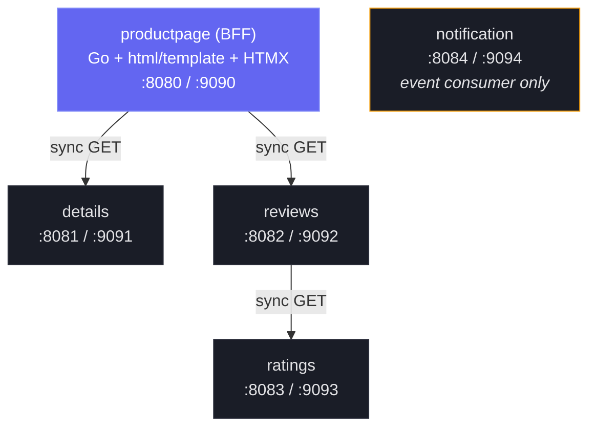
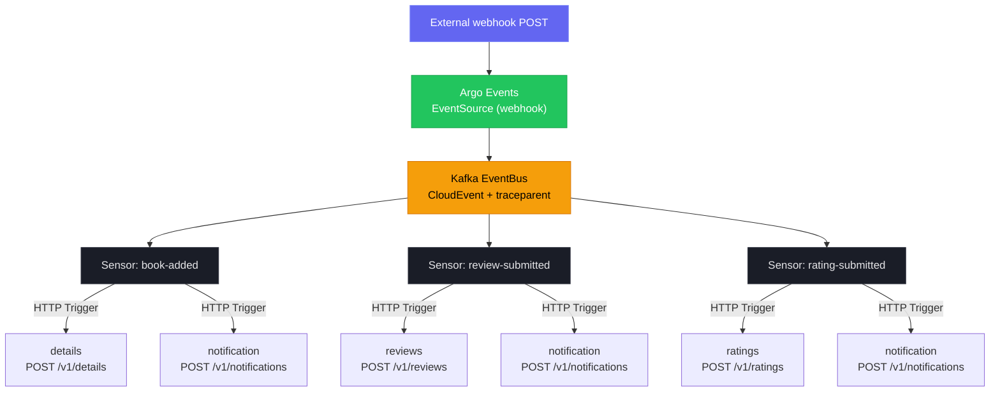

# Event-Driven Bookinfo

Go hexagonal architecture monorepo adapting Istio's Bookinfo as an event-driven e-commerce system.

## Architecture Overview

### Service Topology



### Event-Driven Write Flow



Reads are synchronous HTTP calls between services. Writes are fully async via Argo Events webhooks -> Kafka EventBus -> Sensors -> HTTP triggers. This separates the read and write paths cleanly while keeping the services themselves as plain HTTP servers with no Kafka dependency.

### Hexagonal Architecture

Each backend service (details, reviews, ratings, notification) is structured into three layers:

- **Core** — domain types, inbound ports (use-case interfaces), outbound ports (repository/client interfaces). No framework or infrastructure imports.
- **Inbound adapters** — HTTP handlers that translate HTTP requests into core use-case calls.
- **Outbound adapters** — repository implementations (`memory`, `postgres`) and external HTTP clients. Swapped at composition root via the `STORAGE_BACKEND` env var.

All service wiring happens in `services/<name>/cmd/main.go`. The shared `pkg/` packages handle cross-cutting concerns (config, logging, metrics, tracing, profiling, health, server lifecycle) so each service's `main.go` stays under ~60 lines.

---

## Services

| Service | Type | API Port | Admin Port | Description |
|---|---|---|---|---|
| **productpage** | BFF (Go + HTMX) | 8080 | 9090 | Aggregates details + reviews + ratings into an HTML product page. Fans out sync GET calls; no storage. |
| **details** | Backend | 8081 | 9091 | Book metadata CRUD. Event-written via `book-added` sensor. |
| **reviews** | Backend | 8082 | 9092 | User reviews. Makes sync GET to ratings service. Event-written via `review-submitted` sensor. |
| **ratings** | Backend | 8083 | 9093 | Star ratings per reviewer. Event-written via `rating-submitted` sensor. |
| **notification** | Event consumer | 8084 | 9094 | Receives POST from sensors, stores audit log. Exposes GET for review. |

All services expose their business API on the API port and observability endpoints (`/metrics`, `/healthz`, `/readyz`, `/debug/pprof/*`) on the admin port.

---

## Shared Packages

| Package | Description |
|---|---|
| `pkg/config` | Loads all service configuration from environment variables with defaults. |
| `pkg/health` | `/healthz` (liveness) and `/readyz` (readiness) handlers. Readiness supports optional check functions (e.g., `db.Ping`). |
| `pkg/logging` | JSON `slog` logger with `otelslog` bridge for automatic `trace_id`/`span_id` injection. HTTP middleware that creates a request-scoped logger with `request_id`, method, path. |
| `pkg/metrics` | OTel Metrics SDK -> Prometheus exporter setup. HTTP middleware recording request duration, request count, and in-flight gauge. Go runtime metrics (goroutines, GC, memory). |
| `pkg/profiling` | Pyroscope SDK wrapper. No-op when `PYROSCOPE_SERVER_ADDRESS` is unset. Enables CPU, alloc, inuse, goroutine, mutex, and block profiles. |
| `pkg/server` | Dual-port HTTP server. API port gets the full middleware chain (logging -> metrics -> tracing -> handler). Admin port gets observability routes. Graceful shutdown on SIGINT/SIGTERM. |
| `pkg/telemetry` | OTel tracing setup with OTLP exporter. No-op when `OTEL_EXPORTER_OTLP_ENDPOINT` is unset. |

---

## Prerequisites

- Go 1.25+
- Docker
- [golangci-lint v2](https://golangci-lint.run/welcome/install/)
- [kustomize](https://kustomize.io/) (optional, for Kubernetes deployment)
- [goreleaser v2](https://goreleaser.com/install/) (for releases)

---

## Quick Start

```bash
# Build all services
make build-all

# Run locally — open a separate terminal for each service

SERVICE_NAME=ratings HTTP_PORT=8083 ADMIN_PORT=9093 ./bin/ratings

SERVICE_NAME=details HTTP_PORT=8081 ADMIN_PORT=9091 ./bin/details

SERVICE_NAME=reviews HTTP_PORT=8082 ADMIN_PORT=9092 \
  RATINGS_SERVICE_URL=http://localhost:8083 \
  ./bin/reviews

SERVICE_NAME=notification HTTP_PORT=8084 ADMIN_PORT=9094 ./bin/notification

SERVICE_NAME=productpage HTTP_PORT=8080 ADMIN_PORT=9090 \
  DETAILS_SERVICE_URL=http://localhost:8081 \
  REVIEWS_SERVICE_URL=http://localhost:8082 \
  RATINGS_SERVICE_URL=http://localhost:8083 \
  TEMPLATE_DIR=services/productpage/templates \
  ./bin/productpage

# Open in browser
open http://localhost:8080
```

By default all services use the in-memory storage backend. To use PostgreSQL, set `STORAGE_BACKEND=postgres` and `DATABASE_URL=<dsn>` for each backend service. Note: the in-memory backend does not support multiple replicas (state is pod-local).

---

## Makefile Targets

| Target | Description |
|---|---|
| `make build SERVICE=<name>` | Build a single service binary to `bin/<name>` |
| `make build-all` | Build all 5 service binaries |
| `make test` | Run all tests |
| `make test-cover` | Run tests with HTML coverage report |
| `make test-race` | Run tests with the race detector |
| `make lint` | Run golangci-lint across the whole module |
| `make fmt` | Format all Go source files with gofmt |
| `make vet` | Run go vet |
| `make mod-tidy` | Tidy go module dependencies |
| `make docker-build SERVICE=<name>` | Build Docker image for one service |
| `make docker-build-all` | Build Docker images for all 5 services |
| `make e2e` | Run E2E tests via docker-compose |
| `make clean` | Remove `bin/` and `dist/` directories |
| `make help` | List all available targets |

---

## Docker

Each service has its own Dockerfile in the `build/` directory (`build/Dockerfile.<service>`). Backend services use `FROM scratch` for the smallest possible image; productpage uses `gcr.io/distroless/static-debian12:nonroot` because it needs the HTML templates directory alongside the binary.

```bash
# Build a single image
make docker-build SERVICE=ratings

# Build all images
make docker-build-all

# Run with docker-compose (memory backend, all services)
docker compose -f test/e2e/docker-compose.yml up

# Run with PostgreSQL backend
docker compose -f test/e2e/docker-compose.yml \
               -f test/e2e/docker-compose.postgres.yml up
```

Images are tagged `event-driven-bookinfo/<service>:latest` locally. Released images are pushed to GitHub Container Registry:

```
ghcr.io/kaio6fellipe/event-driven-bookinfo/productpage:<tag>
ghcr.io/kaio6fellipe/event-driven-bookinfo/details:<tag>
ghcr.io/kaio6fellipe/event-driven-bookinfo/reviews:<tag>
ghcr.io/kaio6fellipe/event-driven-bookinfo/ratings:<tag>
ghcr.io/kaio6fellipe/event-driven-bookinfo/notification:<tag>
```

---

## Kubernetes Deployment

Kubernetes manifests live under `deploy/` and use Kustomize with a `base` plus three overlays per service.

| Overlay | Replicas | Storage | Log level | Notes |
|---|---|---|---|---|
| `dev` | 1 | memory | debug | No resource limits |
| `staging` | 2 | postgres | info | `DATABASE_URL` from Secret |
| `production` | 3 | postgres | warn | HPA (min 3, max 10, 70% CPU target), higher resource limits |

```bash
# Preview rendered manifests for one service/overlay
kustomize build deploy/ratings/overlays/dev

# Apply dev overlay
kubectl apply -k deploy/ratings/overlays/dev

# Apply all services (dev)
for svc in productpage details reviews ratings notification; do
  kubectl apply -k deploy/$svc/overlays/dev
done
```

All deployments expose dual ports (API `:8080` + admin `:9090`). Liveness and readiness probes target `/healthz` and `/readyz` on the admin port. Pyroscope eBPF scraping is configured via pod annotations on the admin port; no application changes are needed.

---

## Argo Events

The event-driven write flow is implemented with Argo Events. This repository provides the EventSource and Sensor manifests only; the Kafka EventBus is expected to exist in the cluster.

```
deploy/argo-events/
├── eventsources/
│   ├── book-added.yaml          # Webhook -> Kafka
│   ├── review-submitted.yaml    # Webhook -> Kafka
│   └── rating-submitted.yaml    # Webhook -> Kafka
└── sensors/
    ├── book-added-sensor.yaml       # Triggers: details + notification
    ├── review-submitted-sensor.yaml # Triggers: reviews + notification
    └── rating-submitted-sensor.yaml # Triggers: ratings + notification
```

Each EventSource exposes an HTTP webhook. External systems POST events to these endpoints; Argo Events converts them to CloudEvents and publishes to Kafka. Sensors subscribe to specific event types and fire HTTP triggers against the target services.

OTel trace context propagates via `traceparent`/`tracestate` CloudEvent extensions. Services extract context when present and start a new trace when it is absent (graceful degradation).

```bash
# Validate manifests without applying
kubectl apply --dry-run=client -f deploy/argo-events/eventsources/
kubectl apply --dry-run=client -f deploy/argo-events/sensors/
```

---

## E2E Tests

E2E tests spin up all five services via docker-compose and exercise each service's HTTP API with shell scripts.

```bash
# Run E2E tests (memory backend)
make e2e

# Run E2E tests with PostgreSQL backend
docker compose -f test/e2e/docker-compose.yml \
               -f test/e2e/docker-compose.postgres.yml up -d
bash test/e2e/run-tests.sh
```

Individual test scripts under `test/e2e/` cover health endpoints, CRUD operations, and cross-service integration (e.g., reviews fetching ratings).

---

## Observability

All observability endpoints are served on the admin port (default `:9090`) and are isolated from the business API.

### Metrics

Prometheus-format metrics are available at `/metrics` on the admin port. Each service exposes:

- **HTTP middleware metrics**: `http_server_request_duration_seconds` (histogram), `http_server_requests_total` (counter), `http_server_active_requests` (gauge) — labeled by method, route, status.
- **Go runtime metrics**: goroutine count, GC stats, memory usage.
- **Business metrics** (per service):

  | Service | Metric |
  |---|---|
  | ratings | `ratings_submitted_total` |
  | details | `books_added_total` |
  | reviews | `reviews_submitted_total` |
  | notification | `notifications_dispatched_total`, `notifications_failed_total`, `notifications_by_status` |

### Tracing

OTel tracing with OTLP exporter. Set `OTEL_EXPORTER_OTLP_ENDPOINT` to enable. When the variable is unset the tracer is a no-op and the service runs without any collector dependency. Trace context is propagated between services via standard `traceparent` headers.

```bash
OTEL_EXPORTER_OTLP_ENDPOINT=http://localhost:4318 ./bin/ratings
```

### Profiling

Two complementary profiling modes:

- **Local/dev (push mode)**: Pyroscope Go SDK. Set `PYROSCOPE_SERVER_ADDRESS` to enable. No-op when unset. Profiles CPU, alloc, inuse objects/space, goroutines, mutex, and block.
- **Production (pull mode)**: Grafana Alloy DaemonSet with `pyroscope.ebpf` scrapes profiles via pod annotations on the admin port. Zero application changes required.

```bash
PYROSCOPE_SERVER_ADDRESS=http://localhost:4040 ./bin/ratings
```

### Logging

Structured JSON via `log/slog` with the `otelslog` bridge. Every log entry from a request-scoped context automatically includes `trace_id` and `span_id`. Each request log includes `request_id`, `method`, `path`, `status`, and `duration_ms`.

```bash
LOG_LEVEL=debug ./bin/ratings
```

pprof endpoints are available at `/debug/pprof/*` on the admin port for on-demand profiling.

---

## Project Structure

```
event-driven-bookinfo/
├── services/
│   ├── productpage/            # BFF — Go + html/template + HTMX
│   │   ├── cmd/main.go
│   │   ├── internal/
│   │   │   ├── client/         # HTTP clients for backend services
│   │   │   ├── handler/        # Page + API handlers
│   │   │   └── model/          # Aggregated view models
│   │   └── templates/          # HTML templates + HTMX partials
│   ├── details/                # Book metadata (hex arch)
│   │   ├── cmd/main.go
│   │   └── internal/
│   │       ├── core/           # domain/, port/inbound.go, port/outbound.go, service/
│   │       └── adapter/
│   │           ├── inbound/http/
│   │           └── outbound/   # memory/ and postgres/
│   ├── reviews/                # User reviews (hex arch, calls ratings)
│   ├── ratings/                # Star ratings (hex arch)
│   └── notification/           # Event consumer + audit log (hex arch)
├── pkg/
│   ├── config/                 # Env-based configuration
│   ├── health/                 # /healthz and /readyz handlers
│   ├── logging/                # slog + otelslog bridge + HTTP middleware
│   ├── metrics/                # OTel -> Prometheus + HTTP middleware + runtime
│   ├── profiling/              # Pyroscope SDK wrapper
│   ├── server/                 # Dual-port server + graceful shutdown
│   └── telemetry/              # OTel tracing setup
├── deploy/
│   ├── <service>/
│   │   ├── base/               # Kustomize base (deployment, service, configmap)
│   │   └── overlays/           # dev / staging / production patches
│   └── argo-events/
│       ├── eventsources/       # Webhook EventSource manifests
│       └── sensors/            # Sensor + HTTP trigger manifests
├── test/
│   └── e2e/                    # docker-compose files + shell test scripts
├── build/
│   └── Dockerfile.<service>    # One per service (5 total)
├── Makefile
├── .golangci.yml               # golangci-lint v2 configuration
├── .goreleaser.yaml            # GoReleaser v2 multi-binary release config
├── go.mod                      # Single module: github.com/kaio6fellipe/event-driven-bookinfo
└── go.sum
```

---

## Contributing

- Follow [Conventional Commits](https://www.conventionalcommits.org/) for commit messages (`feat:`, `fix:`, `docs:`, `refactor:`, etc.).
- Run `make lint` and `make test` before opening a pull request. The CI pipeline enforces both.
- Tests are table-driven. New handlers require both a unit test (`handler_test.go`) and service-layer test (`<domain>_service_test.go`).
- Use `make test-race` to check for data races before submitting.

---

## License

This project is licensed under the MIT License. See [LICENSE](LICENSE) for details.
