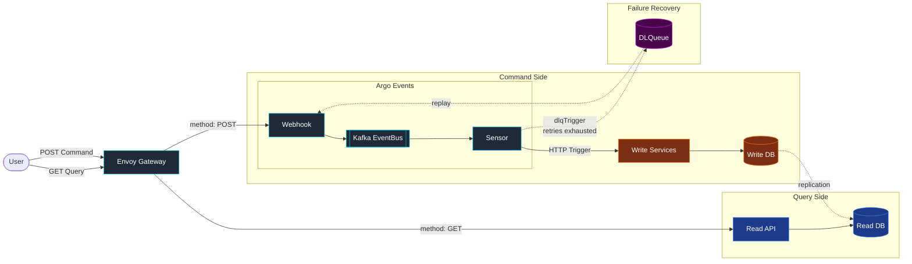
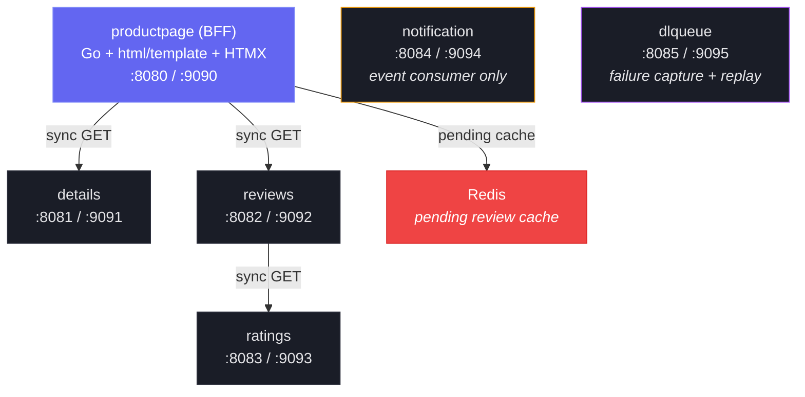
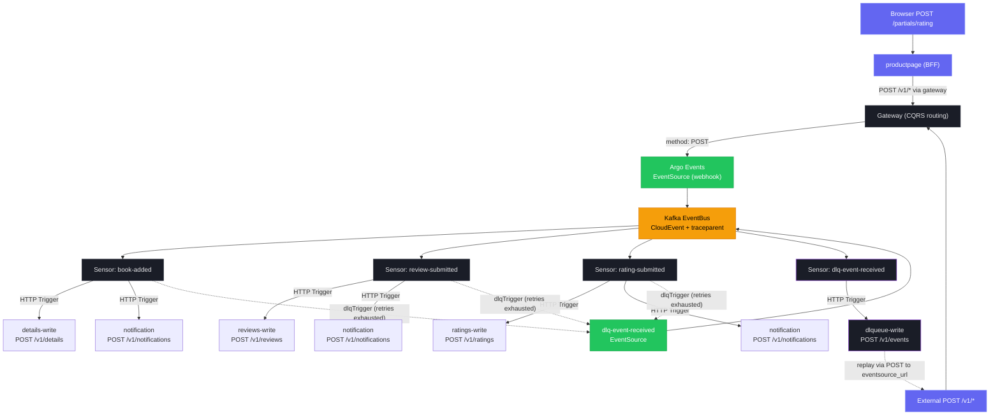
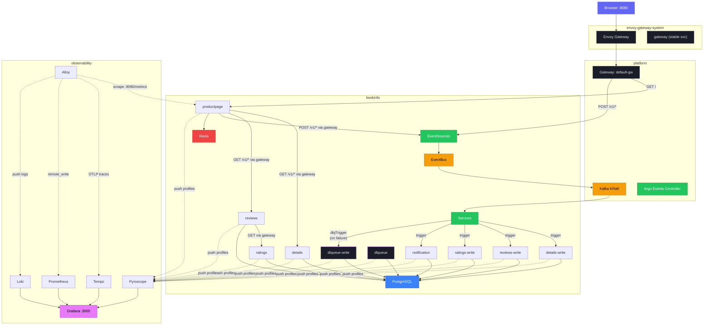

<h1 align="center">Event-Driven Bookinfo</h1>

<p align="center">
  <a href="https://github.com/kaio6fellipe/event-driven-bookinfo/actions/workflows/ci.yml?query=branch%3Amain"></a>
  <a href="https://pkg.go.dev/github.com/kaio6fellipe/event-driven-bookinfo"></a>
  <a href="https://goreportcard.com/report/github.com/kaio6fellipe/event-driven-bookinfo"></a>
  <a href="https://go.dev/"></a>
  <a href="https://unlicense.org/"></a>
  <a href="https://securityscorecards.dev/viewer/?uri=github.com/kaio6fellipe/event-driven-bookinfo"></a>
  <a href="https://www.conventionalcommits.org"></a>
</p>



Go hexagonal architecture monorepo adapting Istio's Bookinfo as a book review system, demonstrating real-time event-driven architecture with Argo Events and Kafka.

Services are plain REST APIs — all event-driven complexity (Kafka consumers, retries, dead-letter queues) is abstracted by Argo Events EventSources and Sensors. The write path flows through Kafka via Argo Events, ensuring every mutation is event-sourced, while the read path remains synchronous HTTP. Failure recovery is built into the pipeline — a `dlqTrigger` on every sensor captures events that exhaust retries into the `dlqueue` service, where they can be inspected, replayed, or marked resolved. This demonstrates using Argo Events not only for workflow automation, but as a real-time event-driven architecture platform — a self-hosted alternative to Google Eventarc or AWS EventBridge.

## Architecture Overview

### Service Topology



### Event-Driven Write Flow



Reads are synchronous HTTP calls between services. Writes are fully async via the Envoy Gateway's method-based CQRS routing — POST requests are routed to Argo Events webhook EventSources, which publish to the Kafka EventBus. Sensors consume events and fire HTTP triggers against the write services. The gateway acts as the CQRS boundary, while services remain plain HTTP servers with no Kafka dependency.

### Hexagonal Architecture

Each backend service (details, reviews, ratings, notification) is structured into three layers:

- **Core** — domain types, inbound ports (use-case interfaces), outbound ports (repository/client interfaces). No framework or infrastructure imports.
- **Inbound adapters** — HTTP handlers that translate HTTP requests into core use-case calls.
- **Outbound adapters** — repository implementations (`memory`, `postgres`) and external HTTP clients. Swapped at composition root via the `STORAGE_BACKEND` env var.

All service wiring happens in `services/<name>/cmd/main.go`. The shared `pkg/` packages handle cross-cutting concerns (config, logging, metrics, tracing, profiling, health, server lifecycle) so each service's `main.go` stays under ~60 lines.

---

## Services

| Service | Release | Coverage | Type | API Port | Admin Port | Description |
|---|---|---|---|---|---|---|
| **productpage** | [](https://github.com/kaio6fellipe/event-driven-bookinfo/releases?q=productpage-v&expanded=true) | [](https://github.com/kaio6fellipe/event-driven-bookinfo/actions/workflows/ci.yml?query=branch%3Amain) | BFF (Go + HTMX) | 8080 | 9090 | Aggregates details + reviews + ratings into an HTML product page. Fans out sync GET calls; pending review cache via Redis. |
| **details** | [](https://github.com/kaio6fellipe/event-driven-bookinfo/releases?q=details-v&expanded=true) | [](https://github.com/kaio6fellipe/event-driven-bookinfo/actions/workflows/ci.yml?query=branch%3Amain) | Backend | 8081 | 9091 | Book metadata CRUD. Event-written via `book-added` sensor. |
| **reviews** | [](https://github.com/kaio6fellipe/event-driven-bookinfo/releases?q=reviews-v&expanded=true) | [](https://github.com/kaio6fellipe/event-driven-bookinfo/actions/workflows/ci.yml?query=branch%3Amain) | Backend | 8082 | 9092 | User reviews. Makes sync GET to ratings service. Event-written via `review-submitted` sensor. |
| **ratings** | [](https://github.com/kaio6fellipe/event-driven-bookinfo/releases?q=ratings-v&expanded=true) | [](https://github.com/kaio6fellipe/event-driven-bookinfo/actions/workflows/ci.yml?query=branch%3Amain) | Backend | 8083 | 9093 | Star ratings per reviewer. Event-written via `rating-submitted` sensor. |
| **notification** | [](https://github.com/kaio6fellipe/event-driven-bookinfo/releases?q=notification-v&expanded=true) | [](https://github.com/kaio6fellipe/event-driven-bookinfo/actions/workflows/ci.yml?query=branch%3Amain) | Event consumer | 8084 | 9094 | Receives POST from sensors, stores audit log. Exposes GET for review. |
| **dlqueue** | [](https://github.com/kaio6fellipe/event-driven-bookinfo/releases?q=dlqueue-v&expanded=true) | [](https://github.com/kaio6fellipe/event-driven-bookinfo/actions/workflows/ci.yml?query=branch%3Amain) | Backend (hex arch) | 8085 | 9095 | Captures events failing sensor retry exhaustion; stores in PostgreSQL; supports replay via REST API |

All services expose their business API on the API port and observability endpoints (`/metrics`, `/healthz`, `/readyz`, `/debug/pprof/*`) on the admin port.

---

## Shared Packages

| Package | Description |
|---|---|
| `pkg/config` | Loads all service configuration from environment variables with defaults. |
| `pkg/health` | `/healthz` (liveness) and `/readyz` (readiness) handlers. Readiness supports optional check functions (e.g., `db.Ping`). |
| `pkg/idempotency` | `Store` interface (`CheckAndRecord`) with memory + postgres adapters; `NaturalKey` (SHA-256 with `0x1f` separator to prevent boundary collisions); `Resolve` picks explicit `idempotency_key` when present, otherwise derives a natural key from business fields. |
| `pkg/logging` | JSON `slog` logger with `otelslog` bridge for automatic `trace_id`/`span_id` injection. HTTP middleware that creates a request-scoped logger with `request_id`, method, path. |
| `pkg/metrics` | OTel Metrics SDK -> Prometheus exporter setup. HTTP middleware recording request duration, request count, and in-flight gauge. Go runtime metrics (goroutines, GC, memory). |
| `pkg/profiling` | Pyroscope SDK wrapper. No-op when `PYROSCOPE_SERVER_ADDRESS` is unset. Enables CPU, alloc, inuse, goroutine, mutex, and block profiles. |
| `pkg/server` | Dual-port HTTP server. API port gets the full middleware chain (logging -> metrics -> tracing -> handler). Admin port gets observability routes. Graceful shutdown on SIGINT/SIGTERM. |
| `pkg/telemetry` | OTel tracing setup with OTLP exporter. No-op when `OTEL_EXPORTER_OTLP_ENDPOINT` is unset. |

---

## Prerequisites

- Go 1.25+
- Docker (Docker Desktop recommended, ~8 GB RAM allocated)
- [golangci-lint v2](https://golangci-lint.run/welcome/install/)
- [goreleaser v2](https://goreleaser.com/install/) (for releases)

**Additional for local Kubernetes (`make run-k8s`):**

- [k3d](https://k3d.io/) (k3s-in-Docker)
- [kubectl](https://kubernetes.io/docs/tasks/tools/)
- [Helm](https://helm.sh/docs/intro/install/)

---

## Quick Start

```bash
# Build all services
make build-all

# Run locally — open a separate terminal for each service

SERVICE_NAME=ratings HTTP_PORT=8083 ADMIN_PORT=9093 ./bin/ratings

SERVICE_NAME=details HTTP_PORT=8081 ADMIN_PORT=9091 ./bin/details

SERVICE_NAME=reviews HTTP_PORT=8082 ADMIN_PORT=9092 \
  RATINGS_SERVICE_URL=http://localhost:8083 \
  ./bin/reviews

SERVICE_NAME=notification HTTP_PORT=8084 ADMIN_PORT=9094 ./bin/notification

SERVICE_NAME=dlqueue HTTP_PORT=8085 ADMIN_PORT=9095 ./bin/dlqueue

# Optional: REDIS_URL=redis://localhost:6379 (enables pending review cache)
SERVICE_NAME=productpage HTTP_PORT=8080 ADMIN_PORT=9090 \
  DETAILS_SERVICE_URL=http://localhost:8081 \
  REVIEWS_SERVICE_URL=http://localhost:8082 \
  RATINGS_SERVICE_URL=http://localhost:8083 \
  TEMPLATE_DIR=services/productpage/templates \
  ./bin/productpage

# Open in browser
open http://localhost:8080
```

By default all services use the in-memory storage backend. To use PostgreSQL, set `STORAGE_BACKEND=postgres` and `DATABASE_URL=<dsn>` for each backend service. Note: the in-memory backend does not support multiple replicas (state is pod-local).

**Or use Docker Compose** (PostgreSQL backend, all services with one command):

```bash
make run          # Start all services + PostgreSQL, seed databases
make run-logs     # Tail logs
make stop         # Stop and remove containers
```

---

## Makefile Targets

| Target | Description |
|---|---|
| `make build SERVICE=<name>` | Build a single service binary to `bin/<name>` |
| `make build-all` | Build all 6 service binaries |
| `make test` | Run all tests |
| `make test-cover` | Run tests with HTML coverage report |
| `make test-race` | Run tests with the race detector |
| `make lint` | Run golangci-lint across the whole module |
| `make fmt` | Format all Go source files with gofmt |
| `make vet` | Run go vet |
| `make mod-tidy` | Tidy go module dependencies |
| `make docker-build SERVICE=<name>` | Build Docker image for one service |
| `make docker-build-all` | Build Docker images for all 6 services |
| `make run` | Start all services via Docker Compose (PostgreSQL backend) |
| `make stop` | Stop services and remove containers |
| `make e2e` | Run E2E tests via docker-compose |
| `make clean` | Remove `bin/` and `dist/` directories |
| `make help` | List all available targets |
| `make run-k8s` | Full local k8s setup (cluster, platform, observability, deploy, seed) |
| `make stop-k8s` | Delete k3d cluster and all resources |
| `make k8s-rebuild` | Fast iteration: rebuild images, reimport, rollout restart |
| `make k8s-status` | Show pod status across all namespaces + access URLs |
| `make k8s-logs` | Tail logs from bookinfo namespace |
| `make k8s-cluster` | Create k3d cluster with port mappings |
| `make k8s-platform` | Install Envoy Gateway, Strimzi, Kafka, Argo Events, Gateway |
| `make k8s-observability` | Install Prometheus, Grafana, Tempo, Loki, Pyroscope, Alloy |
| `make k8s-deploy` | Build images, import to k3d, deploy apps + Argo Events + HTTPRoutes |
| `make k8s-seed` | Seed PostgreSQL databases with sample data |

---

## Docker

Each service has its own Dockerfile in the `build/` directory (`build/Dockerfile.<service>`). Backend services use `FROM scratch` for the smallest possible image; productpage uses `gcr.io/distroless/static-debian12:nonroot` because it needs the HTML templates directory alongside the binary.

```bash
# Build a single image
make docker-build SERVICE=ratings

# Build all images
make docker-build-all

# Run all services with PostgreSQL (recommended for local dev)
make run          # builds images, starts postgres + redis + all services, seeds databases
make run-logs     # tail service logs
make stop         # stop and remove containers (keeps data)
make clean-data   # stop and remove containers + postgres data volume

# Or run directly with docker-compose (memory backend, for E2E tests)
docker compose -f test/e2e/docker-compose.yml up
```

Images are tagged `event-driven-bookinfo/<service>:latest` locally. Released images are pushed to GitHub Container Registry with the service version tag:

```
ghcr.io/kaio6fellipe/event-driven-bookinfo/productpage:<tag>
ghcr.io/kaio6fellipe/event-driven-bookinfo/details:<tag>
ghcr.io/kaio6fellipe/event-driven-bookinfo/reviews:<tag>
ghcr.io/kaio6fellipe/event-driven-bookinfo/ratings:<tag>
ghcr.io/kaio6fellipe/event-driven-bookinfo/notification:<tag>
ghcr.io/kaio6fellipe/event-driven-bookinfo/dlqueue:<tag>
```

---

## Kubernetes Deployment

Kubernetes manifests live under `deploy/` and use Kustomize with a `base` plus three overlays per service.

| Overlay | Replicas | Storage | Log level | Notes |
|---|---|---|---|---|
| `dev` | 1 | memory | debug | No resource limits |
| `staging` | 2 | postgres | info | `DATABASE_URL` from Secret |
| `production` | 3 | postgres | warn | HPA (min 3, max 10, 70% CPU target), higher resource limits |

```bash
# Preview rendered manifests for one service/overlay
kustomize build deploy/ratings/overlays/dev

# Apply dev overlay
kubectl apply -k deploy/ratings/overlays/dev

# Apply all services (dev)
for svc in productpage details reviews ratings notification; do
  kubectl apply -k deploy/$svc/overlays/dev
done
```

All deployments expose dual ports (API `:8080` + admin `:9090`). Liveness and readiness probes target `/healthz` and `/readyz` on the admin port. Continuous profiling is push-based via the Pyroscope Go SDK with trace-to-profile correlation.

For a fully automated local development cluster with all infrastructure included (Kafka, Envoy Gateway, observability stack), see [Local Kubernetes Environment](#local-kubernetes-environment) below.

---

## Local Kubernetes Environment

One-command local development cluster using k3d. Deploys the full stack: Envoy Gateway, Kafka (KRaft), Argo Events, PostgreSQL, observability (Prometheus + Grafana + Tempo + Loki + Pyroscope + Alloy), and all services with CQRS read/write deployment split.

### Cluster Architecture



The cluster (`bookinfo-local`) runs four namespaces:

| Namespace | Components |
|---|---|
| `platform` | Strimzi operator, Kafka (KRaft single-node), Argo Events controller, EventBus, Gateway `default-gw` |
| `envoy-gateway-system` | Envoy Gateway controller, GatewayClass `eg`, stable `gateway` Service for CQRS routing |
| `observability` | Prometheus, Grafana, Tempo, Loki, Pyroscope, Alloy (DaemonSet for logs + Deployment for metrics/traces) |
| `bookinfo` | 10 app deployments (CQRS split incl. dlqueue read/write), PostgreSQL, 4 EventSources (incl. `dlq-event-received`), 4 Sensors (incl. DLQ), method-based HTTPRoutes |

### CQRS Deployment Split

Each backend service deploys as two separate Deployments sharing the same image and PostgreSQL database: a read instance (serves GET traffic from productpage) and a write instance (receives POST triggers from Argo Events sensors).

| Deployment | Role | Called by |
|---|---|---|
| `productpage` | Read-only BFF | Envoy Gateway (HTTPRoute) |
| `details` / `details-write` | Read / Write | productpage / book-added sensor |
| `reviews` / `reviews-write` | Read / Write | productpage / review-submitted sensor |
| `ratings` / `ratings-write` | Read / Write | reviews (read) / rating-submitted sensor |
| `notification` | Write-only | All 3 sensors |
| `dlqueue` / `dlqueue-write` | Read / Write | operator/service API (GET) / `dlq-event-received` sensor (POST) |

### Usage

```bash
make run-k8s        # Full setup (~5-10 min first run)
make k8s-status     # Check status + access URLs
make k8s-rebuild    # Fast iteration (rebuild + redeploy, skip infra)
make k8s-logs       # Tail application logs
make stop-k8s       # Tear down
```

### Access URLs

| Service | URL | Notes |
|---|---|---|
| Productpage | http://localhost:8080 | BFF web UI |
| Grafana | http://localhost:3000 | admin / admin |
| Prometheus | http://localhost:9090 | Metrics queries |
| Webhooks | http://localhost:8080/v1/details | POST to trigger write flow (same port, method-based routing) |

---

## Argo Events

The event-driven write flow is implemented with Argo Events. This repository provides the EventSource and Sensor manifests only; the Kafka EventBus is expected to exist in the cluster.

```
deploy/argo-events/
├── eventsources/
│   ├── book-added.yaml          # Webhook -> Kafka
│   ├── review-submitted.yaml    # Webhook -> Kafka
│   └── rating-submitted.yaml    # Webhook -> Kafka
└── sensors/
    ├── book-added-sensor.yaml       # Triggers: details + notification
    ├── review-submitted-sensor.yaml # Triggers: reviews + notification
    └── rating-submitted-sensor.yaml # Triggers: ratings + notification
```

Each EventSource exposes an HTTP webhook whose endpoint mirrors the target service's API path (e.g., the book-added EventSource listens on /v1/details). The Envoy Gateway routes POST requests to these endpoints via method-based CQRS routing on port 8080. Argo Events converts received payloads to CloudEvents and publishes to Kafka. Sensors subscribe to specific event types and fire HTTP triggers against the write services.

OTel trace context propagates via `traceparent`/`tracestate` CloudEvent extensions. Services extract context when present and start a new trace when it is absent (graceful degradation).

```bash
# Validate manifests without applying
kubectl apply --dry-run=client -f deploy/argo-events/eventsources/
kubectl apply --dry-run=client -f deploy/argo-events/sensors/
```

### Dead Letter Queue

Every primary sensor trigger carries `atLeastOnce: true` + exponential backoff and a `dlqTrigger` that fires after retry exhaustion. The dlqTrigger captures the full CloudEvents context (`id`, `type`, `source`, `subject`, `time`, `datacontenttype`) via `contextKey`, plus the original body and HTTP headers (preserving `traceparent` for distributed trace correlation), and POSTs the structured payload to a dedicated `dlq-event-received` EventSource. The DLQ event then flows through the standard Argo Events pipeline: EventSource → Kafka → DLQ sensor → `dlqueue-write` service → PostgreSQL.

The dlqueue service deduplicates arrivals by a natural composite key (`sensor_name + failed_trigger + SHA-256(original_payload)`). The CloudEvents `id` cannot be used as a dedup key because Argo Events regenerates it on every EventSource pass — per the CNCF CloudEvents spec, `id` is a hop-level identifier, not an end-to-end correlation key. Events are tracked through a state machine (`pending → replayed → resolved` on success; `poisoned` after `max_retries` failed replays).

Replay is operator- or service-initiated via `POST /v1/events/{id}/replay`: dlqueue re-POSTs the original payload and headers to the source EventSource URL stored on the DLQ record, re-entering the full CQRS pipeline. All write services are idempotent (see `pkg/idempotency`) so replays are safe. For the full domain model, API surface, and metric definitions, see [docs/superpowers/specs/2026-04-13-dlqueue-service-design.md](docs/superpowers/specs/2026-04-13-dlqueue-service-design.md).

---

## E2E Tests

E2E tests spin up all five services via docker-compose and exercise each service's HTTP API with shell scripts.

```bash
# Run E2E tests (memory backend)
make e2e

# Run E2E tests with PostgreSQL backend
docker compose -f test/e2e/docker-compose.yml \
               -f test/e2e/docker-compose.postgres.yml up -d
bash test/e2e/run-tests.sh
```

Individual test scripts under `test/e2e/` cover health endpoints, CRUD operations, and cross-service integration (e.g., reviews fetching ratings).

---

## Observability

All observability endpoints are served on the admin port (default `:9090`) and are isolated from the business API.

### Metrics

Prometheus-format metrics are available at `/metrics` on the admin port. Each service exposes:

- **HTTP middleware metrics**: `http_server_request_duration_seconds` (histogram), `http_server_requests_total` (counter), `http_server_active_requests` (gauge) — labeled by method, route, status.
- **Go runtime metrics**: goroutine count, GC stats, memory usage.
- **Business metrics** (per service):

  | Service | Metric |
  |---|---|
  | ratings | `ratings_submitted_total` |
  | details | `books_added_total` |
  | reviews | `reviews_submitted_total` |
  | notification | `notifications_dispatched_total`, `notifications_failed_total`, `notifications_by_status` |

### Tracing

OTel tracing with OTLP exporter. Set `OTEL_EXPORTER_OTLP_ENDPOINT` to enable. When the variable is unset the tracer is a no-op and the service runs without any collector dependency. Trace context is propagated between services via standard `traceparent` headers.

```bash
OTEL_EXPORTER_OTLP_ENDPOINT=http://localhost:4318 ./bin/ratings
```

### Profiling

Push-based continuous profiling with trace-to-profile correlation:

- **Pyroscope Go SDK** with `grafana/otel-profiling-go` wrapper. Set `PYROSCOPE_SERVER_ADDRESS` to enable. No-op when unset. Profiles CPU, alloc, inuse objects/space, goroutines, mutex, and block. Span IDs are automatically injected into profiling samples, enabling Grafana to link Tempo traces directly to Pyroscope profiles.

```bash
PYROSCOPE_SERVER_ADDRESS=http://localhost:4040 ./bin/ratings
```

### Logging

Structured JSON via `log/slog` with the `otelslog` bridge. Every log entry from a request-scoped context automatically includes `trace_id` and `span_id`. Each request log includes `request_id`, `method`, `path`, `status`, and `duration_ms`.

```bash
LOG_LEVEL=debug ./bin/ratings
```

pprof endpoints are available at `/debug/pprof/*` on the admin port for on-demand profiling.

---

## Project Structure

```
event-driven-bookinfo/
├── services/
│   ├── productpage/            # BFF — Go + html/template + HTMX
│   │   ├── cmd/main.go
│   │   ├── internal/
│   │   │   ├── client/         # HTTP clients for backend services
│   │   │   ├── handler/        # Page + API handlers
│   │   │   └── model/          # Aggregated view models
│   │   └── templates/          # HTML templates + HTMX partials
│   ├── details/                # Book metadata (hex arch)
│   │   ├── cmd/main.go
│   │   └── internal/
│   │       ├── core/           # domain/, port/inbound.go, port/outbound.go, service/
│   │       └── adapter/
│   │           ├── inbound/http/
│   │           └── outbound/   # memory/ and postgres/
│   ├── reviews/                # User reviews (hex arch, calls ratings)
│   ├── ratings/                # Star ratings (hex arch)
│   ├── notification/           # Event consumer + audit log (hex arch)
│   └── dlqueue/                # Dead letter queue (hex arch) — NEW
│       ├── cmd/main.go
│       ├── migrations/         # dlq_events + processed_events
│       └── internal/
│           ├── core/           # domain/, port/, service/
│           ├── adapter/
│           │   ├── inbound/http/
│           │   └── outbound/   # memory/, postgres/, http/ (replay client)
│           └── metrics/        # dlq_events_* counters
├── pkg/
│   ├── config/                 # Env-based configuration
│   ├── health/                 # /healthz and /readyz handlers
│   ├── idempotency/            # Store interface + adapters; natural-key hashing
│   ├── logging/                # slog + otelslog bridge + HTTP middleware
│   ├── metrics/                # OTel -> Prometheus + HTTP middleware + runtime
│   ├── profiling/              # Pyroscope SDK wrapper
│   ├── server/                 # Dual-port server + graceful shutdown
│   └── telemetry/              # OTel tracing setup
├── deploy/
│   ├── <service>/
│   │   ├── base/               # Kustomize base (deployment, service, configmap)
│   │   └── overlays/           # dev / staging / production / local patches
│   ├── argo-events/
│   │   ├── eventsources/       # Webhook EventSource manifests
│   │   ├── sensors/            # Sensor + HTTP trigger manifests
│   │   └── overlays/local/     # EventBus, sensors targeting -write services
│   ├── gateway/
│   │   ├── base/               # Gateway, GatewayClass, ReferenceGrant
│   │   └── overlays/local/     # HTTPRoutes for bookinfo
│   ├── observability/local/    # Helm values: Prometheus, Grafana, Tempo, Loki, Pyroscope, Alloy
│   ├── platform/local/         # Helm values: Strimzi, Argo Events; Kafka CRDs
│   ├── redis/local/            # Helm values: Bitnami Redis
│   └── postgres/local/         # StatefulSet, Service, init ConfigMap
├── test/
│   └── e2e/                    # docker-compose files + shell test scripts
├── build/
│   └── Dockerfile.<service>    # One per service (5 total)
├── Makefile
├── .golangci.yml               # golangci-lint v2 configuration
├── .github/workflows/
│   ├── release.yml             # Per-service release via workflow_dispatch
│   └── auto-tag.yml            # Auto-tag on PR merge, dispatches release
├── go.mod                      # Single module: github.com/kaio6fellipe/event-driven-bookinfo
└── go.sum
```

---

## Releasing

Each service is versioned and released independently. Releases are fully automated on PR merge to `main`.

### How It Works

1. **PR merged to `main`** → `auto-tag.yml` runs
2. **Detects changed services** — file paths under `services/<name>/`; changes to `pkg/`, `go.mod`, or `go.sum` trigger all 6 services
3. **Determines version bump** — PR labels (`major`/`minor`) take priority, then conventional commit prefixes (`feat` → minor, `fix` → patch, `BREAKING CHANGE` → major), default is `patch`
4. **Creates tag** — e.g., `details-v0.2.0`
5. **Dispatches release** — `release.yml` builds binaries, Docker images (multi-arch), and creates a GitHub release

### Tag Format

```
<service>-v<major>.<minor>.<patch>
```

Examples: `details-v0.1.0`, `reviews-v1.2.3`, `productpage-v0.3.0`

### Manual Release

```bash
# Trigger a release for a specific service
gh workflow run release.yml -f service=details -f tag=details-v0.1.0
```

### Version Bump Labels

| Label | Effect |
|-------|--------|
| `major` | Major version bump (breaking change) |
| `minor` | Minor version bump (new feature) |
| *(none)* | Determined by conventional commits, default patch |

### GoReleaser Configs

Per-service configs at `services/<name>/.goreleaser.yaml`. Uses GoReleaser OSS with `GORELEASER_CURRENT_TAG` environment variable for version resolution.

---

## Contributing

- Follow [Conventional Commits](https://www.conventionalcommits.org/) for commit messages (`feat:`, `fix:`, `docs:`, `refactor:`, etc.).
- Run `make lint` and `make test` before opening a pull request. The CI pipeline enforces both.
- Tests are table-driven. New handlers require both a unit test (`handler_test.go`) and service-layer test (`<domain>_service_test.go`).
- Use `make test-race` to check for data races before submitting.

---

## License

This project is licensed under the MIT License. See [LICENSE](LICENSE) for details.
