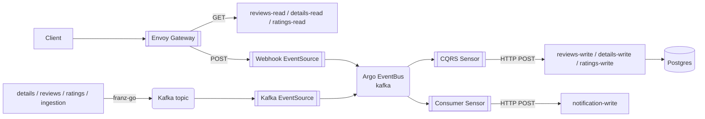
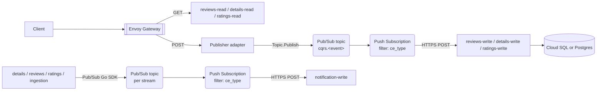

# Overview — Argo Events vs Pub/Sub + Eventarc on GKE

Macro tradeoffs, glossary translation, and an opinionated resource-burden snapshot. Start here, then descend into the per-pattern files.

## Scope

This doc set compares two ways to run the bookinfo event-driven flow on GKE:

- **Today:** Argo Events on top of Strimzi Kafka, deployed via the bookinfo Helm chart.
- **Alternative:** GCP Pub/Sub + Eventarc, with Crossplane managing the GCP resources from the same cluster.

In scope: the CQRS write-path, the events catalog (`events.exposed` / `events.consumed`), the DLQ pipeline, and the producer side (including the ingestion service).

Out of scope: observability cross-cutting (separate doc), schema registries, multi-region failover, migration runbooks. Identity uses GKE Workload Identity (KSA → GSA via annotation); the Workload Identity Federation flavor is excluded.

The doc is hybrid: neutral on macro architectural tradeoffs, opinionated on operational and resource-burden tradeoffs.

## Stack at a glance

### Today (Argo Events on Kafka)

### Alternative (Pub/Sub + Eventarc on GKE)

## Glossary translation

| Concept | Argo Events | Pub/Sub + Eventarc | Crossplane resource (upjet-gcp) |
|---|---|---|---|
| Messaging fabric | `EventBus` (Kafka or NATS Jetstream) | Pub/Sub itself (no separate construct) | n/a |
| Stream / topic | Kafka topic | Pub/Sub Topic | `pubsub.gcp.upbound.io/v1beta1` `Topic` |
| Producer-side bridge | `EventSource` (kafka type) | None — subscribers attach directly | n/a |
| HTTP ingress for writes | `EventSource` (webhook type) | Eventarc generic HTTP source OR thin in-cluster publisher service | `eventarc.gcp.upbound.io/v1beta1` `Trigger` (Eventarc path) |
| Routing logic | `Sensor` with `dependencies` and `triggers` | Subscription with `filter` + push endpoint, OR Eventarc `Trigger` | `pubsub.gcp.upbound.io/v1beta1` `Subscription` |
| Filter on event metadata | Sensor `filters.data` (e.g. `headers.ce_type`) | Subscription `filter` expression on attributes | (in `Subscription` spec) |
| Retry on delivery failure | Sensor `retryStrategy` | Subscription `retryPolicy` | (in `Subscription` spec) |
| Dead-letter | Sensor `dlqTrigger` (HTTP) | Subscription `dead_letter_policy` → DLQ Topic | (in `Subscription` spec) + extra `Topic` |
| Identity | KSA (chart-managed) | KSA → GSA via Workload Identity | `cloudplatform.gcp.upbound.io/v1beta1` `ServiceAccount` + `iam.gcp.upbound.io/v1beta1` `ServiceAccountIAMMember` |
| Per-resource permission | RBAC on KSA | `IAMMember` (e.g. `roles/pubsub.publisher`, `roles/pubsub.subscriber`) | `pubsub.gcp.upbound.io/v1beta1` `TopicIAMMember` / `SubscriptionIAMMember` |

## Macro tradeoff matrix

| Axis | Argo Events | Pub/Sub + Eventarc | Verdict |
|---|---|---|---|
| Portability across clouds / on-prem | Runs anywhere Kubernetes runs; Kafka or NATS Jetstream backends | GCP-only managed services; Pub/Sub is not portable | argo wins |
| Coupling to GKE control plane | None; pure Kubernetes CRDs | Tight — Eventarc Trigger destinations and Workload Identity tie to GKE | argo wins |
| Day-2 ops surface | Argo CRDs (EventBus, EventSource, Sensor) + Strimzi/NATS operator + Kafka brokers + JetStream | Crossplane CRDs + GCP IAM + Pub/Sub dashboards + Eventarc UI | depends — see notes |
| Identity model uniformity | One chart-managed KSA per service covers everything via in-cluster RBAC | Per-event GSA + IAM bindings + KSA annotation; per-subscription Pub/Sub identity | argo wins |
| Schema enforcement | None at the bus layer | Pub/Sub Schemas (Avro / Protobuf) attachable to a Topic | GCP wins |
| Replay model | Kafka offset replay or dlqueue-driven re-POST | Pub/Sub `seek` (timestamp / snapshot) + DLQ resubscribe | depends — see notes |
| Latency profile | In-cluster Sensor → in-cluster service: low single-digit ms p50 | Pub/Sub push round-trip: tens of ms p50 to in-cluster GKE endpoint | argo wins |
| Cost model | Cluster compute for Kafka brokers + sensor pods (sunk capacity) | Per-message Pub/Sub + Eventarc fees; no broker compute | depends — see notes |
| Vendor lock-in | None (CNCF projects + open-source brokers) | High (Pub/Sub + Eventarc are first-party GCP) | argo wins |
| Observability story | OTel-instrumented sensors + EventSource span coverage; same stack as the rest of the cluster | Cloud Trace + Cloud Logging integration out of the box; correlating with in-cluster traces requires extra glue | depends — see notes |

The matrix deliberately avoids a single-line summary verdict on the entire stack. Pick axes that matter for your context, then read the per-pattern files for resource and operational specifics.

## Resource burden snapshot

This is the opinionated section. Same operational changes, different resource counts. Detailed scenarios in [`05-resource-checklists.md`](05-resource-checklists.md).

| Operational change | Argo Events | Pub/Sub + Eventarc |
|---|---|---|
| Expose a new event from a service | +1 Kafka EventSource (CR) — assumes Kafka topic already provisioned | +1 Topic + 1 GSA + 1 IAM publisher binding + 1 KSA annotation (4 GCP-side artifacts) |
| Consume one event with ce_type filter (existing consumer) | +1 dependency entry + 1 trigger entry on existing Sensor (0 new CRs) | +1 Subscription + 1 IAM subscriber binding + (if new identity) 1 GSA + 1 KSA annotation |
| Fan-in 4 ce_types into one consumer | 1 Consumer Sensor with 4 dependencies (the current `notification-consumer-sensor`) | 4 Subscriptions, each with its own filter expression and IAM binding |
| New CQRS write-path service with 1 endpoint | +1 webhook EventSource + 1 Sensor + the chart-rendered ClusterIP Service for the EventSource | +1 Topic + 1 Subscription + 1 GSA + 1 IAM subscriber binding + 1 KSA annotation; the publisher adapter side adds another GSA + IAM publisher binding |
| Enable DLQ on a new consumer | 0 new resources — sensor `dlqTrigger` renders automatically when `sensor.dlq.enabled: true` | +1 DLQ Topic (or reuse one) + `dead_letter_policy` on the Subscription + 1 IAM binding granting Pub/Sub service agent publisher rights to the DLQ Topic |

## How to read this doc set

| File | When to read it |
|---|---|
| [`01-cqrs.md`](01-cqrs.md) | You're touching the write-path: CQRS endpoints, the gateway routing, or the sensors that fire `<svc>-write`. |
| [`02-events-catalog.md`](02-events-catalog.md) | You're adding a service that exposes or consumes a named event. |
| [`03-dlq.md`](03-dlq.md) | You're touching dlqueue or designing failure-handling policy. |
| [`04-ingestion-producer.md`](04-ingestion-producer.md) | You're adding a new producer (especially one that publishes via SDK like ingestion does). |
| [`05-resource-checklists.md`](05-resource-checklists.md) | You want a yes/no list of "which resources do I provision for change X". |
