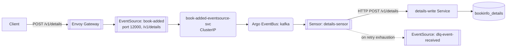
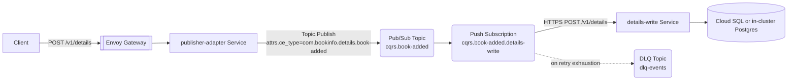

# CQRS Write-Path — Argo Events vs Pub/Sub + Eventarc

How POST writes flow from gateway through the bus to the write service, today and on GCP.

## Today (Argo Events)

A POST to a CQRS endpoint flows: gateway → webhook EventSource → EventBus (Kafka) → Sensor → write Service.



Live cluster inventory (verified 2026-04-27, context `k3d-bookinfo-local`):

| Resource | Count | Names |
|---|---|---|
| EventBus | 1 | `kafka` |
| Webhook EventSources | 5 | `book-added`, `review-submitted`, `review-deleted`, `rating-submitted`, `dlq-event-received` |
| EventSource ClusterIP Services | 5 | `<event>-eventsource-svc` per webhook EventSource |
| CQRS Sensors | 4 | `details-sensor`, `reviews-sensor`, `ratings-sensor`, `dlqueue-sensor` |

All five webhook EventSources listen on **port 12000**. The per-service `deploy/<svc>/values-local.yaml` files still encode the legacy distinct ports 12000-12004; these have been superseded by a recent consolidation and the live cluster diverges from those values. Treat the live state as authoritative.

`reviews-sensor` is notable: it covers both `review-submitted` and `review-deleted` in a single Sensor with two dependencies and two triggers. One Argo Sensor can multiplex N CQRS endpoints for one service cheaply — there is no per-endpoint Sensor proliferation.

## Alternative (Pub/Sub + Eventarc)

Two design variants — the doc primarily uses (a) and notes (b) inline.

- **(a) Thin in-cluster publisher adapter:** a small Go service receives `POST /v1/<endpoint>` from the gateway and calls `Topic.Publish()` against a per-event Pub/Sub topic. A push Subscription delivers to `<svc>-write`. This keeps the gateway routing identical to today.
- **(b) Eventarc generic HTTP source:** Eventarc receives the POST directly and emits to a Pub/Sub topic. Removes the publisher adapter but ties routing semantics to Eventarc's trigger model and requires the destination to be reachable via Eventarc's GKE-internal channel (or a public LB).



The push Subscription's destination must be reachable from Pub/Sub. On GKE, the supported pattern is to expose the in-cluster `<svc>-write` via Eventarc's GKE destination type (Eventarc Trigger with `destination.gke`), or to terminate on an internal load balancer. The doc shows the Trigger path because it's the cleaner integration.

### Crossplane resources (book-added example)

```yaml
# upbound/provider-gcp@v2.5.0
apiVersion: pubsub.gcp.upbound.io/v1beta1
kind: Topic
metadata:
  name: cqrs-book-added
spec:
  forProvider:
    messageRetentionDuration: 86400s
  providerConfigRef:
    name: gcp-default
---
apiVersion: cloudplatform.gcp.upbound.io/v1beta1
kind: ServiceAccount
metadata:
  name: details-write-pubsub
spec:
  forProvider:
    accountId: details-write-pubsub
    displayName: details-write Pub/Sub identity
  providerConfigRef:
    name: gcp-default
---
apiVersion: iam.gcp.upbound.io/v1beta1
kind: ServiceAccountIAMMember
metadata:
  name: details-write-pubsub-wi
spec:
  forProvider:
    serviceAccountIdRef:
      name: details-write-pubsub
    role: roles/iam.workloadIdentityUser
    member: serviceAccount:<PROJECT_ID>.svc.id.goog[bookinfo/details]
  providerConfigRef:
    name: gcp-default
---
apiVersion: eventarc.gcp.upbound.io/v1beta1
kind: Trigger
metadata:
  name: cqrs-book-added-to-details-write
spec:
  forProvider:
    location: <REGION>
    matchingCriteria:
      - attribute: type
        value: google.cloud.pubsub.topic.v1.messagePublished
    transport:
      pubsub:
        topicRef:
          name: cqrs-book-added
    destination:
      gke:
        cluster: bookinfo-cluster
        location: <REGION>
        namespace: bookinfo
        service: details-write
        path: /v1/details
    serviceAccountRef:
      name: details-write-pubsub
  providerConfigRef:
    name: gcp-default
```

The KSA the chart already creates (`details`) gets one annotation:

```yaml
metadata:
  annotations:
    iam.gke.io/gcp-service-account: details-write-pubsub@<PROJECT_ID>.iam.gserviceaccount.com
```

Per the design assumption, KSA annotations are not counted as resources but are flagged when required.

## Side-by-side resources for one CQRS endpoint

| Resource | Argo Events | Pub/Sub + Eventarc | Notes |
|---|---|---|---|
| Ingress route | HTTPRoute (existing) | HTTPRoute (existing) | Unchanged |
| Inbound HTTP receiver | EventSource CR + auto-created Deployment + ClusterIP Service | publisher-adapter Service (or Eventarc generic HTTP source) + KSA annotation | Eventarc variant removes the adapter but adds Trigger config |
| Bus / topic | EventBus (shared, 1 cluster-wide) | Pub/Sub Topic (1 per event) | Pub/Sub has no shared "bus" object |
| Routing rule | Sensor dependency + trigger entries (multiplexed) | Eventarc Trigger OR Subscription per endpoint | N endpoints in argo = 1 Sensor; in GCP = N Triggers |
| Identity | Chart KSA only | KSA + GSA + WI binding | GCP requires a GSA per identity boundary |
| IAM binding for delivery | RBAC on the KSA (in-cluster) | `roles/pubsub.subscriber` on Subscription or push-target identity | One per Subscription |
| Retry policy | `sensor.retryStrategy` (steps, duration, factor, jitter) | `Subscription.retryPolicy.minimumBackoff` / `maximumBackoff` | Different shape; map carefully |
| Idle resource cost | Sensor pod kept warm | Push Subscription = no idle cost; Eventarc Trigger billed per event | GCP wins on idle cost; argo wins on per-event cost |

## Tradeoffs

The opinionated take, scoped to ops/resource burden:

- **N endpoints per service.** Argo bundles them into one Sensor. GCP fans them out into one Trigger or Subscription each. For a service like `reviews` (2 endpoints), the GCP design is roughly 2× the IAM/Topic/Trigger sprawl. For a hypothetical 6-endpoint service this scales linearly on GCP and stays flat on argo.
- **Identity sprawl.** Every Pub/Sub-side actor (publisher adapter, push Subscription delivery identity) needs its own GSA + IAM binding + WI annotation. The chart-managed KSA pattern collapses to a single identity per service.
- **Retry semantics map but don't translate cleanly.** Argo `retryStrategy` has `steps + factor + jitter`; Pub/Sub `retryPolicy` has `minimumBackoff` and `maximumBackoff` only — the curve shape is implicit. If your current `factor` is doing real work, the GCP equivalent is approximate.
- **The webhook port consolidation matters.** All five webhook EventSources today share port 12000 across separate ClusterIP Services. The GCP design has no port-allocation question at all (Pub/Sub topics aren't HTTP-addressable). One less coordination surface.

Macro architecture is roughly a wash for CQRS — both deliver the read/write split, both retry, both fail to a DLQ. Pick on portability, not on this pattern.
