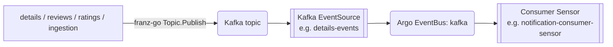
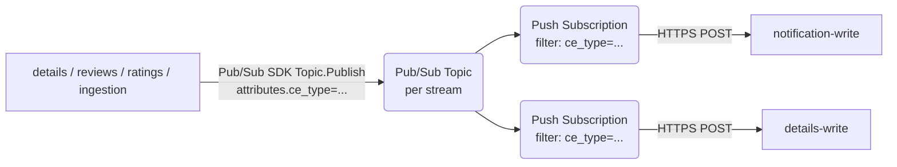
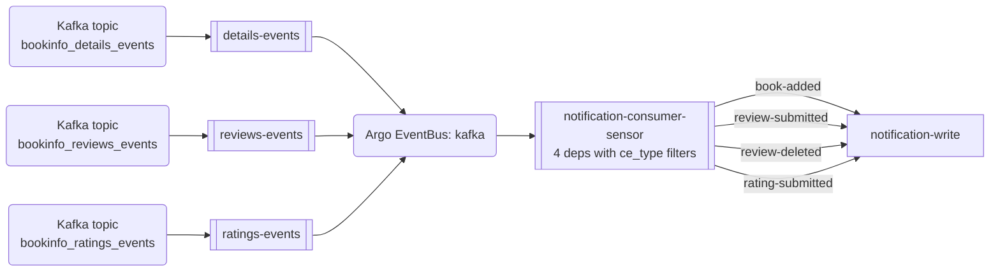
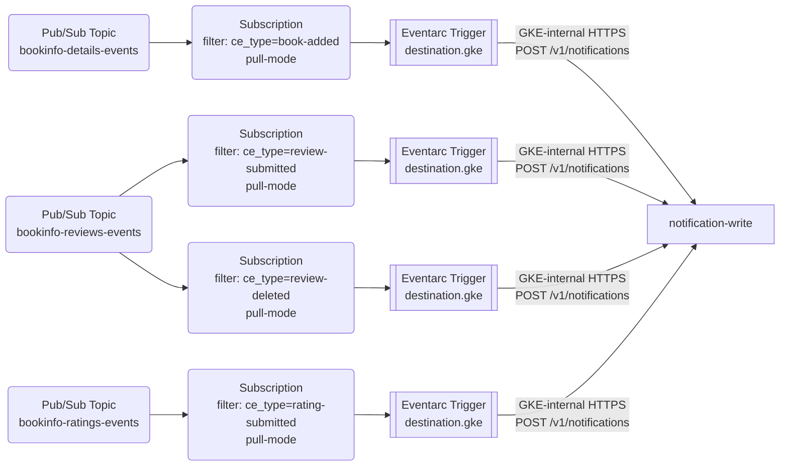

# Events Catalog — Exposed and Consumed

How services publish to and consume from named event streams (`events.exposed` / `events.consumed`), today and on GCP.

## Today — `events.exposed`

Producers publish to Kafka topics directly via franz-go (in-process Kafka client). The chart's `events.exposed` map renders one Kafka-type EventSource per producer to bridge the topic into the Argo EventBus, so downstream Sensors can depend on `eventSourceName` + `eventName` instead of subscribing to Kafka directly.



Live inventory (verified 2026-04-27):

| Producer | Kafka topic | Kafka EventSource (`events.exposed`) |
|---|---|---|
| details | `bookinfo_details_events` | `details-events` |
| reviews | `bookinfo_reviews_events` | `reviews-events` |
| ratings | `bookinfo_ratings_events` | `ratings-events` |
| ingestion | `raw_books_details` | `ingestion-raw-books-details` |

The Kafka EventSource is the broker-to-EventBus bridge. There is no GCP equivalent — Pub/Sub Subscriptions attach directly to a Topic. The `events.exposed` config has no analogue in the GCP design; producers and consumers communicate through the Topic itself.

## Alternative — Pub/Sub Topic per stream

The producer service uses the Pub/Sub Go client (`cloud.google.com/go/pubsub`) and publishes to a Pub/Sub Topic. There is no separate "EventSource" object — the Topic is the publish surface and the subscribe surface.



Two topology options for the topic→stream mapping:

- **One topic per logical stream** (mirrors today: `bookinfo_details_events` → `details-events` Pub/Sub topic). Subscribers filter by `ce_type` attribute.
- **One topic per ce_type** (more granular). Subscribers don't need a filter expression; just attach. This collapses the filter complexity but multiplies the Topic count and IAM bindings.

The doc uses the per-stream model in examples because it matches today's Kafka topology and keeps Topic count comparable.

### Crossplane resources (details-events example)

```yaml
# upbound/provider-gcp@v2.5.0
apiVersion: pubsub.gcp.upbound.io/v1beta1
kind: Topic
metadata:
  name: bookinfo-details-events
spec:
  forProvider:
    messageRetentionDuration: 604800s
  providerConfigRef:
    name: gcp-default
---
apiVersion: cloudplatform.gcp.upbound.io/v1beta1
kind: ServiceAccount
metadata:
  name: details-publisher
spec:
  forProvider:
    accountId: details-publisher
    displayName: details producer identity
  providerConfigRef:
    name: gcp-default
---
apiVersion: pubsub.gcp.upbound.io/v1beta1
kind: TopicIAMMember
metadata:
  name: details-publisher-binding
spec:
  forProvider:
    topicRef:
      name: bookinfo-details-events
    role: roles/pubsub.publisher
    member: serviceAccount:details-publisher@<PROJECT_ID>.iam.gserviceaccount.com
  providerConfigRef:
    name: gcp-default
---
apiVersion: iam.gcp.upbound.io/v1beta1
kind: ServiceAccountIAMMember
metadata:
  name: details-publisher-wi
spec:
  forProvider:
    serviceAccountIdRef:
      name: details-publisher
    role: roles/iam.workloadIdentityUser
    member: serviceAccount:<PROJECT_ID>.svc.id.goog[bookinfo/details]
  providerConfigRef:
    name: gcp-default
```

KSA annotation on the chart-managed `details` ServiceAccount:

```yaml
metadata:
  annotations:
    iam.gke.io/gcp-service-account: details-publisher@<PROJECT_ID>.iam.gserviceaccount.com
```

## Today — `events.consumed`

The consumer service declares one or more dependencies on an existing Kafka EventSource, optionally filtering by CloudEvents `ce_type`. The chart renders one Consumer Sensor per service that aggregates all consumed events into a single CR.



Live `notification-consumer-sensor` dependencies (verified 2026-04-27):

| Dependency name | EventSource.eventName | ce_type filter |
|---|---|---|
| `book-added-dep` | `details-events.events` | `com.bookinfo.details.book-added` |
| `review-submitted-dep` | `reviews-events.events` | `com.bookinfo.reviews.review-submitted` |
| `review-deleted-dep` | `reviews-events.events` | `com.bookinfo.reviews.review-deleted` |
| `rating-submitted-dep` | `ratings-events.events` | `com.bookinfo.ratings.rating-submitted` |

Fan-in cost: **1 Sensor CR with 4 dependencies and 4 triggers**. Adding a 5th ce_type adds two YAML entries and zero new CRs.

The other consumer Sensor in the cluster, `details-consumer-sensor`, has 1 dependency (`ingestion-raw-books-details`, no ce_type filter) and is shown in [`04-ingestion-producer.md`](04-ingestion-producer.md).

## Alternative — Per-ce_type Subscriptions delivered via Eventarc

Pub/Sub push subscriptions deliver over the public internet — they cannot reach an in-cluster GKE service through the VPC. The supported pattern for internal delivery is **Eventarc** with `destination.gke`, which provisions a GKE-internal forwarder and routes traffic privately.

Pub/Sub Subscription `filter` expressions still do the per-ce_type filtering, but the Subscription is **pull-mode only** (no `pushConfig`). An Eventarc Trigger references that Subscription via `transport.pubsub.subscriptionRef` and dispatches to the in-cluster service via its GKE destination.

To replicate the notification fan-in: four Subscriptions (each with a ce_type filter) plus four Eventarc Triggers, each routing to `notification-write`.



Fan-in cost: **4 Subscriptions** + **4 Eventarc Triggers** + **4 IAM `roles/pubsub.subscriber` bindings** + **1 GSA for the Eventarc invoker identity** (with `roles/eventarc.eventReceiver`) + **1 KSA annotation**. Adding a 5th ce_type adds 1 Subscription + 1 Trigger + 1 IAM binding.

(One-time per cluster: the Eventarc GKE destination feature must be enabled and the in-cluster forwarder must be deployed. This is set up once per project/cluster, not per consumer.)

### Crossplane resources (one Subscription + Eventarc Trigger example: book-added → notification)

```yaml
# upbound/provider-gcp@v2.5.0
apiVersion: cloudplatform.gcp.upbound.io/v1beta1
kind: ServiceAccount
metadata:
  name: notification-subscriber
spec:
  forProvider:
    accountId: notification-subscriber
    displayName: notification consumer / Eventarc invoker identity
  providerConfigRef:
    name: gcp-default
---
apiVersion: pubsub.gcp.upbound.io/v1beta1
kind: Subscription
metadata:
  name: notification-book-added
spec:
  forProvider:
    topicRef:
      name: bookinfo-details-events
    filter: 'attributes.ce_type = "com.bookinfo.details.book-added"'
    ackDeadlineSeconds: 30
    retryPolicy:
      minimumBackoff: 2s
      maximumBackoff: 60s
    deadLetterPolicy:
      deadLetterTopicRef:
        name: bookinfo-dlq
      maxDeliveryAttempts: 5
    # No pushConfig — pull-mode subscription consumed by Eventarc.
  providerConfigRef:
    name: gcp-default
---
apiVersion: pubsub.gcp.upbound.io/v1beta1
kind: SubscriptionIAMMember
metadata:
  name: notification-book-added-binding
spec:
  forProvider:
    subscriptionRef:
      name: notification-book-added
    role: roles/pubsub.subscriber
    member: serviceAccount:notification-subscriber@<PROJECT_ID>.iam.gserviceaccount.com
  providerConfigRef:
    name: gcp-default
---
apiVersion: eventarc.gcp.upbound.io/v1beta1
kind: Trigger
metadata:
  name: notification-book-added
spec:
  forProvider:
    location: <REGION>
    matchingCriteria:
      - attribute: type
        value: google.cloud.pubsub.topic.v1.messagePublished
    transport:
      pubsub:
        subscriptionRef:
          name: notification-book-added
    destination:
      gke:
        cluster: bookinfo-cluster
        location: <REGION>
        namespace: bookinfo
        service: notification-write
        path: /v1/notifications
    serviceAccountRef:
      name: notification-subscriber
  providerConfigRef:
    name: gcp-default
```

The remaining three ce_types (`review-submitted`, `review-deleted`, `rating-submitted`) each get a near-identical Subscription + IAMMember + Trigger trio. The GSA and DLQ Topic are reused across all four.

`destination.gke` routes traffic through Eventarc's GKE-internal forwarder — no public ingress, no public DNS. Filtering on `attributes.ce_type` happens at the Subscription layer (server-side) because Eventarc's `matchingCriteria` cannot inspect Pub/Sub message attributes; it only matches on the CloudEvent envelope's `type` (which is the same `messagePublished` value for every message on the topic).

## Side-by-side resources

For exposing one event:

| Resource | Argo Events | Pub/Sub + Eventarc | Notes |
|---|---|---|---|
| Topic / stream | Kafka topic (auto-created by broker on first publish) | Pub/Sub Topic (Crossplane `Topic`) | Argo side has no provisioning artifact for the topic; GCP side does |
| Bus bridge | Kafka EventSource CR | n/a | GCP has no equivalent construct |
| Producer identity | Chart KSA (in-cluster) | GSA + IAM publisher binding + KSA annotation | |
| Producer SDK | franz-go (Kafka client) | `cloud.google.com/go/pubsub` | |

For consuming one event with a ce_type filter:

| Resource | Argo Events | Pub/Sub + Eventarc | Notes |
|---|---|---|---|
| Filter | Sensor `filters.data.path: headers.ce_type` (in-Sensor) | `Subscription.filter` expression on `attributes.ce_type` (managed-side) | |
| Routing rule | Sensor dependency + trigger entry | Pull-mode Subscription + Eventarc Trigger with `destination.gke` | Push-mode Pub/Sub can't reach in-cluster services privately |
| Aggregation | One Sensor CR per consumer service, N dependencies | One Subscription + one Eventarc Trigger per ce_type | argo collapses, GCP fans out |
| Identity | Chart KSA | GSA + WI binding for the Eventarc invoker (also `roles/eventarc.eventReceiver`) | |
| IAM binding for delivery | n/a (in-cluster RBAC) | `roles/pubsub.subscriber` on Subscription (per ce_type) | |

## Tradeoffs

- **Filter location matters for cost.** Argo's Sensor filter runs in-cluster after the message arrives at the EventBus, so unmatched messages still cross the bus. Pub/Sub's Subscription filter runs server-side — unmatched messages don't get delivered and don't cost ack/nack budget. For high-volume topics with low-match consumers, this is a real win for GCP.
- **Subscription + Trigger explosion vs Sensor multiplexing.** N ce_types in one consumer = 1 Argo Sensor or N (Subscription + Eventarc Trigger) pairs on GCP. The Sensor change is "add 2 YAML entries"; the GCP change is "add 1 Subscription + 1 Eventarc Trigger + 1 IAM binding per ce_type". Adding a 5th notification ce_type today is ~5 lines of values change; on GCP it's three fresh Crossplane manifests.
- **The Kafka EventSource bridge has no analogue.** This collapses a layer in the GCP design: producers publish straight to the Topic, consumers subscribe straight to the Topic. One less concept to learn, one less CR per producer.
- **Pub/Sub `filter` expression syntax has limits.** No nested attribute paths, no string functions. The four current notification ce_types are exact matches and translate cleanly; if you ever need prefix matching (e.g. `ce_type starts_with "com.bookinfo.reviews."`), you'll need to either flatten the attribute set, fan out further, or filter app-side.

The macro architecture is roughly a wash, with one nuance: the events catalog pattern is the place where Pub/Sub's lack of a "bus" object actually simplifies the topology. The Kafka EventSource exists in argo because the EventBus is a separate primitive from Kafka; Pub/Sub merges them.
