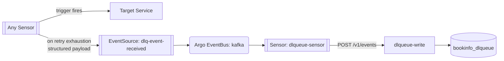
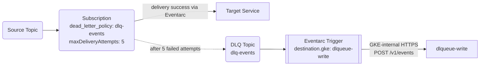

# Dead-Letter Queue — `dlqTrigger` vs `dead_letter_policy`

How failed deliveries land in dlqueue today and what the GCP-native equivalent looks like.

## Today — `dlqTrigger` to dlqueue

Every Argo Sensor trigger automatically renders a `dlqTrigger` block when `sensor.dlq.enabled: true` (default). On retry exhaustion, the Sensor POSTs a structured payload to the `dlq-event-received` webhook EventSource, which forwards into the EventBus and lands at `dlqueue-write` via `dlqueue-sensor`.



The `dlqTrigger` payload includes:

- `original_payload`, `original_headers` — the message that failed
- CloudEvents context keys: `event_id`, `event_type`, `event_source`, `event_subject`, `event_timestamp`, `datacontenttype`
- Sensor-side metadata: `sensor_name`, `failed_trigger`, `eventsource_url` (or `eventsource_name`), `namespace`

Dedup key on the dlqueue side: `SHA-256(sensor_name + failed_trigger + payload)`. State machine: `pending → replayed → resolved / poisoned`.

Resource cost: **0 new resources per consumer** to enable DLQ. The trigger renders inside the existing Sensor.

## Alternative — Subscription `dead_letter_policy` + Eventarc delivery

GCP-native DLQ is configured per Subscription. After `maxDeliveryAttempts` failures (subject to `Subscription.retryPolicy`), the Pub/Sub service agent re-publishes the message to a designated DLQ Topic. The DLQ Topic is then delivered to `dlqueue-write` via an Eventarc Trigger with `destination.gke` (Pub/Sub push subscriptions cannot reach in-cluster GKE services privately).



Resource cost per consumer that wants DLQ enabled: 1 `dead_letter_policy` field on its Subscription. One-time per project: 1 DLQ Topic + 1 Eventarc Trigger from the DLQ Topic to `dlqueue-write` + IAM binding granting `roles/pubsub.publisher` on the DLQ Topic to the project's Pub/Sub service agent (`service-<project-number>@gcp-sa-pubsub.iam.gserviceaccount.com`) + 1 GSA for the Eventarc invoker.

### Crossplane resources (DLQ Topic + project-wide IAM + Eventarc delivery)

```yaml
# upbound/provider-gcp@v2.5.0
apiVersion: pubsub.gcp.upbound.io/v1beta1
kind: Topic
metadata:
  name: bookinfo-dlq
spec:
  forProvider:
    messageRetentionDuration: 604800s
  providerConfigRef:
    name: gcp-default
---
apiVersion: pubsub.gcp.upbound.io/v1beta1
kind: TopicIAMMember
metadata:
  name: bookinfo-dlq-pubsub-agent-publisher
spec:
  forProvider:
    topicRef:
      name: bookinfo-dlq
    role: roles/pubsub.publisher
    member: serviceAccount:service-<PROJECT_NUMBER>@gcp-sa-pubsub.iam.gserviceaccount.com
  providerConfigRef:
    name: gcp-default
---
apiVersion: cloudplatform.gcp.upbound.io/v1beta1
kind: ServiceAccount
metadata:
  name: dlqueue-eventarc-invoker
spec:
  forProvider:
    accountId: dlqueue-eventarc-invoker
    displayName: Eventarc invoker for dlqueue-write
  providerConfigRef:
    name: gcp-default
---
apiVersion: eventarc.gcp.upbound.io/v1beta1
kind: Trigger
metadata:
  name: bookinfo-dlq-to-dlqueue
spec:
  forProvider:
    location: <REGION>
    matchingCriteria:
      - attribute: type
        value: google.cloud.pubsub.topic.v1.messagePublished
    transport:
      pubsub:
        topicRef:
          name: bookinfo-dlq
    destination:
      gke:
        cluster: bookinfo-cluster
        location: <REGION>
        namespace: bookinfo
        service: dlqueue-write
        path: /v1/events
    serviceAccountRef:
      name: dlqueue-eventarc-invoker
  providerConfigRef:
    name: gcp-default
```

Each consumer Subscription that wants DLQ adds (in its own manifest):

```yaml
spec:
  forProvider:
    deadLetterPolicy:
      deadLetterTopicRef:
        name: bookinfo-dlq
      maxDeliveryAttempts: 5
```

## Side-by-side

| Resource | Argo Events | Pub/Sub + Eventarc |
|---|---|---|
| Per-consumer DLQ enablement | `sensor.dlq.enabled: true` (1 boolean, default true) | `deadLetterPolicy` block on each Subscription |
| Shared DLQ destination | `dlq-event-received` EventSource (1 cluster-wide) | DLQ Topic (1 cluster-wide) |
| DLQ delivery path | Sensor → EventSource → Bus → dlqueue-sensor → dlqueue-write | DLQ Topic → Eventarc Trigger (`destination.gke`) → dlqueue-write |
| Payload enrichment | Sensor adds `sensor_name`, `failed_trigger`, etc. via `payload` mapping | Pub/Sub forwards original message; metadata goes in attributes (`googclient_deliveryattempt`, original Subscription path) |
| Per-Subscription IAM | n/a (in-cluster RBAC) | `roles/pubsub.publisher` for the Pub/Sub service agent on the DLQ Topic |

## Tradeoffs

- **Payload shape changes.** Argo enriches the failed message with sensor-side metadata before it lands at dlqueue. Pub/Sub forwards the original message as-is and adds metadata only as Pub/Sub attributes. The current dlqueue dedup key (`sensor_name + failed_trigger + payload`) doesn't translate directly: the GCP equivalent would dedup on `(subscription_name, message_id, payload)` or carry the same metadata as Pub/Sub attributes deliberately added by the publisher. Migrating dlqueue to GCP would require reshaping the DLQ message contract.
- **Default-on vs opt-in.** Argo's chart defaults `sensor.dlq.enabled: true` — every consumer gets DLQ for free. Pub/Sub's `deadLetterPolicy` is an explicit field per Subscription; the chart-equivalent would have to render it by default for parity.
- **One DLQ Topic vs one DLQ EventSource.** Both stacks centralize the dead-letter destination. The big difference is the IAM ceremony around granting the Pub/Sub service agent rights to publish into the DLQ Topic — a one-time setup, but one more identity to track.
- **0 vs >0 new resources to enable DLQ on a new consumer.** Argo: 0. GCP: 1 `deadLetterPolicy` block + 1 IAM binding (already in place if the DLQ is reused). The argo wins here is real.
