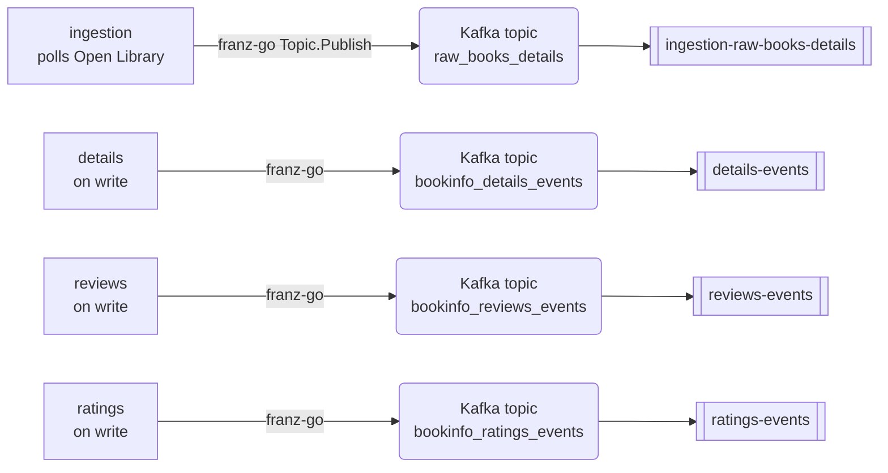
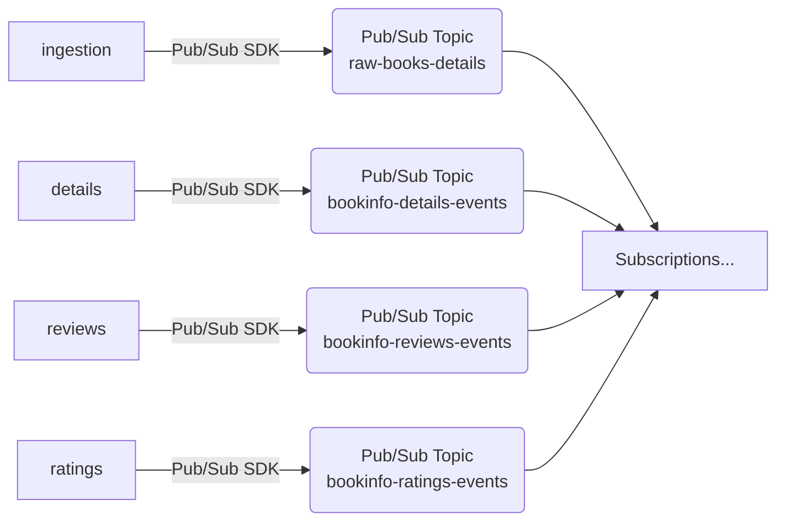

# Producer-Side — Ingestion and In-Cluster Producers

How services publish events (ingestion polling Open Library, details/reviews/ratings emitting their own streams), today and on GCP.

## Today — In-cluster producers

Four producers in the cluster, each publishing to a Kafka topic via franz-go. The chart's `events.exposed` map renders one Kafka EventSource per producer for downstream consumption.



| Producer | Topic | Kafka EventSource | Trigger |
|---|---|---|---|
| ingestion | `raw_books_details` | `ingestion-raw-books-details` | poll-on-interval (`POLL_INTERVAL`) |
| details | `bookinfo_details_events` | `details-events` | on successful write |
| reviews | `bookinfo_reviews_events` | `reviews-events` | on successful write |
| ratings | `bookinfo_ratings_events` | `ratings-events` | on successful write |

ingestion is the standout case: stateless, single Deployment (no CQRS split), no inbound HTTP at all — it polls and emits. The other three producers emit as a side effect of CQRS write handling.

Per-producer cost: 1 Kafka topic (Strimzi `KafkaTopic`) + 1 Kafka EventSource (CR). The franz-go client does the work; no separate adapter needed.

## Alternative — Pub/Sub publish via SDK with Workload Identity

The producer service uses `cloud.google.com/go/pubsub` to publish straight to a Pub/Sub Topic. Authentication via GKE Workload Identity (the KSA the chart already creates is annotated with the GSA email; the GSA holds `roles/pubsub.publisher` on the Topic).



The `events.exposed` bridge collapses entirely: subscribers attach directly to the Topic. Producers don't know about subscribers.

Per-producer cost: 1 Pub/Sub Topic + 1 GSA + 1 `TopicIAMMember` (`roles/pubsub.publisher`) + 1 `ServiceAccountIAMMember` (`roles/iam.workloadIdentityUser` on the GSA for the KSA principal) + 1 KSA annotation on the chart-managed ServiceAccount.

### Crossplane resources (ingestion example)

See [`02-events-catalog.md`](02-events-catalog.md#crossplane-resources-details-events-example) for the full pattern. ingestion's manifest is the same shape, with `metadata.name` and the GSA name swapped:

```yaml
# upbound/provider-gcp@v2.5.0
apiVersion: pubsub.gcp.upbound.io/v1beta1
kind: Topic
metadata:
  name: raw-books-details
spec:
  forProvider:
    messageRetentionDuration: 604800s
---
apiVersion: cloudplatform.gcp.upbound.io/v1beta1
kind: ServiceAccount
metadata:
  name: ingestion-publisher
spec:
  forProvider:
    accountId: ingestion-publisher
---
apiVersion: pubsub.gcp.upbound.io/v1beta1
kind: TopicIAMMember
metadata:
  name: ingestion-publisher-binding
spec:
  forProvider:
    topicRef:
      name: raw-books-details
    role: roles/pubsub.publisher
    member: serviceAccount:ingestion-publisher@<PROJECT_ID>.iam.gserviceaccount.com
---
apiVersion: iam.gcp.upbound.io/v1beta1
kind: ServiceAccountIAMMember
metadata:
  name: ingestion-publisher-wi
spec:
  forProvider:
    serviceAccountIdRef:
      name: ingestion-publisher
    role: roles/iam.workloadIdentityUser
    member: serviceAccount:<PROJECT_ID>.svc.id.goog[bookinfo/ingestion]
```

(`providerConfigRef: name: gcp-default` is implied for all four — omitted for brevity.)

## Side-by-side resources for one producer

| Resource | Argo Events | Pub/Sub + Eventarc | Notes |
|---|---|---|---|
| Stream object | Strimzi `KafkaTopic` | `Topic` (Pub/Sub) | 1:1 |
| Bus bridge | Kafka EventSource CR | n/a | Removed |
| Producer SDK | franz-go | `cloud.google.com/go/pubsub` | |
| Producer identity | Chart KSA | GSA + WI binding + IAM publisher binding + KSA annotation | |
| Total provisioned | 2 (KafkaTopic + EventSource) | 4 (Topic + GSA + IAMMember + WI binding) + 1 KSA annotation | argo: 2 / GCP: 4 + annotation |

## Tradeoffs

- **Schema enforcement.** Today: none — Kafka topics are byte streams; producers and consumers agree by convention. GCP wins on this axis: Pub/Sub Schemas (Avro / Protobuf) attach to a Topic and reject mismatched publishes. If the project ever wants typed contracts, this is essentially free on Pub/Sub and a build-it-yourself effort on Kafka.
- **Idempotent publish.** Kafka producer idempotence is a client config flag (`enable.idempotence=true`), already a common franz-go default. Pub/Sub is at-least-once; ordering keys give per-key in-order delivery. Either stack lets the consumer dedup by `idempotency_key`, which is what the bookinfo write services already do.
- **Identity overhead.** Today the chart KSA is sufficient — Kafka in-cluster has no GCP-side identity. GCP adds GSA + IAM publisher binding + WI binding + KSA annotation per producer. For four producers, that's 16 GCP-side artifacts (4 each) plus 4 KSA annotations.
- **Observability.** The franz-go producer span is already hooked into the OTel pipeline today. The Pub/Sub Go client emits its own OpenTelemetry spans; correlating them with downstream subscriber spans needs the standard `googclient_*` propagation. Roughly equivalent — both stacks integrate cleanly with the project's existing OTel setup.
