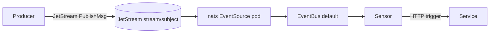

# NATS JetStream EventBus in event-driven-bookinfo

This document covers how the NATS JetStream path works in this repository.
For the Kafka alternative, see [`kafka-eventbus.md`](./kafka-eventbus.md).

## Cluster topology

`make run-k8s eventbus=jetstream` creates a k3d cluster named
`bookinfo-jetstream-local` with these `platform`-namespace components:

- **cert-manager** (`jetstack/cert-manager v1.16.2`) — issues TLS certificates
  for the NATS server.
- **NATS server** (Helm chart `nats-io/nats`, tag `2.10-alpine`, JetStream enabled,
  file store on emptyDir, TLS required) — exposes a `Service` at
  `nats.platform.svc.cluster.local:4222`.
- **`nats-client-token` Secret** (mirrored into both `platform` and `bookinfo`
  namespaces) — three-key secret holding the shared basic-auth credentials.
- **Argo Events controller** (same custom CRDs from `argoproj/argo-events#3961`+`#3983`
  as the kafka cluster).
- **EventBus CR** named `default`, `spec.jetstreamExotic.url` pointing at NATS,
  `accessSecret` referencing the auth YAML key in the token secret.

## EventBus shape

```yaml
apiVersion: argoproj.io/v1alpha1
kind: EventBus
metadata:
  name: default
  namespace: bookinfo
spec:
  jetstreamExotic:
    url: nats://nats.platform.svc.cluster.local:4222
    accessSecret:
      name: nats-client-token
      key: auth.yaml
    streamConfig: ""
```

Source: `deploy/platform/local/jetstream/eventbus-jetstream.yaml`.

We use `jetstreamExotic` (pointing at our own NATS deployment) rather than
`jetstream` (which would have Argo Events provision an embedded NATS). This
gives an explicit, inspectable topology: the NATS server, its streams, and
the connected clients are all visible via the `nats` CLI or the built-in
NATS monitoring HTTP endpoint.

## Why basic auth, not token

Argo Events' `jetstreamExotic` driver hardcodes `AuthStrategyBasic` whenever
an `accessSecret` is configured. The relevant logic lives in
`pkg/eventbus/driver.go` (`GetAuth` function) in the fork: if `accessSecret`
is present, the driver unmarshals the file into `AuthCredential{Token,
Username, Password}` and returns strategy `Basic` — token-only strategy is
never reached through this code path. As a result, the NATS server must be
configured for username/password auth, and application producers must also
use `nats.UserInfo()`. There is no way to use a bare token with the
`jetstreamExotic` EventBus type.

## Why TLS is required

The same `jetstreamExotic` driver unconditionally wraps the NATS connection
in `nats.Secure()` at connection time. When no explicit client TLS config is
provided, it falls back to `InsecureSkipVerify=true`. The consequence: the
NATS server **must** speak TLS or every Argo Events pod (EventBus controller,
EventSource, Sensor) fails with "secure connection not available". There is
no flag to disable this behaviour without modifying the fork.

## TLS via cert-manager

A namespace-scoped `Issuer` (`nats-selfsigned`, type `selfSigned`) and a
`Certificate` (`nats-server-tls`) are installed alongside the NATS chart:

```yaml
# deploy/platform/local/jetstream/nats-tls.yaml (excerpt)
apiVersion: cert-manager.io/v1
kind: Certificate
metadata:
  name: nats-server-tls
  namespace: platform
spec:
  secretName: nats-server-tls
  issuerRef:
    name: nats-selfsigned
    kind: Issuer
  dnsNames:
    - nats.platform.svc.cluster.local
    - nats.platform.svc
    - nats.platform
    - nats
    - localhost
```

cert-manager generates the `nats-server-tls` Secret; the NATS Helm chart
consumes it via `config.nats.tls.enabled: true` and
`config.nats.tls.secretName: nats-server-tls`.

Application producer pods connect with `NATS_TLS_INSECURE=true`, which the
chart wires to `nats.Secure(&tls.Config{InsecureSkipVerify: true})` in
`pkg/eventsmessaging/natspub/producer.go`. This is suitable for local dev
only — in any non-local environment, set `tlsInsecure: false` and provide a
valid CA bundle.

## Exposed-event flow



The producer publishes a NATS JetStream message with these headers
(dash convention, per the NATS/HTTP header naming spec):

```
ce-specversion   ce-type   ce-source   ce-id   ce-time   ce-subject   content-type   traceparent
```

## NATS EventSource (not jetstream)

Argo Events does not have a `jetstream:` EventSource type. JetStream subjects
are consumed via the `nats:` EventSource, which creates a NATS pub/sub
subscription on the configured subject. Because JetStream subjects are
addressable via standard NATS pub/sub, this works transparently — the
EventSource pod receives messages delivered by JetStream and forwards them
into the EventBus. The chart template is
`charts/bookinfo-service/templates/nats-eventsource.yaml`, rendered only when
`events.bus.type=jetstream`.

NATS EventSource auth uses separate `username` and `password`
`SecretKeySelector` entries (not a single `accessSecret` like the EventBus):

```yaml
spec:
  nats:
    <eventName>:
      url: nats://nats.platform.svc.cluster.local:4222
      subject: <topic>
      jsonBody: true
      auth:
        basic:
          username: { name: nats-client-token, key: username }
          password: { name: nats-client-token, key: password }
      tls:
        enabled: true
        insecureSkipVerify: true
```

## Stream creation semantics

Unlike Strimzi+Kafka, JetStream does not auto-create streams on publish.
`pkg/eventsmessaging/natspub/producer.go` calls `ensureStream` on startup
using the legacy `nats.JetStreamContext.AddStream` API and tolerates
`nats.ErrStreamNameAlreadyInUse`. The stream name and publish subject are
equal (e.g. both `raw_books_details`).

If a future iteration switches to per-domain shared streams (e.g.
`bookinfo.>` subjects), the platform should manage streams declaratively and
remove the producer-side ensure step.

## Auth secret keys

`deploy/platform/local/jetstream/nats-token-secret.yaml` creates the
`nats-client-token` Secret in both `platform` and `bookinfo` namespaces with
three keys:

| Key | Format | Consumer |
|-----|--------|---------|
| `username` | raw string | App pods — mounted as `NATS_USER` env via `valueFrom.secretKeyRef` |
| `password` | raw string | App pods — mounted as `NATS_PASSWORD` env via `valueFrom.secretKeyRef` |
| `auth.yaml` | YAML (`username: bookinfo\npassword: local-dev-secret`) | Argo Events EventBus `accessSecret` reference (`key: auth.yaml`). Argo Events mounts the value at `/etc/eventbus/auth/auth.yaml` and Viper-unmarshals it into `AuthCredential{Token, Username, Password}`. A raw string fails unmarshal; the YAML structure is required. |

The NATS EventSource uses the `username` and `password` keys directly (separate
`SecretKeySelector` references), not `auth.yaml`. The EventBus uses `auth.yaml`.
Application pods use `username` + `password` as individual env vars. All
consumers share the same credentials; the three representations exist because
each consumer expects a different file/env shape.

## Sensor filter path divergence

The filter path used to match CloudEvent type differs by bus because the two
EventSource types serialise headers differently:

| Bus | Filter path | Reason |
|-----|------------|--------|
| `kafka` | `headers.ce_type` | kafka EventSource serialises headers as `map[string]string` under `headers`; kafka header convention uses underscores |
| `jetstream` | `header.ce-type.0` | nats EventSource serialises `nats.Header` (a `map[string][]string`) under `header`; gjson array index `.0` selects the first element; NATS/HTTP header convention uses dashes |

`charts/bookinfo-service/templates/consumer-sensor.yaml` branches on
`{{ eq .Values.events.bus.type "jetstream" }}` to emit the correct path. Any
service consuming events from both buses would need separate Sensor manifests.

## ConfigMap + secret env wiring

When `events.bus.type=jetstream`, the chart emits these env vars:

| Env var | Source | Value |
|---------|--------|-------|
| `EVENT_BACKEND` | ConfigMap | `jetstream` |
| `NATS_URL` | ConfigMap | `events.jetstream.url` value |
| `NATS_USER` | Secret (`valueFrom.secretKeyRef`) | `nats-client-token` key `username` |
| `NATS_PASSWORD` | Secret (`valueFrom.secretKeyRef`) | `nats-client-token` key `password` |
| `NATS_TLS_INSECURE` | Pod spec env literal | `events.jetstream.tlsInsecure` value |

`cmd/main.go` reads `EVENT_BACKEND` to select the publisher, then passes
`NATS_URL`, `NATS_USER`, `NATS_PASSWORD`, and `NATS_TLS_INSECURE` to
`natspub.NewProducer`.

## Tracing requires the argo-events fork patch

Standard upstream Argo Events has trace-context propagation on the Kafka
EventSource side (added via PR `#3983`), but does not propagate `traceparent`
from NATS message headers. The JetStream path requires three additional commits
on the `feat/cloudevents-compliance-otel-tracing` fork branch:

1. A `WithNATSHeaders` option in `pkg/eventsources/common/common.go` that
   extracts `traceparent` from a `nats.Header` map, supporting both lowercase
   and Title-cased key variants.
2. NATS EventSource `start.go` calling `dispatch` with
   `WithNATSHeaders(msg.Header)` so the trace context travels from the NATS
   message into the Argo Events dispatch pipeline.
3. A `eventsource.consume` CONSUMER span wrapping dispatch, with messaging
   semconv attributes (`messaging.system=nats`,
   `messaging.destination.name=<subject>`, `messaging.operation.type=receive`).

The fork branch was rebased on `argoproj:master`, and the image was rebuilt
and pushed:

```
ghcr.io/kaio6fellipe/argo-events:prs-3961-3983
sha256:b82199f39c739e66931bf840c7938494e2268f1f82629a0842065c7277bca1ab
  linux/amd64: sha256:5a4af10e...
  linux/arm64: sha256:768d7e97...
```

Without this patched image, distributed traces will have broken spans at the
NATS EventSource → Sensor boundary.

## Where to look

- `pkg/eventsmessaging/natspub/producer.go` — Go producer (nats.go JetStream,
  CloudEvents-binary headers, `ensureStream`, basic auth, TLS).
- `pkg/eventsmessaging/publisher.go` — shared `Publisher` interface.
- `charts/bookinfo-service/templates/nats-eventsource.yaml` — NATS EventSource
  template (gated on `bus.type=jetstream`).
- `charts/bookinfo-service/templates/consumer-sensor.yaml` — Sensor filter path
  branches on `events.bus.type`.
- `charts/bookinfo-service/templates/configmap.yaml` — `EVENT_BACKEND` + `NATS_URL`.
- `charts/bookinfo-service/templates/deployment.yaml` — `NATS_USER`, `NATS_PASSWORD`,
  `NATS_TLS_INSECURE` env injected from secret.
- `charts/bookinfo-service/values.yaml` — `events.jetstream.tokenSecret` schema.
- `deploy/platform/local/jetstream/` — NATS Helm values, token secret, cert-manager
  TLS manifest, EventBus CR.

## References

- [Argo Events NATS EventSource](https://argoproj.github.io/argo-events/eventsources/setup/nats/)
- [Argo Events jetstreamExotic EventBus](https://argoproj.github.io/argo-events/eventbus/jetstream/)
- [nats.go JetStream API](https://pkg.go.dev/github.com/nats-io/nats.go)
- [NATS JetStream concepts](https://docs.nats.io/nats-concepts/jetstream)
- [cert-manager](https://cert-manager.io/docs/)
- [nats-io/nats Helm chart](https://github.com/nats-io/k8s/tree/main/helm/charts/nats)
