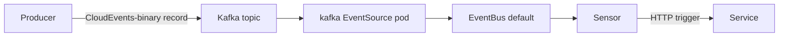

# Kafka EventBus in event-driven-bookinfo

This document covers how the Kafka path works in this repository. For the
NATS JetStream alternative, see [`jetstream-eventbus.md`](./jetstream-eventbus.md).

## Cluster topology

`make run-k8s eventbus=kafka` (the default) creates a k3d cluster named
`bookinfo-kafka-local` with these `platform`-namespace components:

- **Strimzi operator** (`strimzi/strimzi-kafka-operator`) — manages Kafka CRs.
- **Kafka cluster** (`Kafka` CR `bookinfo-kafka`, KRaft single-node) — exposes a
  bootstrap service at `bookinfo-kafka-kafka-bootstrap.platform.svc.cluster.local:9092`.
- **Argo Events controller** (with custom CRDs from `argoproj/argo-events#3961`+`#3983`).
- **EventBus CR** named `default`, `spec.kafka.url` pointing at the bootstrap.

## EventBus shape

```yaml
apiVersion: argoproj.io/v1alpha1
kind: EventBus
metadata:
  name: default
  namespace: bookinfo
spec:
  kafka:
    url: bookinfo-kafka-kafka-bootstrap.platform.svc.cluster.local:9092
    topic: argo-events
    version: "4.2.0"
    consumerBatchMaxWait: "0"
```

Source: `deploy/platform/local/eventbus-kafka.yaml`.

## Exposed-event flow



The producer emits a CloudEvents-binary record with these Kafka headers
(underscore convention, per the Kafka header naming spec):

```
ce_specversion   ce_type   ce_source   ce_id   ce_time   ce_subject   content-type
```

The kafka EventSource (rendered from
`charts/bookinfo-service/templates/kafka-eventsource.yaml`) listens on the
topic and forwards each record into the Argo Events EventBus. The Sensor
filters on `headers.ce_type` — plural key, underscore-separated — which is
how the kafka EventSource serialises headers into the event data payload.

## ConfigMap env wiring

When `events.bus.type=kafka`, the chart emits two env vars on each pod via
`charts/bookinfo-service/templates/configmap.yaml`:

- `EVENT_BACKEND=kafka`
- `KAFKA_BROKERS=<events.kafka.broker>`

`cmd/main.go` reads these and constructs a `kafkapub.Producer`.

## Idempotency + topic creation

`pkg/eventsmessaging/kafkapub/producer.go` calls `ensureTopic` on startup
using the franz-go admin client (`kadm.CreateTopics`). It creates the topic
with `defaultPartitions=3` and `defaultReplicationFactor=1` when missing, and
silently ignores "topic already exists" / `TOPIC_ALREADY_EXISTS` errors. Strimzi's
auto-create-topics-on-produce setting provides a second layer of safety in local dev.

All write services (reviews, ratings, details, notification, dlqueue) deduplicate
on a client-supplied `idempotency_key` or a derived natural key (SHA-256 of
business fields via `pkg/idempotency`), making Kafka producer retries and DLQ
replays safe.

## Where to look

- `pkg/eventsmessaging/kafkapub/` — Go producer (franz-go, CloudEvents-binary headers).
- `pkg/eventsmessaging/publisher.go` — `Publisher` interface.
- `charts/bookinfo-service/templates/kafka-eventsource.yaml` — EventSource template.
- `charts/bookinfo-service/templates/consumer-sensor.yaml` — Sensor filter path
  branches on `events.bus.type`; kafka path uses `headers.ce_type`.
- `deploy/platform/local/eventbus-kafka.yaml` — EventBus CR.
- `deploy/platform/local/kafka-cluster.yaml`, `kafka-nodepool.yaml`,
  `strimzi-values.yaml` — Strimzi platform manifests.

## References

- [Strimzi Kafka operator](https://strimzi.io/)
- [franz-go](https://github.com/twmb/franz-go)
- [Argo Events Kafka EventSource](https://argoproj.github.io/argo-events/eventsources/setup/kafka/)
- [CloudEvents Kafka Protocol Binding](https://github.com/cloudevents/spec/blob/main/cloudevents/bindings/kafka-protocol-binding.md)
