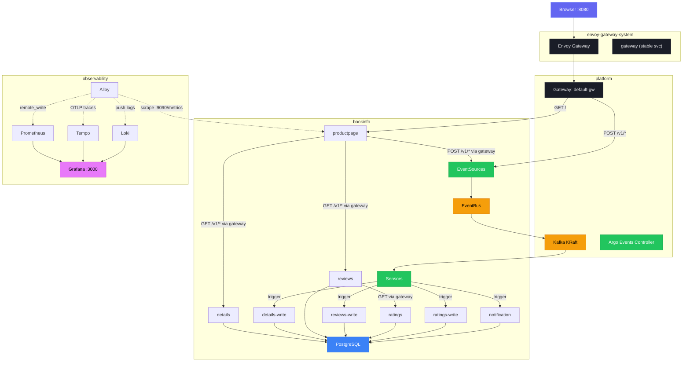
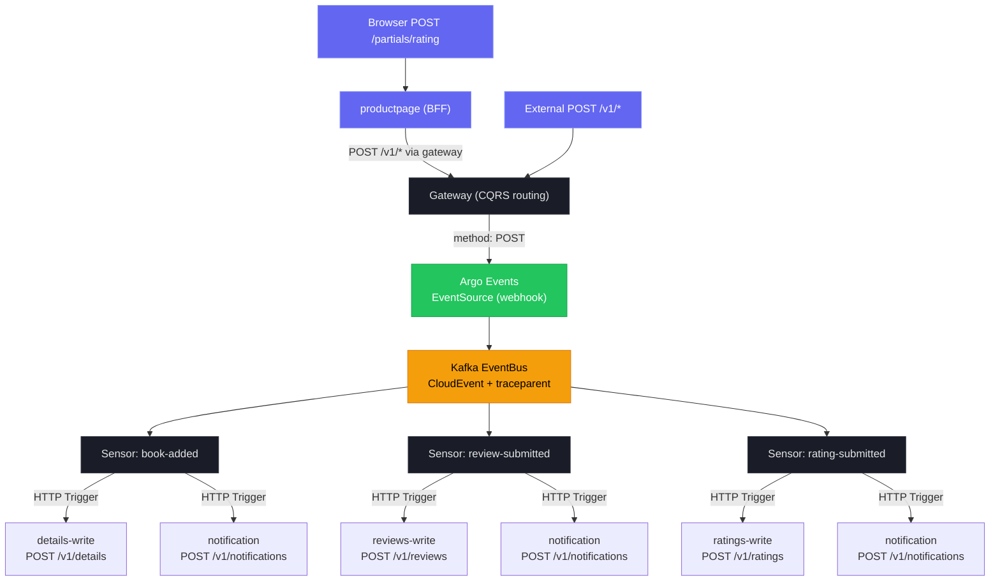

# Gateway CQRS Routing Implementation Plan

> **For agentic workers:** REQUIRED SUB-SKILL: Use superpowers:subagent-driven-development (recommended) or superpowers:executing-plans to implement this plan task-by-task. Steps use checkbox (`- [ ]`) syntax for tracking.

**Goal:** Consolidate the Envoy Gateway to a single listener with method-based CQRS routing — GET goes to read services, POST goes to EventSource webhooks (event pipeline). Services reuse existing `SERVICE_URL` env vars pointed at a stable gateway service.

**Architecture:** The Envoy Gateway becomes the CQRS routing boundary. A stable ClusterIP Service with label selectors targets the Envoy proxy pods. EventSource webhook endpoints are aligned to match service API paths. HTTPRoutes use method matching to split reads (GET → services) from writes (POST → EventSources). Productpage client code is updated to accept async 200 responses from EventSources.

**Tech Stack:** Kubernetes Gateway API, Envoy Gateway, Argo Events EventSources, Kustomize, Go net/http

**Spec:** `docs/superpowers/specs/2026-04-09-gateway-cqrs-routing-design.md`

---

## File Map

| Action | File | Responsibility |
|--------|------|----------------|
| Create | `deploy/gateway/base/gateway-service.yaml` | Stable ClusterIP Service targeting Envoy proxy pods |
| Modify | `deploy/gateway/base/gateway.yaml` | Remove `webhooks` listener |
| Modify | `deploy/gateway/base/kustomization.yaml` | Add `gateway-service.yaml` to resources |
| Modify | `deploy/gateway/overlays/local/httproutes.yaml` | Replace with method-based CQRS routing |
| Modify | `deploy/argo-events/overlays/local/eventsources/book-added.yaml` | Change endpoint `/book-added` → `/v1/details` |
| Modify | `deploy/argo-events/overlays/local/eventsources/review-submitted.yaml` | Change endpoint `/review-submitted` → `/v1/reviews` |
| Modify | `deploy/argo-events/overlays/local/eventsources/rating-submitted.yaml` | Change endpoint `/rating-submitted` → `/v1/ratings` |
| Modify | `deploy/productpage/overlays/local/configmap-patch.yaml` | Point SERVICE_URLs at gateway |
| Modify | `deploy/reviews/overlays/local/configmap-patch.yaml` | Point RATINGS_SERVICE_URL at gateway |
| Modify | `services/productpage/internal/client/ratings.go` | Accept 200 (async) in addition to 201 |
| Modify | `services/productpage/internal/client/reviews.go` | Accept 200 (async) in addition to 201 |
| Modify | `services/productpage/internal/handler/handler_test.go` | Add test cases for async 200 response |
| Modify | `Makefile` | Remove 8443 port mapping, update `k8s-status` |
| Modify | `README.md` | Update Mermaid diagrams, access URLs, EventSource docs |
| Modify | `CLAUDE.md` | Remove 8443 references, update architecture descriptions |

---

### Task 1: Create Stable Gateway Service

**Files:**

- Create: `deploy/gateway/base/gateway-service.yaml`
- Modify: `deploy/gateway/base/kustomization.yaml`

- [ ] **Step 1: Create the gateway service manifest**

```yaml
# deploy/gateway/base/gateway-service.yaml
apiVersion: v1
kind: Service
metadata:
  name: gateway
  namespace: envoy-gateway-system
  labels:
    app.kubernetes.io/name: gateway
    app.kubernetes.io/component: proxy-alias
    part-of: event-driven-bookinfo
spec:
  type: ClusterIP
  selector:
    gateway.envoyproxy.io/owning-gateway-name: default-gw
    gateway.envoyproxy.io/owning-gateway-namespace: platform
  ports:
    - name: http
      port: 80
      targetPort: 10080
```

- [ ] **Step 2: Add to kustomization**

In `deploy/gateway/base/kustomization.yaml`, add `gateway-service.yaml` to resources:

```yaml
apiVersion: kustomize.config.k8s.io/v1beta1
kind: Kustomization

resources:
  - gatewayclass.yaml
  - gateway.yaml
  - reference-grant.yaml
  - gateway-service.yaml
```

- [ ] **Step 3: Validate manifest renders**

Run:

```bash
kustomize build deploy/gateway/base/
```

Expected: Output includes the new Service with `name: gateway` in `envoy-gateway-system` namespace alongside the existing Gateway, GatewayClass, and ReferenceGrant resources.

- [ ] **Step 4: Commit**

```bash
git add deploy/gateway/base/gateway-service.yaml deploy/gateway/base/kustomization.yaml
git commit -m "feat(deploy): add stable gateway ClusterIP service for CQRS routing"
```

---

### Task 2: Remove Webhooks Listener from Gateway

**Files:**

- Modify: `deploy/gateway/base/gateway.yaml`

- [ ] **Step 1: Remove the webhooks listener**

Replace the full contents of `deploy/gateway/base/gateway.yaml` with:

```yaml
apiVersion: gateway.networking.k8s.io/v1
kind: Gateway
metadata:
  name: default-gw
  namespace: platform
spec:
  gatewayClassName: eg
  listeners:
    - name: web
      protocol: HTTP
      port: 80
      allowedRoutes:
        namespaces:
          from: All
```

- [ ] **Step 2: Validate manifest renders**

Run:

```bash
kustomize build deploy/gateway/base/ | grep -A 20 'kind: Gateway'
```

Expected: Only the `web` listener on port 80. No `webhooks` listener.

- [ ] **Step 3: Commit**

```bash
git add deploy/gateway/base/gateway.yaml
git commit -m "feat(deploy): remove webhooks listener, consolidate to single web listener"
```

---

### Task 3: Update EventSource Endpoints to Match Service API Paths

**Files:**

- Modify: `deploy/argo-events/overlays/local/eventsources/book-added.yaml`
- Modify: `deploy/argo-events/overlays/local/eventsources/review-submitted.yaml`
- Modify: `deploy/argo-events/overlays/local/eventsources/rating-submitted.yaml`

- [ ] **Step 1: Update book-added EventSource**

Replace the full contents of `deploy/argo-events/overlays/local/eventsources/book-added.yaml` with:

```yaml
apiVersion: argoproj.io/v1alpha1
kind: EventSource
metadata:
  name: book-added
  namespace: bookinfo
spec:
  eventBusName: kafka
  template:
    container:
      env:
        - name: OTEL_EXPORTER_OTLP_ENDPOINT
          value: "http://alloy-metrics-traces.observability.svc.cluster.local:4317"
        - name: OTEL_SERVICE_NAME
          value: "book-added-eventsource"
  webhook:
    book-added:
      port: "12000"
      endpoint: /v1/details
      method: POST
```

- [ ] **Step 2: Update review-submitted EventSource**

Replace the full contents of `deploy/argo-events/overlays/local/eventsources/review-submitted.yaml` with:

```yaml
apiVersion: argoproj.io/v1alpha1
kind: EventSource
metadata:
  name: review-submitted
  namespace: bookinfo
spec:
  eventBusName: kafka
  template:
    container:
      env:
        - name: OTEL_EXPORTER_OTLP_ENDPOINT
          value: "http://alloy-metrics-traces.observability.svc.cluster.local:4317"
        - name: OTEL_SERVICE_NAME
          value: "review-submitted-eventsource"
  webhook:
    review-submitted:
      port: "12001"
      endpoint: /v1/reviews
      method: POST
```

- [ ] **Step 3: Update rating-submitted EventSource**

Replace the full contents of `deploy/argo-events/overlays/local/eventsources/rating-submitted.yaml` with:

```yaml
apiVersion: argoproj.io/v1alpha1
kind: EventSource
metadata:
  name: rating-submitted
  namespace: bookinfo
spec:
  eventBusName: kafka
  template:
    container:
      env:
        - name: OTEL_EXPORTER_OTLP_ENDPOINT
          value: "http://alloy-metrics-traces.observability.svc.cluster.local:4317"
        - name: OTEL_SERVICE_NAME
          value: "rating-submitted-eventsource"
  webhook:
    rating-submitted:
      port: "12002"
      endpoint: /v1/ratings
      method: POST
```

- [ ] **Step 4: Validate manifests render**

Run:

```bash
kustomize build deploy/argo-events/overlays/local/ --load-restrictor LoadRestrictionsNone | grep 'endpoint:'
```

Expected:

```
endpoint: /v1/details
endpoint: /v1/reviews
endpoint: /v1/ratings
```

- [ ] **Step 5: Commit**

```bash
git add deploy/argo-events/overlays/local/eventsources/
git commit -m "feat(deploy): align EventSource endpoints with service API paths"
```

---

### Task 4: Replace HTTPRoutes with Method-Based CQRS Routing

**Files:**

- Modify: `deploy/gateway/overlays/local/httproutes.yaml`

- [ ] **Step 1: Replace HTTPRoutes with method-based routing**

Replace the full contents of `deploy/gateway/overlays/local/httproutes.yaml` with:

```yaml
# POST /v1/details → book-added EventSource (write path)
apiVersion: gateway.networking.k8s.io/v1
kind: HTTPRoute
metadata:
  name: details-write
  namespace: bookinfo
spec:
  parentRefs:
    - name: default-gw
      namespace: platform
      sectionName: web
  rules:
    - matches:
        - path:
            type: Exact
            value: /v1/details
          method: POST
      backendRefs:
        - name: book-added-eventsource-svc
          port: 12000
---
# POST /v1/reviews → review-submitted EventSource (write path)
apiVersion: gateway.networking.k8s.io/v1
kind: HTTPRoute
metadata:
  name: reviews-write
  namespace: bookinfo
spec:
  parentRefs:
    - name: default-gw
      namespace: platform
      sectionName: web
  rules:
    - matches:
        - path:
            type: Exact
            value: /v1/reviews
          method: POST
      backendRefs:
        - name: review-submitted-eventsource-svc
          port: 12001
---
# POST /v1/ratings → rating-submitted EventSource (write path)
apiVersion: gateway.networking.k8s.io/v1
kind: HTTPRoute
metadata:
  name: ratings-write
  namespace: bookinfo
spec:
  parentRefs:
    - name: default-gw
      namespace: platform
      sectionName: web
  rules:
    - matches:
        - path:
            type: Exact
            value: /v1/ratings
          method: POST
      backendRefs:
        - name: rating-submitted-eventsource-svc
          port: 12002
---
# GET /v1/details/* → details service (read path)
apiVersion: gateway.networking.k8s.io/v1
kind: HTTPRoute
metadata:
  name: details-read
  namespace: bookinfo
spec:
  parentRefs:
    - name: default-gw
      namespace: platform
      sectionName: web
  rules:
    - matches:
        - path:
            type: PathPrefix
            value: /v1/details
          method: GET
      backendRefs:
        - name: details
          port: 80
---
# GET /v1/reviews/* → reviews service (read path)
apiVersion: gateway.networking.k8s.io/v1
kind: HTTPRoute
metadata:
  name: reviews-read
  namespace: bookinfo
spec:
  parentRefs:
    - name: default-gw
      namespace: platform
      sectionName: web
  rules:
    - matches:
        - path:
            type: PathPrefix
            value: /v1/reviews
          method: GET
      backendRefs:
        - name: reviews
          port: 80
---
# GET /v1/ratings/* → ratings service (read path)
apiVersion: gateway.networking.k8s.io/v1
kind: HTTPRoute
metadata:
  name: ratings-read
  namespace: bookinfo
spec:
  parentRefs:
    - name: default-gw
      namespace: platform
      sectionName: web
  rules:
    - matches:
        - path:
            type: PathPrefix
            value: /v1/ratings
          method: GET
      backendRefs:
        - name: ratings
          port: 80
---
# POST /partials/* → productpage (HTMX form submissions)
apiVersion: gateway.networking.k8s.io/v1
kind: HTTPRoute
metadata:
  name: productpage-partials
  namespace: bookinfo
spec:
  parentRefs:
    - name: default-gw
      namespace: platform
      sectionName: web
  rules:
    - matches:
        - path:
            type: PathPrefix
            value: /partials
          method: POST
      backendRefs:
        - name: productpage
          port: 80
---
# GET /* → productpage (catch-all for HTML pages, API, static)
apiVersion: gateway.networking.k8s.io/v1
kind: HTTPRoute
metadata:
  name: productpage
  namespace: bookinfo
spec:
  parentRefs:
    - name: default-gw
      namespace: platform
      sectionName: web
  rules:
    - matches:
        - path:
            type: PathPrefix
            value: /
          method: GET
      backendRefs:
        - name: productpage
          port: 80
```

- [ ] **Step 2: Validate manifest renders**

Run:

```bash
kustomize build deploy/gateway/overlays/local/ | grep 'name:' | head -20
```

Expected: 8 HTTPRoute resources — `details-write`, `reviews-write`, `ratings-write`, `details-read`, `reviews-read`, `ratings-read`, `productpage-partials`, `productpage`.

- [ ] **Step 3: Commit**

```bash
git add deploy/gateway/overlays/local/httproutes.yaml
git commit -m "feat(deploy): replace HTTPRoutes with method-based CQRS routing"
```

---

### Task 5: Update Configmaps to Point at Gateway

**Files:**

- Modify: `deploy/productpage/overlays/local/configmap-patch.yaml`
- Modify: `deploy/reviews/overlays/local/configmap-patch.yaml`

- [ ] **Step 1: Update productpage configmap**

Replace the full contents of `deploy/productpage/overlays/local/configmap-patch.yaml` with:

```yaml
apiVersion: v1
kind: ConfigMap
metadata:
  name: productpage
data:
  LOG_LEVEL: "debug"
  OTEL_EXPORTER_OTLP_ENDPOINT: "http://alloy-metrics-traces.observability.svc.cluster.local:4317"
  DETAILS_SERVICE_URL: "http://gateway.envoy-gateway-system.svc.cluster.local"
  REVIEWS_SERVICE_URL: "http://gateway.envoy-gateway-system.svc.cluster.local"
  RATINGS_SERVICE_URL: "http://gateway.envoy-gateway-system.svc.cluster.local"
```

- [ ] **Step 2: Update reviews configmap**

In `deploy/reviews/overlays/local/configmap-patch.yaml`, change the `RATINGS_SERVICE_URL` value:

```yaml
  RATINGS_SERVICE_URL: "http://gateway.envoy-gateway-system.svc.cluster.local"
```

The rest of the file stays the same (LOG_LEVEL, STORAGE_BACKEND, DATABASE_URL, RUN_MIGRATIONS, OTEL_EXPORTER_OTLP_ENDPOINT).

- [ ] **Step 3: Commit**

```bash
git add deploy/productpage/overlays/local/configmap-patch.yaml deploy/reviews/overlays/local/configmap-patch.yaml
git commit -m "feat(deploy): point SERVICE_URLs at gateway for CQRS routing"
```

---

### Task 6: Update Productpage Clients for Async Writes

**Files:**

- Modify: `services/productpage/internal/client/ratings.go`
- Modify: `services/productpage/internal/client/reviews.go`
- Test: `services/productpage/internal/handler/handler_test.go`

- [ ] **Step 1: Write failing test for async rating response**

In `services/productpage/internal/handler/handler_test.go`, add a new test that simulates the EventSource returning 200 OK (instead of 201 Created). Add this test after the existing `TestPartialRatingSubmit`:

```go
func TestPartialRatingSubmitAsync(t *testing.T) {
	detailsURL, reviewsURL, _ := setupMockServers(t)

	// Simulate EventSource webhook: returns 200 OK with event ack (not 201 Created)
	asyncRatingsMux := http.NewServeMux()
	asyncRatingsMux.HandleFunc("POST /v1/ratings", func(w http.ResponseWriter, _ *http.Request) {
		w.Header().Set("Content-Type", "application/json")
		w.WriteHeader(http.StatusOK)
		_ = json.NewEncoder(w).Encode(map[string]any{
			"eventID":    "evt-12345",
			"eventSource": "rating-submitted",
		})
	})
	asyncRatingsServer := httptest.NewServer(asyncRatingsMux)
	t.Cleanup(asyncRatingsServer.Close)

	detailsClient := client.NewDetailsClient(detailsURL)
	reviewsClient := client.NewReviewsClient(reviewsURL)
	ratingsClient := client.NewRatingsClient(asyncRatingsServer.URL)

	h := handler.NewHandler(detailsClient, reviewsClient, ratingsClient, templateDir(t))

	mux := http.NewServeMux()
	h.RegisterRoutes(mux)

	formData := "product_id=product-1&reviewer=bob&stars=5"
	req := httptest.NewRequest(http.MethodPost, "/partials/rating", strings.NewReader(formData))
	req.Header.Set("Content-Type", "application/x-www-form-urlencoded")
	rec := httptest.NewRecorder()
	mux.ServeHTTP(rec, req)

	if rec.Code != http.StatusOK {
		t.Errorf("status = %d, want %d", rec.Code, http.StatusOK)
	}

	body := rec.Body.String()
	if !strings.Contains(body, "successfully") {
		t.Errorf("expected success message for async write, got:\n%s", body)
	}
}
```

- [ ] **Step 2: Run test to verify it fails**

Run:

```bash
go test -run TestPartialRatingSubmitAsync -v ./services/productpage/internal/handler/
```

Expected: FAIL — `SubmitRating` returns error because `ratings service returned status 200` (expects 201).

- [ ] **Step 3: Update RatingsClient to accept 200 and 201**

In `services/productpage/internal/client/ratings.go`, replace the status check and response handling in `SubmitRating` (lines 73-82):

Replace:

```go
	if resp.StatusCode != http.StatusCreated {
		return nil, fmt.Errorf("ratings service returned status %d", resp.StatusCode)
	}

	var body RatingResponse
	if err := json.NewDecoder(resp.Body).Decode(&body); err != nil {
		return nil, fmt.Errorf("decoding rating response: %w", err)
	}

	return &body, nil
```

With:

```go
	switch resp.StatusCode {
	case http.StatusCreated:
		var body RatingResponse
		if err := json.NewDecoder(resp.Body).Decode(&body); err != nil {
			return nil, fmt.Errorf("decoding rating response: %w", err)
		}
		return &body, nil
	case http.StatusOK:
		// Async write via EventSource — event accepted, no resource returned
		return nil, nil
	default:
		return nil, fmt.Errorf("ratings service returned status %d", resp.StatusCode)
	}
```

- [ ] **Step 4: Write failing test for async review response**

In `services/productpage/internal/handler/handler_test.go`, add a test for async review submission. Add this test after `TestPartialRatingSubmitAsync`:

```go
func TestPartialRatingSubmitAsyncWithReview(t *testing.T) {
	detailsURL, _, _ := setupMockServers(t)

	// Simulate EventSource webhooks: return 200 OK
	asyncRatingsMux := http.NewServeMux()
	asyncRatingsMux.HandleFunc("POST /v1/ratings", func(w http.ResponseWriter, _ *http.Request) {
		w.WriteHeader(http.StatusOK)
	})
	asyncRatingsServer := httptest.NewServer(asyncRatingsMux)
	t.Cleanup(asyncRatingsServer.Close)

	asyncReviewsMux := http.NewServeMux()
	asyncReviewsMux.HandleFunc("GET /v1/reviews/{id}", func(w http.ResponseWriter, r *http.Request) {
		w.Header().Set("Content-Type", "application/json")
		_ = json.NewEncoder(w).Encode(map[string]any{
			"product_id": r.PathValue("id"),
			"reviews":    []any{},
		})
	})
	asyncReviewsMux.HandleFunc("POST /v1/reviews", func(w http.ResponseWriter, _ *http.Request) {
		w.WriteHeader(http.StatusOK)
	})
	asyncReviewsServer := httptest.NewServer(asyncReviewsMux)
	t.Cleanup(asyncReviewsServer.Close)

	detailsClient := client.NewDetailsClient(detailsURL)
	reviewsClient := client.NewReviewsClient(asyncReviewsServer.URL)
	ratingsClient := client.NewRatingsClient(asyncRatingsServer.URL)

	h := handler.NewHandler(detailsClient, reviewsClient, ratingsClient, templateDir(t))

	mux := http.NewServeMux()
	h.RegisterRoutes(mux)

	formData := "product_id=product-1&reviewer=bob&stars=5&text=Great+book"
	req := httptest.NewRequest(http.MethodPost, "/partials/rating", strings.NewReader(formData))
	req.Header.Set("Content-Type", "application/x-www-form-urlencoded")
	rec := httptest.NewRecorder()
	mux.ServeHTTP(rec, req)

	if rec.Code != http.StatusOK {
		t.Errorf("status = %d, want %d", rec.Code, http.StatusOK)
	}

	body := rec.Body.String()
	if !strings.Contains(body, "successfully") {
		t.Errorf("expected success message for async write with review, got:\n%s", body)
	}
}
```

- [ ] **Step 5: Run test to verify it fails**

Run:

```bash
go test -run TestPartialRatingSubmitAsyncWithReview -v ./services/productpage/internal/handler/
```

Expected: FAIL — `SubmitReview` returns error because `reviews service returned status 200` (expects 201).

- [ ] **Step 6: Update ReviewsClient to accept 200 and 201**

In `services/productpage/internal/client/reviews.go`, replace the status check in `SubmitReview` (lines 106-108):

Replace:

```go
	if resp.StatusCode != http.StatusCreated {
		return fmt.Errorf("reviews service returned status %d", resp.StatusCode)
	}
```

With:

```go
	if resp.StatusCode != http.StatusCreated && resp.StatusCode != http.StatusOK {
		return fmt.Errorf("reviews service returned status %d", resp.StatusCode)
	}
```

- [ ] **Step 7: Run all tests to verify they pass**

Run:

```bash
go test -race -count=1 -v ./services/productpage/...
```

Expected: All tests pass — `TestPartialRatingSubmit`, `TestPartialRatingSubmitAsync`, `TestPartialRatingSubmitAsyncWithReview`, and all existing tests.

- [ ] **Step 8: Commit**

```bash
git add services/productpage/internal/client/ratings.go services/productpage/internal/client/reviews.go services/productpage/internal/handler/handler_test.go
git commit -m "feat(productpage): accept async 200 response from EventSource webhooks"
```

---

### Task 7: Update Makefile

**Files:**

- Modify: `Makefile`

- [ ] **Step 1: Remove 8443 port mapping from k8s-cluster target**

In `Makefile`, find the `k8s-cluster` target (around line 228). Remove the line:

```
			-p "8443:443@loadbalancer" \
```

After the change, the `k3d cluster create` block should look like:

```makefile
		k3d cluster create $(K8S_CLUSTER) \
			--api-port 6550 \
			-p "8080:80@loadbalancer" \
			-p "3000:30300@server:0" \
			-p "9090:30900@server:0" \
			--k3s-arg "--disable=traefik@server:0" \
			--wait; \
```

- [ ] **Step 2: Update k8s-status webhook section**

In `Makefile`, find the `k8s-status` target (around line 432). Replace the webhooks section:

Replace:

```makefile
	@printf "\n$(BOLD)Webhooks (via Gateway):$(NC)\n\n"
	@printf "  $(CYAN)book-added:$(NC)         curl -X POST http://localhost:8443/v1/book-added -H 'Content-Type: application/json' -d '{...}'\n"
	@printf "  $(CYAN)review-submitted:$(NC)   curl -X POST http://localhost:8443/v1/review-submitted -H 'Content-Type: application/json' -d '{...}'\n"
	@printf "  $(CYAN)rating-submitted:$(NC)   curl -X POST http://localhost:8443/v1/rating-submitted -H 'Content-Type: application/json' -d '{...}'\n"
```

With:

```makefile
	@printf "\n$(BOLD)Webhooks (via Gateway CQRS routing):$(NC)\n\n"
	@printf "  $(CYAN)book-added:$(NC)         curl -X POST http://localhost:8080/v1/details -H 'Content-Type: application/json' -d '{...}'\n"
	@printf "  $(CYAN)review-submitted:$(NC)   curl -X POST http://localhost:8080/v1/reviews -H 'Content-Type: application/json' -d '{...}'\n"
	@printf "  $(CYAN)rating-submitted:$(NC)   curl -X POST http://localhost:8080/v1/ratings -H 'Content-Type: application/json' -d '{...}'\n"
```

- [ ] **Step 3: Commit**

```bash
git add Makefile
git commit -m "chore: update Makefile for single-port CQRS gateway routing"
```

---

### Task 8: Update README.md

**Files:**

- Modify: `README.md`

- [ ] **Step 1: Update the Cluster Architecture Mermaid diagram**

In `README.md`, find the `Cluster Architecture` Mermaid diagram (starts around line 272). Replace the entire `mermaid` block with:

````markdown

````

- [ ] **Step 2: Update the Event-Driven Write Flow Mermaid diagram**

In `README.md`, find the `Event-Driven Write Flow` Mermaid diagram (starts around line 32). Replace the entire `mermaid` block with:

````markdown

````

- [ ] **Step 3: Update the description paragraph after the write flow diagram**

In `README.md`, replace line 73:

```
Reads are synchronous HTTP calls between services. Writes are fully async via Argo Events webhooks -> Kafka EventBus -> Sensors -> HTTP triggers. This separates the read and write paths cleanly while keeping the services themselves as plain HTTP servers with no Kafka dependency.
```

With:

```
Reads are synchronous HTTP calls between services. Writes are fully async via the Envoy Gateway's method-based CQRS routing — POST requests are routed to Argo Events webhook EventSources, which publish to the Kafka EventBus. Sensors consume events and fire HTTP triggers against the write services. The gateway acts as the CQRS boundary, while services remain plain HTTP servers with no Kafka dependency.
```

- [ ] **Step 4: Update Access URLs table**

In `README.md`, find the Access URLs table (around line 384). Replace it with:

```markdown
| Service | URL | Notes |
|---|---|---|
| Productpage | http://localhost:8080 | BFF web UI |
| Webhooks | http://localhost:8080/v1/details | POST to trigger write flow (same port, method-based routing) |
| Grafana | http://localhost:3000 | admin / admin |
| Prometheus | http://localhost:9090 | Metrics queries |
```

- [ ] **Step 5: Update EventSource documentation section**

In `README.md`, find the Argo Events section (around line 395). Replace the paragraph:

```
Each EventSource exposes an HTTP webhook. External systems POST events to these endpoints; Argo Events converts them to CloudEvents and publishes to Kafka. Sensors subscribe to specific event types and fire HTTP triggers against the target services.
```

With:

```
Each EventSource exposes an HTTP webhook whose endpoint mirrors the target service's API path (e.g., the `book-added` EventSource listens on `/v1/details`). The Envoy Gateway routes POST requests to these endpoints via method-based CQRS routing on port 8080. Argo Events converts received payloads to CloudEvents and publishes to Kafka. Sensors subscribe to specific event types and fire HTTP triggers against the write services.
```

- [ ] **Step 6: Update the namespace table**

In `README.md`, find the namespace components table (around line 354). Update the `bookinfo` row and add detail to `envoy-gateway-system`:

Replace:

```
| `envoy-gateway-system` | Envoy Gateway controller, GatewayClass `eg` |
```

With:

```
| `envoy-gateway-system` | Envoy Gateway controller, GatewayClass `eg`, stable `gateway` Service for CQRS routing |
```

Replace:

```
| `bookinfo` | 8 app deployments (CQRS split), PostgreSQL, 3 EventSources, 3 Sensors, HTTPRoutes |
```

With:

```
| `bookinfo` | 8 app deployments (CQRS split), PostgreSQL, 3 EventSources, 3 Sensors, method-based HTTPRoutes |
```

- [ ] **Step 7: Commit**

```bash
git add README.md
git commit -m "docs: update README for single-port CQRS gateway routing"
```

---

### Task 9: Update CLAUDE.md

**Files:**

- Modify: `CLAUDE.md`

- [ ] **Step 1: Update Access line**

In `CLAUDE.md`, find the Access line (around line 55):

Replace:

```
**Access:** Productpage http://localhost:8080, Grafana http://localhost:3000, Prometheus http://localhost:9090, Webhooks http://localhost:8443/v1/*
```

With:

```
**Access:** Productpage http://localhost:8080, Webhooks POST http://localhost:8080/v1/* (method-based CQRS routing), Grafana http://localhost:3000, Prometheus http://localhost:9090
```

- [ ] **Step 2: Update event-driven writes description**

In `CLAUDE.md`, find the Architecture section bullet (around line 22):

Replace:

```
- **Event-driven writes**: Argo Events webhook EventSources -> Kafka EventBus -> Sensors -> HTTP triggers to services
```

With:

```
- **Event-driven writes**: Envoy Gateway CQRS routing (POST -> EventSources) -> Kafka EventBus -> Sensors -> HTTP triggers to write services
```

- [ ] **Step 3: Update CQRS deployments description**

In `CLAUDE.md`, find the CQRS line (around line 26):

Replace:

```
- **CQRS deployments** (local k8s): each backend service has separate read and write Deployments; read serves GET from productpage, write receives POST from Argo Events sensors
```

With:

```
- **CQRS deployments** (local k8s): each backend service has separate read and write Deployments; read serves GET via gateway, write receives POST from Argo Events sensors. The Envoy Gateway acts as the CQRS routing boundary (GET -> read services, POST -> EventSource webhooks)
```

- [ ] **Step 4: Update argo-events overlay description**

In `CLAUDE.md`, find the deploy structure (around line 62):

Replace:

```
├── argo-events/overlays/local/  # EventBus + sensors targeting -write services
```

With:

```
├── argo-events/overlays/local/  # EventBus + EventSources (API-aligned webhooks) + sensors targeting -write services
```

- [ ] **Step 5: Commit**

```bash
git add CLAUDE.md
git commit -m "docs: update CLAUDE.md for single-port CQRS gateway routing"
```

---

### Task 10: Full Build Verification and Deploy Test

- [ ] **Step 1: Run full test suite**

Run:

```bash
make test
```

Expected: All tests pass, including the new async write tests.

- [ ] **Step 2: Run linter**

Run:

```bash
make lint
```

Expected: No lint errors.

- [ ] **Step 3: Deploy to local cluster (if running)**

If a k3d cluster is running, deploy the changes:

```bash
make k8s-rebuild
kubectl --context=k3d-bookinfo-local apply -k deploy/gateway/base/
kubectl --context=k3d-bookinfo-local kustomize deploy/argo-events/overlays/local/ --load-restrictor LoadRestrictionsNone | kubectl --context=k3d-bookinfo-local apply -f -
kubectl --context=k3d-bookinfo-local apply -k deploy/gateway/overlays/local/
```

- [ ] **Step 4: Verify CQRS routing works**

Test read path:

```bash
curl -s http://localhost:8080/ | head -5
```

Expected: HTML from productpage.

Test write path:

```bash
curl -X POST http://localhost:8080/v1/details \
  -H 'Content-Type: application/json' \
  -d '{"title":"Test Book","author":"Test Author","year":2024,"type":"paperback","pages":200}'
```

Expected: 200 OK from EventSource (event accepted).

Test that GET still routes to service:

```bash
curl -s http://localhost:8080/v1/details | head -5
```

Expected: JSON array from details service (not EventSource).

- [ ] **Step 5: Commit verification notes (if changes needed)**

If any fixes were needed during verification, commit them with appropriate messages.
