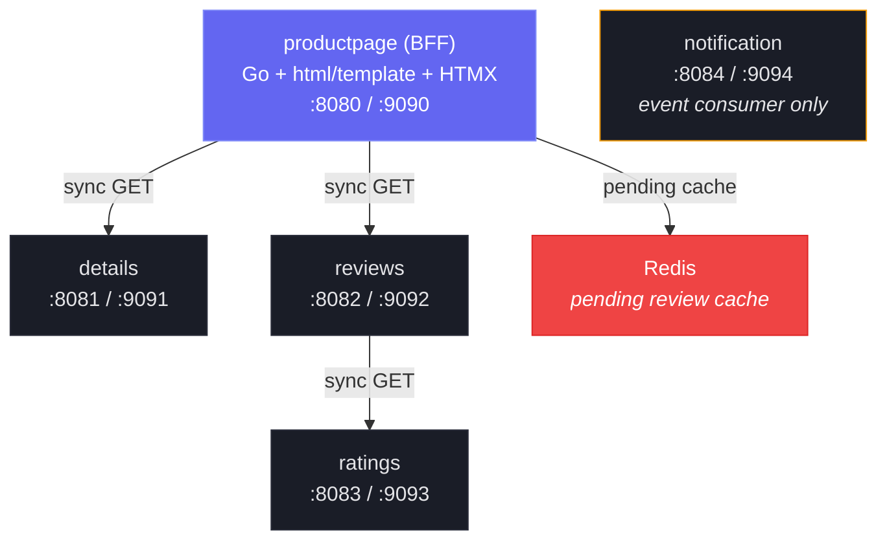

# Pending Reviews Implementation Plan

> **For agentic workers:** REQUIRED SUB-SKILL: Use superpowers:subagent-driven-development (recommended) or superpowers:executing-plans to implement this plan task-by-task. Steps use checkbox (`- [ ]`) syntax for tracking.

**Goal:** Show submitted reviews immediately in the UI as "Processing" (backed by Redis) while the async CQRS pipeline completes, then auto-remove the pending state once confirmed.

**Architecture:** Productpage stores pending reviews in Redis on submit, merges them into the read response, and uses HTMX polling (every 2s) to auto-reconcile. Pending reviews render with a dashed border + pulsing dot at the bottom of the reviews list. When `REDIS_URL` is unset, the feature is disabled and productpage behaves as before.

**Tech Stack:** Go, Redis (Bitnami Helm chart), `github.com/redis/go-redis/v9`, HTMX, html/template

---

## File Map

| Action | File | Responsibility |
|--------|------|----------------|
| Create | `services/productpage/internal/pending/pending.go` | `PendingStore` interface + `PendingReview` type |
| Create | `services/productpage/internal/pending/redis.go` | Redis-backed `PendingStore` implementation |
| Create | `services/productpage/internal/pending/noop.go` | No-op `PendingStore` (when Redis is disabled) |
| Create | `services/productpage/internal/pending/pending_test.go` | Unit tests for Redis store using miniredis |
| Modify | `services/productpage/internal/model/product.go` | Add `Pending bool` to `ProductReview` |
| Modify | `services/productpage/internal/handler/handler.go` | Wire `PendingStore`, use it in submit + reviews handlers |
| Modify | `services/productpage/internal/handler/handler_test.go` | Update tests to pass `PendingStore`, add pending-specific tests |
| Modify | `services/productpage/cmd/main.go` | Initialize Redis client or noop, pass to handler |
| Modify | `services/productpage/templates/partials/reviews.html` | Pending review styling + HTMX polling wrapper |
| Modify | `services/productpage/templates/layout.html` | Add `.review-pending` CSS |
| Create | `deploy/redis/local/redis-values.yaml` | Bitnami Redis Helm values |
| Modify | `deploy/productpage/overlays/local/configmap-patch.yaml` | Add `REDIS_URL` |
| Modify | `Makefile` | Add Redis helm install step to `k8s-deploy` |
| Modify | `docker-compose.yml` | Add Redis service |
| Modify | `test/e2e/docker-compose.yml` | Add Redis service |
| Modify | `README.md` | Update diagrams, tables, project structure |
| Modify | `CLAUDE.md` | Update services table, architecture, deploy structure |

---

### Task 1: Add `go-redis` dependency

**Files:**
- Modify: `go.mod`
- Modify: `go.sum`

- [ ] **Step 1: Add the go-redis module**

```bash
go get github.com/redis/go-redis/v9
```

- [ ] **Step 2: Add miniredis for testing**

```bash
go get github.com/alicebob/miniredis/v2
```

- [ ] **Step 3: Tidy modules**

```bash
go mod tidy
```

- [ ] **Step 4: Verify build**

```bash
go build ./...
```

Expected: clean build, no errors.

- [ ] **Step 5: Commit**

```bash
git add go.mod go.sum
git commit -m "chore: add go-redis and miniredis dependencies"
```

---

### Task 2: Add `Pending` field to `ProductReview` view model

**Files:**
- Modify: `services/productpage/internal/model/product.go:19-26`

- [ ] **Step 1: Add the Pending field**

In `services/productpage/internal/model/product.go`, add `Pending bool` to the `ProductReview` struct:

```go
// ProductReview is the view model for a single review.
type ProductReview struct {
	ID       string
	Reviewer string
	Text     string
	Stars    int
	Average  float64
	Count    int
	Pending  bool
}
```

- [ ] **Step 2: Verify build**

```bash
go build ./services/productpage/...
```

Expected: clean build. Existing code that creates `ProductReview` without `Pending` still compiles (zero value is `false`).

- [ ] **Step 3: Run existing tests**

```bash
go test ./services/productpage/...
```

Expected: all tests pass. The new field is a zero-value bool and doesn't break anything.

- [ ] **Step 4: Commit**

```bash
git add services/productpage/internal/model/product.go
git commit -m "feat(productpage): add Pending field to ProductReview view model"
```

---

### Task 3: Create `PendingStore` interface and types

**Files:**
- Create: `services/productpage/internal/pending/pending.go`

- [ ] **Step 1: Create the pending package with interface and types**

Create `services/productpage/internal/pending/pending.go`:

```go
// Package pending provides a pending review store for the productpage BFF.
// Pending reviews are stored in Redis and merged into read responses
// until the async CQRS write pipeline confirms them.
package pending

import (
	"context"
	"time"
)

// Review represents a review that has been submitted but not yet confirmed
// by the read path.
type Review struct {
	Reviewer  string `json:"reviewer"`
	Text      string `json:"text"`
	Stars     int    `json:"stars"`
	Timestamp int64  `json:"timestamp"`
}

// ConfirmedReview contains the fields used to match a pending review
// against a confirmed review from the read service.
type ConfirmedReview struct {
	Reviewer string
	Text     string
}

// Store defines operations for managing pending reviews.
type Store interface {
	// StorePending appends a pending review for the given product.
	StorePending(ctx context.Context, productID string, review Review) error

	// GetAndReconcile returns pending reviews for a product after removing
	// any that match the confirmed reviews. A pending review matches a
	// confirmed review when both reviewer and text are equal.
	GetAndReconcile(ctx context.Context, productID string, confirmed []ConfirmedReview) ([]Review, error)
}

// NewReview creates a Review with the current timestamp.
func NewReview(reviewer, text string, stars int) Review {
	return Review{
		Reviewer:  reviewer,
		Text:      text,
		Stars:     stars,
		Timestamp: time.Now().Unix(),
	}
}
```

- [ ] **Step 2: Verify build**

```bash
go build ./services/productpage/internal/pending/...
```

Expected: clean build.

- [ ] **Step 3: Commit**

```bash
git add services/productpage/internal/pending/pending.go
git commit -m "feat(productpage): add PendingStore interface and Review types"
```

---

### Task 4: Implement no-op `PendingStore`

**Files:**
- Create: `services/productpage/internal/pending/noop.go`

- [ ] **Step 1: Create the no-op implementation**

Create `services/productpage/internal/pending/noop.go`:

```go
package pending

import "context"

// NoopStore is a PendingStore that does nothing. Used when REDIS_URL is unset.
type NoopStore struct{}

func (NoopStore) StorePending(_ context.Context, _ string, _ Review) error {
	return nil
}

func (NoopStore) GetAndReconcile(_ context.Context, _ string, _ []ConfirmedReview) ([]Review, error) {
	return nil, nil
}
```

- [ ] **Step 2: Verify build**

```bash
go build ./services/productpage/internal/pending/...
```

Expected: clean build.

- [ ] **Step 3: Commit**

```bash
git add services/productpage/internal/pending/noop.go
git commit -m "feat(productpage): add no-op PendingStore for disabled Redis"
```

---

### Task 5: Implement Redis-backed `PendingStore`

**Files:**
- Create: `services/productpage/internal/pending/redis.go`

- [ ] **Step 1: Write the Redis implementation**

Create `services/productpage/internal/pending/redis.go`:

```go
package pending

import (
	"context"
	"encoding/json"
	"fmt"

	"github.com/redis/go-redis/v9"
)

const keyPrefix = "pending:reviews:"

// RedisStore implements Store backed by Redis lists.
type RedisStore struct {
	client *redis.Client
}

// NewRedisStore creates a RedisStore from a Redis URL (e.g. "redis://localhost:6379").
func NewRedisStore(redisURL string) (*RedisStore, error) {
	opts, err := redis.ParseURL(redisURL)
	if err != nil {
		return nil, fmt.Errorf("parsing redis URL: %w", err)
	}
	return &RedisStore{client: redis.NewClient(opts)}, nil
}

// Ping verifies the connection to Redis.
func (s *RedisStore) Ping(ctx context.Context) error {
	return s.client.Ping(ctx).Err()
}

// Close closes the Redis connection.
func (s *RedisStore) Close() error {
	return s.client.Close()
}

func (s *RedisStore) StorePending(ctx context.Context, productID string, review Review) error {
	data, err := json.Marshal(review)
	if err != nil {
		return fmt.Errorf("marshaling pending review: %w", err)
	}
	return s.client.RPush(ctx, keyPrefix+productID, data).Err()
}

func (s *RedisStore) GetAndReconcile(ctx context.Context, productID string, confirmed []ConfirmedReview) ([]Review, error) {
	key := keyPrefix + productID

	vals, err := s.client.LRange(ctx, key, 0, -1).Result()
	if err != nil {
		return nil, fmt.Errorf("fetching pending reviews: %w", err)
	}

	if len(vals) == 0 {
		return nil, nil
	}

	confirmedSet := make(map[string]struct{}, len(confirmed))
	for _, c := range confirmed {
		confirmedSet[c.Reviewer+"\x00"+c.Text] = struct{}{}
	}

	var remaining []Review
	for _, raw := range vals {
		var r Review
		if err := json.Unmarshal([]byte(raw), &r); err != nil {
			continue // skip corrupted entries
		}

		matchKey := r.Reviewer + "\x00" + r.Text
		if _, found := confirmedSet[matchKey]; found {
			// Review confirmed — remove from Redis
			s.client.LRem(ctx, key, 1, raw)
			delete(confirmedSet, matchKey) // only remove first match
		} else {
			remaining = append(remaining, r)
		}
	}

	return remaining, nil
}
```

- [ ] **Step 2: Verify build**

```bash
go build ./services/productpage/internal/pending/...
```

Expected: clean build.

- [ ] **Step 3: Commit**

```bash
git add services/productpage/internal/pending/redis.go
git commit -m "feat(productpage): add Redis-backed PendingStore implementation"
```

---

### Task 6: Test Redis `PendingStore` with miniredis

**Files:**
- Create: `services/productpage/internal/pending/pending_test.go`

- [ ] **Step 1: Write the tests**

Create `services/productpage/internal/pending/pending_test.go`:

```go
package pending_test

import (
	"context"
	"testing"

	"github.com/alicebob/miniredis/v2"

	"github.com/kaio6fellipe/event-driven-bookinfo/services/productpage/internal/pending"
)

func setupRedisStore(t *testing.T) *pending.RedisStore {
	t.Helper()
	mr := miniredis.RunT(t)
	store, err := pending.NewRedisStore("redis://" + mr.Addr())
	if err != nil {
		t.Fatalf("failed to create redis store: %v", err)
	}
	t.Cleanup(func() { _ = store.Close() })
	return store
}

func TestStorePending(t *testing.T) {
	store := setupRedisStore(t)
	ctx := context.Background()

	err := store.StorePending(ctx, "product-1", pending.NewReview("alice", "Great book!", 5))
	if err != nil {
		t.Fatalf("StorePending failed: %v", err)
	}

	// Should retrieve 1 pending review with no confirmed reviews
	reviews, err := store.GetAndReconcile(ctx, "product-1", nil)
	if err != nil {
		t.Fatalf("GetAndReconcile failed: %v", err)
	}
	if len(reviews) != 1 {
		t.Fatalf("got %d pending reviews, want 1", len(reviews))
	}
	if reviews[0].Reviewer != "alice" {
		t.Errorf("reviewer = %q, want %q", reviews[0].Reviewer, "alice")
	}
	if reviews[0].Text != "Great book!" {
		t.Errorf("text = %q, want %q", reviews[0].Text, "Great book!")
	}
	if reviews[0].Stars != 5 {
		t.Errorf("stars = %d, want 5", reviews[0].Stars)
	}
}

func TestGetAndReconcile_RemovesConfirmed(t *testing.T) {
	store := setupRedisStore(t)
	ctx := context.Background()

	_ = store.StorePending(ctx, "product-1", pending.NewReview("alice", "Great book!", 5))
	_ = store.StorePending(ctx, "product-1", pending.NewReview("bob", "Decent read", 3))

	confirmed := []pending.ConfirmedReview{
		{Reviewer: "alice", Text: "Great book!"},
	}

	reviews, err := store.GetAndReconcile(ctx, "product-1", confirmed)
	if err != nil {
		t.Fatalf("GetAndReconcile failed: %v", err)
	}
	if len(reviews) != 1 {
		t.Fatalf("got %d pending reviews, want 1", len(reviews))
	}
	if reviews[0].Reviewer != "bob" {
		t.Errorf("remaining reviewer = %q, want %q", reviews[0].Reviewer, "bob")
	}

	// Second call with no confirmed: alice should be gone from Redis
	reviews, err = store.GetAndReconcile(ctx, "product-1", nil)
	if err != nil {
		t.Fatalf("GetAndReconcile failed: %v", err)
	}
	if len(reviews) != 1 {
		t.Fatalf("got %d pending reviews after reconcile, want 1 (bob only)", len(reviews))
	}
}

func TestGetAndReconcile_EmptyProduct(t *testing.T) {
	store := setupRedisStore(t)
	ctx := context.Background()

	reviews, err := store.GetAndReconcile(ctx, "nonexistent", nil)
	if err != nil {
		t.Fatalf("GetAndReconcile failed: %v", err)
	}
	if reviews != nil {
		t.Errorf("expected nil for nonexistent product, got %v", reviews)
	}
}

func TestGetAndReconcile_IsolatesProducts(t *testing.T) {
	store := setupRedisStore(t)
	ctx := context.Background()

	_ = store.StorePending(ctx, "product-1", pending.NewReview("alice", "Review for P1", 5))
	_ = store.StorePending(ctx, "product-2", pending.NewReview("bob", "Review for P2", 4))

	reviews, err := store.GetAndReconcile(ctx, "product-1", nil)
	if err != nil {
		t.Fatalf("GetAndReconcile failed: %v", err)
	}
	if len(reviews) != 1 {
		t.Fatalf("product-1 got %d pending, want 1", len(reviews))
	}
	if reviews[0].Reviewer != "alice" {
		t.Errorf("product-1 reviewer = %q, want alice", reviews[0].Reviewer)
	}
}
```

- [ ] **Step 2: Run the tests to verify they pass**

```bash
go test -v ./services/productpage/internal/pending/...
```

Expected: all 4 tests pass.

- [ ] **Step 3: Commit**

```bash
git add services/productpage/internal/pending/pending_test.go
git commit -m "test(productpage): add PendingStore tests with miniredis"
```

---

### Task 7: Add `REDIS_URL` to `pkg/config`

**Files:**
- Modify: `pkg/config/config.go:10-20`

- [ ] **Step 1: Add RedisURL field to Config struct**

In `pkg/config/config.go`, add `RedisURL string` to the `Config` struct and load it in `Load()`:

Add the field after `PyroscopeServerAddress`:

```go
type Config struct {
	ServiceName            string
	HTTPPort               string
	AdminPort              string
	LogLevel               string
	StorageBackend         string
	DatabaseURL            string
	RunMigrations          bool
	OTLPEndpoint           string
	PyroscopeServerAddress string
	RedisURL               string
}
```

In the `Load()` function, add this line to the `cfg` initialization (after `PyroscopeServerAddress`):

```go
RedisURL:               os.Getenv("REDIS_URL"),
```

- [ ] **Step 2: Verify build**

```bash
go build ./...
```

Expected: clean build.

- [ ] **Step 3: Run all tests**

```bash
go test ./...
```

Expected: all tests pass.

- [ ] **Step 4: Commit**

```bash
git add pkg/config/config.go
git commit -m "feat(config): add RedisURL configuration field"
```

---

### Task 8: Wire `PendingStore` into handler and update submit flow

**Files:**
- Modify: `services/productpage/internal/handler/handler.go`

- [ ] **Step 1: Add PendingStore to Handler struct and constructor**

Update `services/productpage/internal/handler/handler.go`:

Add import for the pending package:

```go
import (
	"encoding/json"
	"html/template"
	"net/http"
	"path/filepath"
	"strconv"

	"github.com/kaio6fellipe/event-driven-bookinfo/pkg/logging"
	"github.com/kaio6fellipe/event-driven-bookinfo/services/productpage/internal/client"
	"github.com/kaio6fellipe/event-driven-bookinfo/services/productpage/internal/model"
	"github.com/kaio6fellipe/event-driven-bookinfo/services/productpage/internal/pending"
)
```

Update the `Handler` struct to add `pendingStore`:

```go
type Handler struct {
	detailsClient *client.DetailsClient
	reviewsClient *client.ReviewsClient
	ratingsClient *client.RatingsClient
	pendingStore  pending.Store
	templates     *template.Template
	templateDir   string
}
```

Update `NewHandler` signature:

```go
func NewHandler(
	detailsClient *client.DetailsClient,
	reviewsClient *client.ReviewsClient,
	ratingsClient *client.RatingsClient,
	pendingStore pending.Store,
	templateDir string,
) *Handler {
	tmpl := template.Must(template.ParseGlob(filepath.Join(templateDir, "*.html")))
	template.Must(tmpl.ParseGlob(filepath.Join(templateDir, "partials", "*.html")))

	return &Handler{
		detailsClient: detailsClient,
		reviewsClient: reviewsClient,
		ratingsClient: ratingsClient,
		pendingStore:  pendingStore,
		templates:     tmpl,
		templateDir:   templateDir,
	}
}
```

- [ ] **Step 2: Update `partialRatingSubmit` to store pending review**

In the `partialRatingSubmit` method, add the `StorePending` call after the review submission. Replace the section after the successful rating submit (lines 236-248) with:

```go
	if reviewText != "" {
		if err := h.reviewsClient.SubmitReview(r.Context(), productID, reviewer, reviewText); err != nil {
			logger.Warn("failed to submit review", "error", err)
		}

		if err := h.pendingStore.StorePending(r.Context(), productID, pending.NewReview(reviewer, reviewText, stars)); err != nil {
			logger.Warn("failed to store pending review", "error", err)
		}
	}

	w.Header().Set("Content-Type", "text/html; charset=utf-8")
	_ = h.templates.ExecuteTemplate(w, "rating-form.html", map[string]any{
		"Success":   true,
		"Stars":     stars,
		"ProductID": productID,
	})
```

- [ ] **Step 3: Update `partialReviews` to merge pending reviews**

Replace the `partialReviews` method (lines 166-195) with:

```go
func (h *Handler) partialReviews(w http.ResponseWriter, r *http.Request) {
	productID := r.PathValue("id")
	logger := logging.FromContext(r.Context())

	reviews, err := h.reviewsClient.GetProductReviews(r.Context(), productID)
	if err != nil {
		logger.Warn("failed to fetch reviews for partial", "product_id", productID, "error", err)
		w.WriteHeader(http.StatusOK)
		_, _ = w.Write([]byte(`<p class="error">Failed to load reviews.</p>`))
		return
	}

	var confirmed []pending.ConfirmedReview
	var viewModels []model.ProductReview
	for _, review := range reviews.Reviews {
		confirmed = append(confirmed, pending.ConfirmedReview{
			Reviewer: review.Reviewer,
			Text:     review.Text,
		})

		vm := model.ProductReview{
			ID:       review.ID,
			Reviewer: review.Reviewer,
			Text:     review.Text,
		}
		if review.Rating != nil {
			vm.Stars = review.Rating.Stars
			vm.Average = review.Rating.Average
			vm.Count = review.Rating.Count
		}
		viewModels = append(viewModels, vm)
	}

	// Merge pending reviews from Redis
	pendingReviews, err := h.pendingStore.GetAndReconcile(r.Context(), productID, confirmed)
	if err != nil {
		logger.Warn("failed to get pending reviews", "product_id", productID, "error", err)
	}
	for _, pr := range pendingReviews {
		viewModels = append(viewModels, model.ProductReview{
			Reviewer: pr.Reviewer,
			Text:     pr.Text,
			Stars:    pr.Stars,
			Pending:  true,
		})
	}

	hasPending := len(pendingReviews) > 0

	w.Header().Set("Content-Type", "text/html; charset=utf-8")
	_ = h.templates.ExecuteTemplate(w, "reviews.html", struct {
		Reviews    []model.ProductReview
		HasPending bool
		ProductID  string
	}{
		Reviews:    viewModels,
		HasPending: hasPending,
		ProductID:  productID,
	})
}
```

- [ ] **Step 4: Verify build**

```bash
go build ./services/productpage/...
```

Expected: build fails — `cmd/main.go` and tests still call `NewHandler` with the old signature. This is expected; we fix these in the next tasks.

- [ ] **Step 5: Commit (WIP — handler updated but callers not yet fixed)**

```bash
git add services/productpage/internal/handler/handler.go
git commit -m "feat(productpage): wire PendingStore into handler submit and reviews flow"
```

---

### Task 9: Wire `PendingStore` in `cmd/main.go`

**Files:**
- Modify: `services/productpage/cmd/main.go`

- [ ] **Step 1: Update main.go to initialize PendingStore**

Replace the entire `services/productpage/cmd/main.go` file:

```go
// Package main is the entry point for the productpage service.
package main

import (
	"context"
	"log/slog"
	"net/http"
	"os"

	"github.com/kaio6fellipe/event-driven-bookinfo/pkg/config"
	"github.com/kaio6fellipe/event-driven-bookinfo/pkg/logging"
	"github.com/kaio6fellipe/event-driven-bookinfo/pkg/metrics"
	"github.com/kaio6fellipe/event-driven-bookinfo/pkg/profiling"
	"github.com/kaio6fellipe/event-driven-bookinfo/pkg/server"
	"github.com/kaio6fellipe/event-driven-bookinfo/pkg/telemetry"
	"github.com/kaio6fellipe/event-driven-bookinfo/services/productpage/internal/client"
	"github.com/kaio6fellipe/event-driven-bookinfo/services/productpage/internal/handler"
	"github.com/kaio6fellipe/event-driven-bookinfo/services/productpage/internal/pending"
)

func main() {
	cfg, err := config.Load()
	if err != nil {
		slog.Error("failed to load config", "error", err)
		os.Exit(1)
	}

	logger := logging.New(cfg.LogLevel, cfg.ServiceName)

	ctx := context.Background()

	shutdown, err := telemetry.Setup(ctx, cfg.ServiceName)
	if err != nil {
		logger.Error("failed to setup telemetry", "error", err)
		os.Exit(1)
	}
	defer func() { _ = shutdown(ctx) }()

	metricsHandler, err := metrics.Setup(cfg.ServiceName)
	if err != nil {
		logger.Error("failed to setup metrics", "error", err)
		os.Exit(1)
	}

	stopProfiler, err := profiling.Start(cfg)
	if err != nil {
		logger.Error("failed to start profiling", "error", err)
		os.Exit(1)
	}
	defer stopProfiler()

	metrics.RegisterRuntimeMetrics()

	// HTTP clients for backend services
	detailsURL := envOrDefault("DETAILS_SERVICE_URL", "http://localhost:8081")
	reviewsURL := envOrDefault("REVIEWS_SERVICE_URL", "http://localhost:8082")
	ratingsURL := envOrDefault("RATINGS_SERVICE_URL", "http://localhost:8083")

	detailsClient := client.NewDetailsClient(detailsURL)
	reviewsClient := client.NewReviewsClient(reviewsURL)
	ratingsClient := client.NewRatingsClient(ratingsURL)

	// Pending review store (Redis or no-op)
	var pendingStore pending.Store
	if cfg.RedisURL != "" {
		rs, err := pending.NewRedisStore(cfg.RedisURL)
		if err != nil {
			logger.Error("failed to create redis pending store", "error", err)
			os.Exit(1)
		}
		if err := rs.Ping(ctx); err != nil {
			logger.Error("failed to connect to redis", "error", err)
			os.Exit(1)
		}
		defer func() { _ = rs.Close() }()
		logger.Info("pending review store enabled", "redis_url", cfg.RedisURL)
		pendingStore = rs
	} else {
		logger.Info("pending review store disabled (REDIS_URL not set)")
		pendingStore = pending.NoopStore{}
	}

	templateDir := envOrDefault("TEMPLATE_DIR", "services/productpage/templates")
	h := handler.NewHandler(detailsClient, reviewsClient, ratingsClient, pendingStore, templateDir)

	registerRoutes := func(mux *http.ServeMux) {
		h.RegisterRoutes(mux)
	}

	if err := server.Run(ctx, cfg, registerRoutes, metricsHandler); err != nil {
		logger.Error("server error", "error", err)
		os.Exit(1)
	}
}

func envOrDefault(key, defaultValue string) string {
	if v := os.Getenv(key); v != "" {
		return v
	}
	return defaultValue
}
```

- [ ] **Step 2: Verify build**

```bash
go build ./services/productpage/...
```

Expected: build succeeds (tests may still fail due to old `NewHandler` calls in test file — fixed in next task).

- [ ] **Step 3: Commit**

```bash
git add services/productpage/cmd/main.go
git commit -m "feat(productpage): wire PendingStore in composition root"
```

---

### Task 10: Update handler tests for `PendingStore`

**Files:**
- Modify: `services/productpage/internal/handler/handler_test.go`

- [ ] **Step 1: Update all `NewHandler` calls to include `NoopStore`**

In `services/productpage/internal/handler/handler_test.go`, add the pending import:

```go
import (
	"encoding/json"
	"net/http"
	"net/http/httptest"
	"os"
	"path/filepath"
	"strings"
	"testing"

	"github.com/kaio6fellipe/event-driven-bookinfo/services/productpage/internal/client"
	"github.com/kaio6fellipe/event-driven-bookinfo/services/productpage/internal/handler"
	"github.com/kaio6fellipe/event-driven-bookinfo/services/productpage/internal/pending"
)
```

Update every `handler.NewHandler(...)` call to pass `pending.NoopStore{}` as the 4th argument. There are 5 occurrences:

```go
// In TestAPIGetProducts:
h := handler.NewHandler(detailsClient, reviewsClient, ratingsClient, pending.NoopStore{}, templateDir(t))

// In TestPartialDetails:
h := handler.NewHandler(detailsClient, reviewsClient, ratingsClient, pending.NoopStore{}, templateDir(t))

// In TestPartialReviews:
h := handler.NewHandler(detailsClient, reviewsClient, ratingsClient, pending.NoopStore{}, templateDir(t))

// In TestPartialRatingSubmit:
h := handler.NewHandler(detailsClient, reviewsClient, ratingsClient, pending.NoopStore{}, templateDir(t))

// In TestPartialRatingSubmitAsync:
h := handler.NewHandler(detailsClient, reviewsClient, ratingsClient, pending.NoopStore{}, templateDir(t))

// In TestPartialRatingSubmitAsyncWithReview:
h := handler.NewHandler(detailsClient, reviewsClient, ratingsClient, pending.NoopStore{}, templateDir(t))
```

- [ ] **Step 2: Run tests — expect template failure**

```bash
go test -v ./services/productpage/...
```

Expected: `TestPartialReviews` will fail because the `partialReviews` handler now passes a struct to the template instead of a slice. This is expected — we fix the template in the next task.

- [ ] **Step 3: Commit**

```bash
git add services/productpage/internal/handler/handler_test.go
git commit -m "test(productpage): update handler tests with NoopStore"
```

---

### Task 11: Update `reviews.html` template for pending reviews + HTMX polling

**Files:**
- Modify: `services/productpage/templates/partials/reviews.html`

- [ ] **Step 1: Replace the reviews.html template**

The handler now passes a struct `{Reviews, HasPending, ProductID}` instead of a plain slice. Replace the entire content of `services/productpage/templates/partials/reviews.html`:

```html
{{if .HasPending}}
<div hx-get="/partials/reviews/{{.ProductID}}"
     hx-trigger="every 2s"
     hx-target="#reviews-section"
     hx-swap="innerHTML">
{{end}}
{{if .Reviews}}
{{range .Reviews}}
<div class="review{{if .Pending}} review-pending{{end}}">
    <div class="review-header">
        <div class="reviewer">
            <div class="reviewer-avatar">{{slice .Reviewer 0 1}}</div>
            <div>
                <div class="reviewer-name">
                    {{.Reviewer}}
                    {{if .Pending}}
                    <span class="pending-badge">
                        <span class="pending-dot"></span>
                        Processing
                    </span>
                    {{end}}
                </div>
            </div>
        </div>
        {{if gt .Stars 0}}
        <div style="display: flex; align-items: center; gap: 0.5rem;">
            <div class="stars">
                {{$s := .Stars}}
                {{if ge $s 1}}<svg class="star star-filled" viewBox="0 0 24 24" fill="currentColor"><path d="M12 2l3.09 6.26L22 9.27l-5 4.87 1.18 6.88L12 17.77l-6.18 3.25L7 14.14 2 9.27l6.91-1.01L12 2z"/></svg>{{else}}<svg class="star star-empty" viewBox="0 0 24 24" fill="currentColor"><path d="M12 2l3.09 6.26L22 9.27l-5 4.87 1.18 6.88L12 17.77l-6.18 3.25L7 14.14 2 9.27l6.91-1.01L12 2z"/></svg>{{end}}
                {{if ge $s 2}}<svg class="star star-filled" viewBox="0 0 24 24" fill="currentColor"><path d="M12 2l3.09 6.26L22 9.27l-5 4.87 1.18 6.88L12 17.77l-6.18 3.25L7 14.14 2 9.27l6.91-1.01L12 2z"/></svg>{{else}}<svg class="star star-empty" viewBox="0 0 24 24" fill="currentColor"><path d="M12 2l3.09 6.26L22 9.27l-5 4.87 1.18 6.88L12 17.77l-6.18 3.25L7 14.14 2 9.27l6.91-1.01L12 2z"/></svg>{{end}}
                {{if ge $s 3}}<svg class="star star-filled" viewBox="0 0 24 24" fill="currentColor"><path d="M12 2l3.09 6.26L22 9.27l-5 4.87 1.18 6.88L12 17.77l-6.18 3.25L7 14.14 2 9.27l6.91-1.01L12 2z"/></svg>{{else}}<svg class="star star-empty" viewBox="0 0 24 24" fill="currentColor"><path d="M12 2l3.09 6.26L22 9.27l-5 4.87 1.18 6.88L12 17.77l-6.18 3.25L7 14.14 2 9.27l6.91-1.01L12 2z"/></svg>{{end}}
                {{if ge $s 4}}<svg class="star star-filled" viewBox="0 0 24 24" fill="currentColor"><path d="M12 2l3.09 6.26L22 9.27l-5 4.87 1.18 6.88L12 17.77l-6.18 3.25L7 14.14 2 9.27l6.91-1.01L12 2z"/></svg>{{else}}<svg class="star star-empty" viewBox="0 0 24 24" fill="currentColor"><path d="M12 2l3.09 6.26L22 9.27l-5 4.87 1.18 6.88L12 17.77l-6.18 3.25L7 14.14 2 9.27l6.91-1.01L12 2z"/></svg>{{end}}
                {{if ge $s 5}}<svg class="star star-filled" viewBox="0 0 24 24" fill="currentColor"><path d="M12 2l3.09 6.26L22 9.27l-5 4.87 1.18 6.88L12 17.77l-6.18 3.25L7 14.14 2 9.27l6.91-1.01L12 2z"/></svg>{{else}}<svg class="star star-empty" viewBox="0 0 24 24" fill="currentColor"><path d="M12 2l3.09 6.26L22 9.27l-5 4.87 1.18 6.88L12 17.77l-6.18 3.25L7 14.14 2 9.27l6.91-1.01L12 2z"/></svg>{{end}}
            </div>
            <span class="rating-count">{{.Stars}}/5</span>
        </div>
        {{end}}
    </div>
    <div class="review-text">{{.Text}}</div>
</div>
{{end}}
{{else}}
<p style="color: var(--text-muted); font-size: 0.9rem; padding: 0.5rem 0;">No reviews yet.</p>
{{end}}
{{if .HasPending}}
</div>
{{end}}
```

- [ ] **Step 2: Run tests**

```bash
go test -v ./services/productpage/...
```

Expected: all tests pass. The tests use `NoopStore` (no pending reviews), so `HasPending` is `false` and the template behaves like before except it receives a struct.

- [ ] **Step 3: Commit**

```bash
git add services/productpage/templates/partials/reviews.html
git commit -m "feat(productpage): update reviews template for pending state and HTMX polling"
```

---

### Task 12: Add pending review CSS to `layout.html`

**Files:**
- Modify: `services/productpage/templates/layout.html`

- [ ] **Step 1: Add CSS classes for pending reviews**

In `services/productpage/templates/layout.html`, add the following CSS rules right before the closing `</style>` tag (after the `.skeleton-line` block, around line 468):

```css
        /* Pending review */
        .review-pending {
            border: 1px dashed rgba(245, 158, 11, 0.4);
            border-radius: 6px;
            background: rgba(245, 158, 11, 0.03);
            padding: 0.75rem;
            margin-top: 0.5rem;
        }

        .review-pending:last-child {
            border-bottom: 1px dashed rgba(245, 158, 11, 0.4);
        }

        .pending-badge {
            display: inline-flex;
            align-items: center;
            gap: 0.3rem;
            color: var(--warning);
            font-size: 0.65rem;
            font-weight: 500;
            margin-left: 0.5rem;
        }

        .pending-dot {
            width: 6px;
            height: 6px;
            border-radius: 50%;
            background: var(--warning);
            display: inline-block;
            animation: pending-pulse 1.5s ease-in-out infinite;
        }

        @keyframes pending-pulse {
            0%, 100% { opacity: 1; }
            50% { opacity: 0.3; }
        }
```

- [ ] **Step 2: Run tests**

```bash
go test -v ./services/productpage/...
```

Expected: all tests pass.

- [ ] **Step 3: Commit**

```bash
git add services/productpage/templates/layout.html
git commit -m "feat(productpage): add pending review CSS with dashed border and pulsing dot"
```

---

### Task 13: Add test for pending reviews in handler

**Files:**
- Modify: `services/productpage/internal/handler/handler_test.go`

- [ ] **Step 1: Add a test that verifies pending reviews appear in the reviews partial**

Add the following test to `services/productpage/internal/handler/handler_test.go`:

```go
func TestPartialReviewsWithPending(t *testing.T) {
	detailsURL, reviewsURL, ratingsURL := setupMockServers(t)

	detailsClient := client.NewDetailsClient(detailsURL)
	reviewsClient := client.NewReviewsClient(reviewsURL)
	ratingsClient := client.NewRatingsClient(ratingsURL)

	mr := miniredis.RunT(t)
	store, err := pending.NewRedisStore("redis://" + mr.Addr())
	if err != nil {
		t.Fatalf("failed to create redis store: %v", err)
	}
	t.Cleanup(func() { _ = store.Close() })

	// Store a pending review
	ctx := context.Background()
	_ = store.StorePending(ctx, "product-1", pending.NewReview("bob", "Pending review text", 4))

	h := handler.NewHandler(detailsClient, reviewsClient, ratingsClient, store, templateDir(t))

	mux := http.NewServeMux()
	h.RegisterRoutes(mux)

	req := httptest.NewRequest(http.MethodGet, "/partials/reviews/product-1", nil)
	rec := httptest.NewRecorder()
	mux.ServeHTTP(rec, req)

	if rec.Code != http.StatusOK {
		t.Errorf("status = %d, want %d", rec.Code, http.StatusOK)
	}

	body := rec.Body.String()

	// Confirmed review from mock server
	if !strings.Contains(body, "alice") {
		t.Errorf("expected confirmed review 'alice' in response")
	}

	// Pending review
	if !strings.Contains(body, "bob") {
		t.Errorf("expected pending review 'bob' in response")
	}
	if !strings.Contains(body, "Pending review text") {
		t.Errorf("expected pending review text in response")
	}
	if !strings.Contains(body, "review-pending") {
		t.Errorf("expected 'review-pending' CSS class in response")
	}
	if !strings.Contains(body, "Processing") {
		t.Errorf("expected 'Processing' label in response")
	}

	// HTMX polling should be active
	if !strings.Contains(body, "every 2s") {
		t.Errorf("expected HTMX polling trigger 'every 2s' in response")
	}
}

func TestPartialReviewsNoPending(t *testing.T) {
	detailsURL, reviewsURL, ratingsURL := setupMockServers(t)

	detailsClient := client.NewDetailsClient(detailsURL)
	reviewsClient := client.NewReviewsClient(reviewsURL)
	ratingsClient := client.NewRatingsClient(ratingsURL)

	h := handler.NewHandler(detailsClient, reviewsClient, ratingsClient, pending.NoopStore{}, templateDir(t))

	mux := http.NewServeMux()
	h.RegisterRoutes(mux)

	req := httptest.NewRequest(http.MethodGet, "/partials/reviews/product-1", nil)
	rec := httptest.NewRecorder()
	mux.ServeHTTP(rec, req)

	body := rec.Body.String()

	// Should NOT have polling when no pending reviews
	if strings.Contains(body, "every 2s") {
		t.Errorf("expected NO HTMX polling when there are no pending reviews")
	}

	// Should NOT have pending CSS class
	if strings.Contains(body, "review-pending") {
		t.Errorf("expected NO review-pending CSS class when no pending reviews")
	}
}
```

Add imports at the top of the file:

```go
import (
	"context"
	"encoding/json"
	"net/http"
	"net/http/httptest"
	"os"
	"path/filepath"
	"strings"
	"testing"

	"github.com/alicebob/miniredis/v2"

	"github.com/kaio6fellipe/event-driven-bookinfo/services/productpage/internal/client"
	"github.com/kaio6fellipe/event-driven-bookinfo/services/productpage/internal/handler"
	"github.com/kaio6fellipe/event-driven-bookinfo/services/productpage/internal/pending"
)
```

- [ ] **Step 2: Run the new tests**

```bash
go test -v -run "TestPartialReviewsWithPending|TestPartialReviewsNoPending" ./services/productpage/internal/handler/...
```

Expected: both tests pass.

- [ ] **Step 3: Run all productpage tests**

```bash
go test -v ./services/productpage/...
```

Expected: all tests pass.

- [ ] **Step 4: Commit**

```bash
git add services/productpage/internal/handler/handler_test.go
git commit -m "test(productpage): add handler tests for pending review rendering and HTMX polling"
```

---

### Task 14: Add Redis to docker-compose.yml (local dev)

**Files:**
- Modify: `docker-compose.yml`

- [ ] **Step 1: Add Redis service and update productpage**

In `docker-compose.yml`, add the Redis service after `postgres`:

```yaml
  redis:
    image: redis:7-alpine
    ports:
      - "6379:6379"
    volumes:
      - redisdata:/data
    healthcheck:
      test: ["CMD", "redis-cli", "ping"]
      interval: 2s
      timeout: 5s
      retries: 5
```

Update the productpage service — add `REDIS_URL` to its environment and `redis` to `depends_on`:

```yaml
  productpage:
    build:
      context: .
      dockerfile: build/Dockerfile.productpage
    ports:
      - "8080:8080"
      - "9090:9090"
    environment:
      SERVICE_NAME: productpage
      DETAILS_SERVICE_URL: http://details:8080
      REVIEWS_SERVICE_URL: http://reviews:8080
      RATINGS_SERVICE_URL: http://ratings:8080
      REDIS_URL: redis://redis:6379
    depends_on:
      redis:
        condition: service_healthy
      details:
        condition: service_started
      reviews:
        condition: service_started
      ratings:
        condition: service_started
```

Add `redisdata` to the volumes section:

```yaml
volumes:
  pgdata:
  redisdata:
```

- [ ] **Step 2: Validate compose file**

```bash
docker compose config --quiet
```

Expected: exits 0 with no errors.

- [ ] **Step 3: Commit**

```bash
git add docker-compose.yml
git commit -m "feat: add Redis to docker-compose for pending review cache"
```

---

### Task 15: Add Redis to e2e docker-compose

**Files:**
- Modify: `test/e2e/docker-compose.yml`

- [ ] **Step 1: Add Redis service and update productpage**

In `test/e2e/docker-compose.yml`, add the Redis service and update productpage:

```yaml
services:
  redis:
    image: redis:7-alpine
    healthcheck:
      test: ["CMD", "redis-cli", "ping"]
      interval: 2s
      timeout: 5s
      retries: 5

  ratings:
    build:
      context: ../..
      dockerfile: build/Dockerfile.ratings
    ports:
      - "8083:8080"
      - "9093:9090"
    environment:
      SERVICE_NAME: ratings
      STORAGE_BACKEND: memory

  details:
    build:
      context: ../..
      dockerfile: build/Dockerfile.details
    ports:
      - "8081:8080"
      - "9091:9090"
    environment:
      SERVICE_NAME: details
      STORAGE_BACKEND: memory

  reviews:
    build:
      context: ../..
      dockerfile: build/Dockerfile.reviews
    ports:
      - "8082:8080"
      - "9092:9090"
    environment:
      SERVICE_NAME: reviews
      STORAGE_BACKEND: memory
      RATINGS_SERVICE_URL: http://ratings:8080
    depends_on:
      - ratings

  notification:
    build:
      context: ../..
      dockerfile: build/Dockerfile.notification
    ports:
      - "8084:8080"
      - "9094:9090"
    environment:
      SERVICE_NAME: notification
      STORAGE_BACKEND: memory

  productpage:
    build:
      context: ../..
      dockerfile: build/Dockerfile.productpage
    ports:
      - "8080:8080"
      - "9090:9090"
    environment:
      SERVICE_NAME: productpage
      DETAILS_SERVICE_URL: http://details:8080
      REVIEWS_SERVICE_URL: http://reviews:8080
      RATINGS_SERVICE_URL: http://ratings:8080
      REDIS_URL: redis://redis:6379
    depends_on:
      redis:
        condition: service_healthy
      details:
        condition: service_started
      reviews:
        condition: service_started
      ratings:
        condition: service_started
```

- [ ] **Step 2: Validate compose file**

```bash
docker compose -f test/e2e/docker-compose.yml config --quiet
```

Expected: exits 0 with no errors.

- [ ] **Step 3: Commit**

```bash
git add test/e2e/docker-compose.yml
git commit -m "feat: add Redis to e2e docker-compose for pending review cache"
```

---

### Task 16: Add Redis Helm values and update k8s deploy

**Files:**
- Create: `deploy/redis/local/redis-values.yaml`
- Modify: `deploy/productpage/overlays/local/configmap-patch.yaml`
- Modify: `Makefile`

- [ ] **Step 1: Create Redis Helm values**

Create `deploy/redis/local/redis-values.yaml`:

```yaml
# Bitnami Redis - standalone mode for local k8s development
architecture: standalone

auth:
  enabled: false

master:
  persistence:
    enabled: true
    size: 1Gi

  resources:
    requests:
      cpu: 50m
      memory: 64Mi
    limits:
      cpu: 250m
      memory: 128Mi
```

- [ ] **Step 2: Add REDIS_URL to productpage ConfigMap**

In `deploy/productpage/overlays/local/configmap-patch.yaml`, add the `REDIS_URL` line:

```yaml
apiVersion: v1
kind: ConfigMap
metadata:
  name: productpage
data:
  LOG_LEVEL: "debug"
  OTEL_EXPORTER_OTLP_ENDPOINT: "http://alloy-metrics-traces.observability.svc.cluster.local:4317"
  DETAILS_SERVICE_URL: "http://gateway.envoy-gateway-system.svc.cluster.local"
  REVIEWS_SERVICE_URL: "http://gateway.envoy-gateway-system.svc.cluster.local"
  RATINGS_SERVICE_URL: "http://gateway.envoy-gateway-system.svc.cluster.local"
  REDIS_URL: "redis://redis-master.bookinfo.svc.cluster.local:6379"
```

- [ ] **Step 3: Add Redis Helm install to Makefile k8s-deploy target**

In the `Makefile`, in the `k8s-deploy` target, add a Redis install step between PostgreSQL (step 3) and deploying services (step 4). The step numbering changes from 5 steps to 6 steps.

After the PostgreSQL ready line (`@printf "  $(GREEN)PostgreSQL ready.$(NC)\n"`), add:

```makefile
	@printf "$(BOLD)[4/6] Deploying Redis...$(NC)\n"
	@$(HELM) repo add bitnami https://charts.bitnami.com/bitnami --force-update > /dev/null 2>&1
	@$(HELM) upgrade --install redis bitnami/redis \
		--namespace $(K8S_NS_BOOKINFO) \
		--values deploy/redis/local/redis-values.yaml \
		--wait --timeout 120s
	@printf "  $(GREEN)Redis ready.$(NC)\n"
```

Update the step labels: [1/5] → [1/6], [2/5] → [2/6], [3/5] → [3/6], [4/5] → [5/6], [5/5] → [6/6].

- [ ] **Step 4: Commit**

```bash
git add deploy/redis/local/redis-values.yaml deploy/productpage/overlays/local/configmap-patch.yaml Makefile
git commit -m "feat: add Redis to local k8s deployment with Helm and ConfigMap"
```

---

### Task 17: Run full test suite

**Files:** (none — verification only)

- [ ] **Step 1: Run all Go tests**

```bash
go test -race -count=1 ./...
```

Expected: all tests pass with race detector enabled.

- [ ] **Step 2: Run linter**

```bash
make lint
```

Expected: no lint errors.

- [ ] **Step 3: Build all services**

```bash
make build-all
```

Expected: all 5 services build successfully.

- [ ] **Step 4: Build all Docker images**

```bash
make docker-build-all
```

Expected: all 5 Docker images build successfully.

---

### Task 18: Update README.md

**Files:**
- Modify: `README.md`

- [ ] **Step 1: Update Service Topology diagram**

In the `### Service Topology` mermaid block, add Redis node and connection:



- [ ] **Step 2: Update Cluster Architecture diagram**

In the `### Cluster Architecture` mermaid block, add Redis to the `bookinfo` subgraph (next to `PG["PostgreSQL"]`):

```
        Redis["Redis"]
```

Add connection (next to the `DR & DW & ... --> PG` line):

```
    PP --> Redis
```

Add style:

```
    style Redis fill:#ef4444,color:#fff,stroke:#dc2626
```

- [ ] **Step 3: Update Services table**

Change productpage row description:

```
| **productpage** | BFF (Go + HTMX) | 8080 | 9090 | Aggregates details + reviews + ratings into an HTML product page. Fans out sync GET calls; pending review cache via Redis. |
```

- [ ] **Step 4: Update Project Structure**

Add `deploy/redis/local/` under the `deploy/` tree:

```
│   ├── redis/local/            # Helm values: Bitnami Redis
```

- [ ] **Step 5: Update Quick Start section**

In the productpage binary run command, add an optional `REDIS_URL` comment:

```bash
# Optional: REDIS_URL=redis://localhost:6379 (enables pending review cache)
SERVICE_NAME=productpage HTTP_PORT=8080 ADMIN_PORT=9090 \
  DETAILS_SERVICE_URL=http://localhost:8081 \
  REVIEWS_SERVICE_URL=http://localhost:8082 \
  RATINGS_SERVICE_URL=http://localhost:8083 \
  TEMPLATE_DIR=services/productpage/templates \
  ./bin/productpage
```

- [ ] **Step 6: Update Docker section**

In the Docker paragraph, update the `make run` description to mention Redis:

```
make run          # builds images, starts postgres + redis + all services, seeds databases
```

- [ ] **Step 7: Commit**

```bash
git add README.md
git commit -m "docs: update README with Redis pending review cache"
```

---

### Task 19: Update CLAUDE.md

**Files:**
- Modify: `CLAUDE.md`

- [ ] **Step 1: Update Services table**

Change productpage row:

```
| **productpage** | BFF (Go + HTMX) | :8080 web / :9090 admin | Aggregator; fans out sync reads to details + reviews; renders HTML with HTMX; pending review cache via Redis |
```

- [ ] **Step 2: Update Architecture section**

Add a new bullet after the `CQRS deployments` bullet:

```
- **Pending review cache**: productpage stores submitted reviews in Redis immediately after async POST; merges into read responses with "Processing" badge; HTMX auto-polls to reconcile when confirmed. Disabled when `REDIS_URL` is unset.
```

- [ ] **Step 3: Update Deploy Structure**

Add `redis/local/` under the `deploy/` tree:

```
├── redis/local/                 # Helm values: Bitnami Redis
```

- [ ] **Step 4: Update Run Locally section**

In the productpage run example, add `REDIS_URL` as an optional env var:

```
Optional env vars (all services): `LOG_LEVEL` (debug/info/warn/error, default info), `OTEL_EXPORTER_OTLP_ENDPOINT`, `PYROSCOPE_SERVER_ADDRESS`, `STORAGE_BACKEND` (memory/postgres), `DATABASE_URL`. Productpage-specific: `REDIS_URL` (enables pending review cache; disabled when unset).
```

- [ ] **Step 5: Update pkg table**

Add `RedisURL` to the `pkg/config` package description:

```
| `pkg/config` | Env-based config struct: ServiceName, HTTPPort, AdminPort, LogLevel, StorageBackend, DatabaseURL, RedisURL, OTLPEndpoint, PyroscopeServerAddress |
```

- [ ] **Step 6: Commit**

```bash
git add CLAUDE.md
git commit -m "docs: update CLAUDE.md with Redis pending review cache"
```

---

### Task 20: Final verification

**Files:** (none — verification only)

- [ ] **Step 1: Run full test suite with race detector**

```bash
go test -race -count=1 ./...
```

Expected: all tests pass.

- [ ] **Step 2: Run linter**

```bash
make lint
```

Expected: no lint errors.

- [ ] **Step 3: Verify e2e compose files are valid**

```bash
docker compose config --quiet
docker compose -f test/e2e/docker-compose.yml config --quiet
docker compose -f test/e2e/docker-compose.yml -f test/e2e/docker-compose.postgres.yml config --quiet
```

Expected: all three exit 0.

- [ ] **Step 4: Run e2e tests (memory backend)**

```bash
make e2e
```

Expected: all e2e tests pass.

- [ ] **Step 5: Verify git status is clean (all changes committed)**

```bash
git status
```

Expected: clean working tree.
