# Argo Events vs Pub/Sub + Eventarc Comparison Doc Set Implementation Plan

> **For agentic workers:** REQUIRED SUB-SKILL: Use superpowers:subagent-driven-development (recommended) or superpowers:executing-plans to implement this plan task-by-task. Steps use checkbox (`- [ ]`) syntax for tracking.

**Goal:** Produce a six-file comparison doc set under `docs/comparisons/argo-events-vs-pubsub-eventarc/` that puts the project's current Argo Events implementation side-by-side with an equivalent design built on GCP Pub/Sub + Eventarc, both running on GKE.

**Architecture:** Documentation-only deliverable. Six markdown files following a fixed internal pattern (Argo approach → GCP approach → resource table → Crossplane YAML → tradeoffs). Mermaid diagrams use a single shape vocabulary across files for visual continuity. Crossplane YAML snippets target a pinned `provider-upjet-gcp` release; identity model is GKE Workload Identity only.

**Tech Stack:** Markdown (CommonMark + GitHub-flavored mermaid), Crossplane upjet-gcp provider YAML examples (`pubsub.gcp.upbound.io/v1beta1`, `eventarc.gcp.upbound.io/v1beta1`, `cloudplatform.gcp.upbound.io/v1beta1`, `iam.gcp.upbound.io/v1beta1`).

**Spec:** `docs/superpowers/specs/2026-04-27-argo-events-vs-pubsub-eventarc-comparison-design.md` — read before starting.

---

## Branch

All tasks happen on a feature branch off `main`:

```bash
git checkout -b docs/argo-events-vs-pubsub-eventarc-comparison
```

The spec file `docs/superpowers/specs/2026-04-27-argo-events-vs-pubsub-eventarc-comparison-design.md` is currently uncommitted on `main`. Task 1 commits it onto the new branch.

## File Structure

```
docs/comparisons/argo-events-vs-pubsub-eventarc/
├── 00-overview.md                  # Macro tradeoffs, glossary, stack diagrams
├── 01-cqrs.md                      # CQRS write-path comparison
├── 02-events-catalog.md            # events.exposed + events.consumed comparison
├── 03-dlq.md                       # DLQ comparison
├── 04-ingestion-producer.md        # Producer-side comparison (incl. ingestion)
└── 05-resource-checklists.md       # Scenario-driven provisioning checklists
```

Each file is a self-contained section but cross-links to siblings via relative paths. `00-overview.md` is the entry point and contains the glossary all later files reference.

## Conventions

- **Commit scope:** `docs(comparisons): ...` for each commit.
- **Commit cadence:** one commit per file once the file is fully populated. Use `--signoff` if the project requires DCO (check `.github/SECURITY.md` and recent commits — if signoffs are present, include `-s`).
- **Mermaid shape vocabulary** (must be identical across files):
  - `[ ]` (rectangle) = app Service / Deployment
  - `( )` (stadium) = managed messaging primitive (Kafka topic, Pub/Sub topic, Pub/Sub subscription, Argo EventBus)
  - `[[ ]]` (subroutine) = orchestrating CRD or GCP construct (Sensor, EventSource, Eventarc Trigger)
  - `[( )]` (cylinder) = persistent store (Postgres, dead-letter table)
- **YAML conventions:** every Crossplane snippet pins API versions to the tag chosen in Task 1, uses `metadata.name` matching the live resource it represents (e.g. `book-added`, `notification`), and uses placeholder values only for project ID and region (`<PROJECT_ID>`, `<REGION>`) — never for event names.

---

## Task 1: Branch, commit spec, and pin Crossplane provider version

**Files:**
- Modify: `docs/superpowers/specs/2026-04-27-argo-events-vs-pubsub-eventarc-comparison-design.md` (add the pinned version)
- Create: branch `docs/argo-events-vs-pubsub-eventarc-comparison`

- [ ] **Step 1: Create branch and commit the spec**

```bash
git checkout -b docs/argo-events-vs-pubsub-eventarc-comparison
git add docs/superpowers/specs/2026-04-27-argo-events-vs-pubsub-eventarc-comparison-design.md
git commit -s -m "docs(comparisons): add design spec for argo-events vs pub/sub+eventarc"
```

- [ ] **Step 2: Look up the latest stable provider-upjet-gcp release tag**

Run:

```bash
curl -s https://api.github.com/repos/upbound/provider-upjet-gcp/releases/latest | grep -E '"tag_name"' | head -1
```

Expected: a tag like `"tag_name": "v1.x.y"`.

If the curl call fails (rate limit, no network), use `gh release list -R upbound/provider-upjet-gcp --limit 1` instead.

Record the tag. Throughout the rest of the doc set, every YAML snippet that uses upjet-gcp APIs cites this tag in a comment header like:

```yaml
# upbound/provider-upjet-gcp@vX.Y.Z
```

- [ ] **Step 3: Update the spec to record the pinned version**

Edit `docs/superpowers/specs/2026-04-27-argo-events-vs-pubsub-eventarc-comparison-design.md` Risks section. Replace the bullet starting "Crossplane provider API versions for `provider-upjet-gcp` evolve faster..." with:

```markdown
- Crossplane provider API versions for `provider-upjet-gcp` evolve
  faster than the doc set. This doc set pins to
  `upbound/provider-upjet-gcp@vX.Y.Z` (replace `vX.Y.Z` with the
  recorded tag); each YAML snippet cites that pinned version in a
  comment header. Downstream readers should re-validate against newer
  releases.
```

Substitute the actual recorded tag for `vX.Y.Z`.

- [ ] **Step 4: Commit the spec update**

```bash
git add docs/superpowers/specs/2026-04-27-argo-events-vs-pubsub-eventarc-comparison-design.md
git commit -s -m "docs(comparisons): pin upjet-gcp provider version in design spec"
```

---

## Task 2: Create directory and scaffold six empty files

**Files:**
- Create: `docs/comparisons/argo-events-vs-pubsub-eventarc/00-overview.md`
- Create: `docs/comparisons/argo-events-vs-pubsub-eventarc/01-cqrs.md`
- Create: `docs/comparisons/argo-events-vs-pubsub-eventarc/02-events-catalog.md`
- Create: `docs/comparisons/argo-events-vs-pubsub-eventarc/03-dlq.md`
- Create: `docs/comparisons/argo-events-vs-pubsub-eventarc/04-ingestion-producer.md`
- Create: `docs/comparisons/argo-events-vs-pubsub-eventarc/05-resource-checklists.md`

- [ ] **Step 1: Create the directory and six files with title-only headers**

Run:

```bash
mkdir -p docs/comparisons/argo-events-vs-pubsub-eventarc
```

Create each file with just its H1 title and a one-line summary paragraph. Content for each:

`00-overview.md`:

```markdown
# Overview — Argo Events vs Pub/Sub + Eventarc on GKE

Macro tradeoffs, glossary translation, and an opinionated resource-burden snapshot. Start here, then descend into the per-pattern files.
```

`01-cqrs.md`:

```markdown
# CQRS Write-Path — Argo Events vs Pub/Sub + Eventarc

How POST writes flow from gateway through the bus to the write service, today and on GCP.
```

`02-events-catalog.md`:

```markdown
# Events Catalog — Exposed and Consumed

How services publish to and consume from named event streams (`events.exposed` / `events.consumed`), today and on GCP.
```

`03-dlq.md`:

```markdown
# Dead-Letter Queue — `dlqTrigger` vs `dead_letter_policy`

How failed deliveries land in dlqueue today and what the GCP-native equivalent looks like.
```

`04-ingestion-producer.md`:

```markdown
# Producer-Side — Ingestion and In-Cluster Producers

How services publish events (ingestion polling Open Library, details/reviews/ratings emitting their own streams), today and on GCP.
```

`05-resource-checklists.md`:

```markdown
# Resource Checklists by Scenario

For each common change (expose a new event, consume one, add a new CQRS service, enable DLQ, bootstrap a fresh producer), the exact list of resources to provision in each stack and the resulting delta count.
```

- [ ] **Step 2: Verify the files exist and render**

Run:

```bash
ls -la docs/comparisons/argo-events-vs-pubsub-eventarc/
```

Expected: 6 files, ~50-200 bytes each.

Open `00-overview.md` in a markdown preview (VS Code `Cmd+Shift+V` or GitHub PR preview if pushed). Confirm the H1 renders and the summary paragraph reads cleanly.

- [ ] **Step 3: Commit the scaffolding**

```bash
git add docs/comparisons/argo-events-vs-pubsub-eventarc/
git commit -s -m "docs(comparisons): scaffold argo-events vs pub/sub+eventarc doc set"
```

---

## Task 3: `00-overview.md` — Scope, glossary, stack diagrams

**Files:**
- Modify: `docs/comparisons/argo-events-vs-pubsub-eventarc/00-overview.md`

- [ ] **Step 1: Add the Scope section**

Append after the existing summary paragraph:

```markdown
## Scope

This doc set compares two ways to run the bookinfo event-driven flow on GKE:

- **Today:** Argo Events on top of Strimzi Kafka, deployed via the bookinfo Helm chart.
- **Alternative:** GCP Pub/Sub + Eventarc, with Crossplane managing the GCP resources from the same cluster.

In scope: the CQRS write-path, the events catalog (`events.exposed` / `events.consumed`), the DLQ pipeline, and the producer side (including the ingestion service).

Out of scope: observability cross-cutting (separate doc), schema registries, multi-region failover, migration runbooks. Identity uses GKE Workload Identity (KSA → GSA via annotation); the Workload Identity Federation flavor is excluded.

The doc is hybrid: neutral on macro architectural tradeoffs, opinionated on operational and resource-burden tradeoffs.
```

- [ ] **Step 2: Add the Stack-at-a-glance section with two mermaid diagrams**

Append:

````markdown
## Stack at a glance

### Today (Argo Events on Kafka)

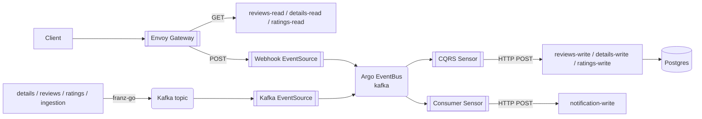

### Alternative (Pub/Sub + Eventarc on GKE)

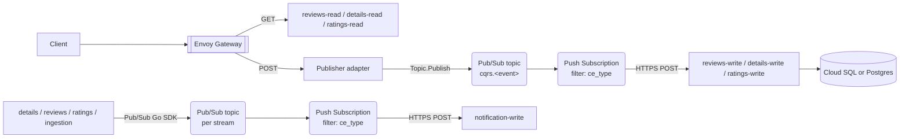
````

- [ ] **Step 3: Add the Glossary translation table**

Append:

```markdown
## Glossary translation

| Concept | Argo Events | Pub/Sub + Eventarc | Crossplane resource (upjet-gcp) |
|---|---|---|---|
| Messaging fabric | `EventBus` (Kafka or NATS Jetstream) | Pub/Sub itself (no separate construct) | n/a |
| Stream / topic | Kafka topic | Pub/Sub Topic | `pubsub.gcp.upbound.io/v1beta1` `Topic` |
| Producer-side bridge | `EventSource` (kafka type) | None — subscribers attach directly | n/a |
| HTTP ingress for writes | `EventSource` (webhook type) | Eventarc generic HTTP source OR thin in-cluster publisher service | `eventarc.gcp.upbound.io/v1beta1` `Trigger` (Eventarc path) |
| Routing logic | `Sensor` with `dependencies` and `triggers` | Subscription with `filter` + push endpoint, OR Eventarc `Trigger` | `pubsub.gcp.upbound.io/v1beta1` `Subscription` |
| Filter on event metadata | Sensor `filters.data` (e.g. `headers.ce_type`) | Subscription `filter` expression on attributes | (in `Subscription` spec) |
| Retry on delivery failure | Sensor `retryStrategy` | Subscription `retryPolicy` | (in `Subscription` spec) |
| Dead-letter | Sensor `dlqTrigger` (HTTP) | Subscription `dead_letter_policy` → DLQ Topic | (in `Subscription` spec) + extra `Topic` |
| Identity | KSA (chart-managed) | KSA → GSA via Workload Identity | `cloudplatform.gcp.upbound.io/v1beta1` `ServiceAccount` + `iam.gcp.upbound.io/v1beta1` `ServiceAccountIAMMember` |
| Per-resource permission | RBAC on KSA | `IAMMember` (e.g. `roles/pubsub.publisher`, `roles/pubsub.subscriber`) | `pubsub.gcp.upbound.io/v1beta1` `TopicIAMMember` / `SubscriptionIAMMember` |
```

- [ ] **Step 4: Render check**

Open `00-overview.md` in markdown preview. Confirm:

- Both mermaid diagrams render (in VS Code, install "Markdown Preview Mermaid Support" or push to a branch and view on GitHub).
- The glossary table renders with all columns aligned.
- No broken anchors.

If a mermaid block fails to render, the most likely cause is a stray HTML entity (`<`, `>`, `&`) inside a node label. Wrap such labels in double quotes: `Label["text with <stuff>"]`.

- [ ] **Step 5: Stage but do not commit yet** (this file is committed at the end of Task 5)

---

## Task 4: `00-overview.md` — Macro tradeoff matrix

**Files:**
- Modify: `docs/comparisons/argo-events-vs-pubsub-eventarc/00-overview.md`

- [ ] **Step 1: Append the Macro tradeoff matrix section**

```markdown
## Macro tradeoff matrix

| Axis | Argo Events | Pub/Sub + Eventarc | Verdict |
|---|---|---|---|
| Portability across clouds / on-prem | Runs anywhere Kubernetes runs; Kafka or NATS Jetstream backends | GCP-only managed services; Pub/Sub is not portable | argo wins |
| Coupling to GKE control plane | None; pure Kubernetes CRDs | Tight — Eventarc Trigger destinations and Workload Identity tie to GKE | argo wins |
| Day-2 ops surface | Argo CRDs (EventBus, EventSource, Sensor) + Strimzi/NATS operator + Kafka brokers + JetStream | Crossplane CRDs + GCP IAM + Pub/Sub dashboards + Eventarc UI | depends — see notes |
| Identity model uniformity | One chart-managed KSA per service covers everything via in-cluster RBAC | Per-event GSA + IAM bindings + KSA annotation; per-subscription Pub/Sub identity | argo wins |
| Schema enforcement | None at the bus layer | Pub/Sub Schemas (Avro / Protobuf) attachable to a Topic | GCP wins |
| Replay model | Kafka offset replay or dlqueue-driven re-POST | Pub/Sub `seek` (timestamp / snapshot) + DLQ resubscribe | depends — see notes |
| Latency profile | In-cluster Sensor → in-cluster service: low single-digit ms p50 | Pub/Sub push round-trip: tens of ms p50 to in-cluster GKE endpoint | argo wins |
| Cost model | Cluster compute for Kafka brokers + sensor pods (sunk capacity) | Per-message Pub/Sub + Eventarc fees; no broker compute | depends — see notes |
| Vendor lock-in | None (CNCF projects + open-source brokers) | High (Pub/Sub + Eventarc are first-party GCP) | argo wins |
| Observability story | OTel-instrumented sensors + EventSource span coverage; same stack as the rest of the cluster | Cloud Trace + Cloud Logging integration out of the box; correlating with in-cluster traces requires extra glue | depends — see notes |

The matrix deliberately avoids a single-line summary verdict on the entire stack. Pick axes that matter for your context, then read the per-pattern files for resource and operational specifics.
```

- [ ] **Step 2: Render check** — open the file in preview, confirm the four-column table renders cleanly.

- [ ] **Step 3: Stage but do not commit yet.**

---

## Task 5: `00-overview.md` — Resource burden snapshot + how-to-read

**Files:**
- Modify: `docs/comparisons/argo-events-vs-pubsub-eventarc/00-overview.md`

- [ ] **Step 1: Append the Resource burden snapshot**

```markdown
## Resource burden snapshot

This is the opinionated section. Same operational changes, different resource counts. Detailed scenarios in [`05-resource-checklists.md`](05-resource-checklists.md).

| Operational change | Argo Events | Pub/Sub + Eventarc |
|---|---|---|
| Expose a new event from a service | +1 Kafka EventSource (CR) — assumes Kafka topic already provisioned | +1 Topic + 1 GSA + 1 IAM publisher binding + 1 KSA annotation (4 GCP-side artifacts) |
| Consume one event with ce_type filter (existing consumer) | +1 dependency entry + 1 trigger entry on existing Sensor (0 new CRs) | +1 Subscription + 1 IAM subscriber binding + (if new identity) 1 GSA + 1 KSA annotation |
| Fan-in 4 ce_types into one consumer | 1 Consumer Sensor with 4 dependencies (the current `notification-consumer-sensor`) | 4 Subscriptions, each with its own filter expression and IAM binding |
| New CQRS write-path service with 1 endpoint | +1 webhook EventSource + 1 Sensor + the chart-rendered ClusterIP Service for the EventSource | +1 Topic + 1 Subscription + 1 GSA + 1 IAM subscriber binding + 1 KSA annotation; the publisher adapter side adds another GSA + IAM publisher binding |
| Enable DLQ on a new consumer | 0 new resources — sensor `dlqTrigger` renders automatically when `sensor.dlq.enabled: true` | +1 DLQ Topic (or reuse one) + `dead_letter_policy` on the Subscription + 1 IAM binding granting Pub/Sub service agent publisher rights to the DLQ Topic |
```

- [ ] **Step 2: Append the How to read this doc set section**

```markdown
## How to read this doc set

| File | When to read it |
|---|---|
| [`01-cqrs.md`](01-cqrs.md) | You're touching the write-path: CQRS endpoints, the gateway routing, or the sensors that fire `<svc>-write`. |
| [`02-events-catalog.md`](02-events-catalog.md) | You're adding a service that exposes or consumes a named event. |
| [`03-dlq.md`](03-dlq.md) | You're touching dlqueue or designing failure-handling policy. |
| [`04-ingestion-producer.md`](04-ingestion-producer.md) | You're adding a new producer (especially one that publishes via SDK like ingestion does). |
| [`05-resource-checklists.md`](05-resource-checklists.md) | You want a yes/no list of "which resources do I provision for change X". |
```

- [ ] **Step 3: Render check** — open in preview, confirm both tables render and links are present (don't fail if anchors don't resolve yet — sibling files are still empty).

- [ ] **Step 4: Commit `00-overview.md`**

```bash
git add docs/comparisons/argo-events-vs-pubsub-eventarc/00-overview.md
git commit -s -m "docs(comparisons): write 00-overview.md (scope, glossary, macro matrix)"
```

---

## Task 6: `01-cqrs.md` — Today (Argo Events) section

**Files:**
- Modify: `docs/comparisons/argo-events-vs-pubsub-eventarc/01-cqrs.md`

- [ ] **Step 1: Append the Today section**

````markdown
## Today (Argo Events)

A POST to a CQRS endpoint flows: gateway → webhook EventSource → EventBus (Kafka) → Sensor → write Service.

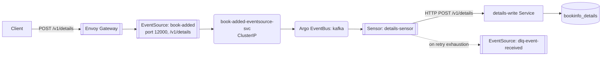

Live cluster inventory (verified 2026-04-27, context `k3d-bookinfo-local`):

| Resource | Count | Names |
|---|---|---|
| EventBus | 1 | `kafka` |
| Webhook EventSources | 5 | `book-added`, `review-submitted`, `review-deleted`, `rating-submitted`, `dlq-event-received` |
| EventSource ClusterIP Services | 5 | `<event>-eventsource-svc` per webhook EventSource |
| CQRS Sensors | 4 | `details-sensor`, `reviews-sensor`, `ratings-sensor`, `dlqueue-sensor` |

All five webhook EventSources listen on **port 12000**. The per-service `deploy/<svc>/values-local.yaml` files still encode the legacy distinct ports 12000-12004; these have been superseded by a recent consolidation and the live cluster diverges from those values. Treat the live state as authoritative.

`reviews-sensor` is notable: it covers both `review-submitted` and `review-deleted` in a single Sensor with two dependencies and two triggers. One Argo Sensor can multiplex N CQRS endpoints for one service cheaply — there is no per-endpoint Sensor proliferation.
````

- [ ] **Step 2: Render check** — confirm the mermaid renders and the table is aligned.

- [ ] **Step 3: Stage, do not commit yet.**

---

## Task 7: `01-cqrs.md` — Pub/Sub + Eventarc section with Crossplane YAML

**Files:**
- Modify: `docs/comparisons/argo-events-vs-pubsub-eventarc/01-cqrs.md`

- [ ] **Step 1: Append the Alternative section with diagram and design choice explanation**

````markdown
## Alternative (Pub/Sub + Eventarc)

Two design variants — the doc primarily uses (a) and notes (b) inline.

- **(a) Thin in-cluster publisher adapter:** a small Go service receives `POST /v1/<endpoint>` from the gateway and calls `Topic.Publish()` against a per-event Pub/Sub topic. A push Subscription delivers to `<svc>-write`. This keeps the gateway routing identical to today.
- **(b) Eventarc generic HTTP source:** Eventarc receives the POST directly and emits to a Pub/Sub topic. Removes the publisher adapter but ties routing semantics to Eventarc's trigger model and requires the destination to be reachable via Eventarc's GKE-internal channel (or a public LB).

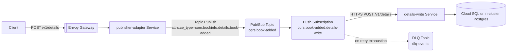

The push Subscription's destination must be reachable from Pub/Sub. On GKE, the supported pattern is to expose the in-cluster `<svc>-write` via Eventarc's GKE destination type (Eventarc Trigger with `destination.gke`), or to terminate on an internal load balancer. The doc shows the Trigger path because it's the cleaner integration.
````

- [ ] **Step 2: Append the Crossplane YAML for the `book-added` example**

Substitute `vX.Y.Z` with the tag pinned in Task 1.

````markdown
### Crossplane resources (book-added example)

```yaml
# upbound/provider-upjet-gcp@vX.Y.Z
apiVersion: pubsub.gcp.upbound.io/v1beta1
kind: Topic
metadata:
  name: cqrs-book-added
spec:
  forProvider:
    messageRetentionDuration: 86400s
  providerConfigRef:
    name: gcp-default
---
apiVersion: cloudplatform.gcp.upbound.io/v1beta1
kind: ServiceAccount
metadata:
  name: details-write-pubsub
spec:
  forProvider:
    accountId: details-write-pubsub
    displayName: details-write Pub/Sub identity
  providerConfigRef:
    name: gcp-default
---
apiVersion: iam.gcp.upbound.io/v1beta1
kind: ServiceAccountIAMMember
metadata:
  name: details-write-pubsub-wi
spec:
  forProvider:
    serviceAccountIdRef:
      name: details-write-pubsub
    role: roles/iam.workloadIdentityUser
    member: serviceAccount:<PROJECT_ID>.svc.id.goog[bookinfo/details]
  providerConfigRef:
    name: gcp-default
---
apiVersion: eventarc.gcp.upbound.io/v1beta1
kind: Trigger
metadata:
  name: cqrs-book-added-to-details-write
spec:
  forProvider:
    location: <REGION>
    matchingCriteria:
      - attribute: type
        value: google.cloud.pubsub.topic.v1.messagePublished
    transport:
      pubsub:
        topicRef:
          name: cqrs-book-added
    destination:
      gke:
        cluster: bookinfo-cluster
        location: <REGION>
        namespace: bookinfo
        service: details-write
        path: /v1/details
    serviceAccountRef:
      name: details-write-pubsub
  providerConfigRef:
    name: gcp-default
```

The KSA the chart already creates (`details`) gets one annotation:

```yaml
metadata:
  annotations:
    iam.gke.io/gcp-service-account: details-write-pubsub@<PROJECT_ID>.iam.gserviceaccount.com
```

Per the design assumption, KSA annotations are not counted as resources but are flagged when required.
````

- [ ] **Step 3: Render check** — confirm mermaid + YAML blocks render, no syntax highlight bleed across blocks.

- [ ] **Step 4: Stage, do not commit yet.**

---

## Task 8: `01-cqrs.md` — Side-by-side resource table + tradeoffs

**Files:**
- Modify: `docs/comparisons/argo-events-vs-pubsub-eventarc/01-cqrs.md`

- [ ] **Step 1: Append the Side-by-side resource table**

```markdown
## Side-by-side resources for one CQRS endpoint

| Resource | Argo Events | Pub/Sub + Eventarc | Notes |
|---|---|---|---|
| Ingress route | HTTPRoute (existing) | HTTPRoute (existing) | Unchanged |
| Inbound HTTP receiver | EventSource CR + auto-created Deployment + ClusterIP Service | publisher-adapter Service (or Eventarc generic HTTP source) + KSA annotation | Eventarc variant removes the adapter but adds Trigger config |
| Bus / topic | EventBus (shared, 1 cluster-wide) | Pub/Sub Topic (1 per event) | Pub/Sub has no shared "bus" object |
| Routing rule | Sensor dependency + trigger entries (multiplexed) | Eventarc Trigger OR Subscription per endpoint | N endpoints in argo = 1 Sensor; in GCP = N Triggers |
| Identity | Chart KSA only | KSA + GSA + WI binding | GCP requires a GSA per identity boundary |
| IAM binding for delivery | RBAC on the KSA (in-cluster) | `roles/pubsub.subscriber` on Subscription or push-target identity | One per Subscription |
| Retry policy | `sensor.retryStrategy` (steps, duration, factor, jitter) | `Subscription.retryPolicy.minimumBackoff` / `maximumBackoff` | Different shape; map carefully |
| Idle resource cost | Sensor pod kept warm | Push Subscription = no idle cost; Eventarc Trigger billed per event | GCP wins on idle cost; argo wins on per-event cost |
```

- [ ] **Step 2: Append the Tradeoffs section**

```markdown
## Tradeoffs

The opinionated take, scoped to ops/resource burden:

- **N endpoints per service.** Argo bundles them into one Sensor. GCP fans them out into one Trigger or Subscription each. For a service like `reviews` (2 endpoints), the GCP design is roughly 2× the IAM/Topic/Trigger sprawl. For a hypothetical 6-endpoint service this scales linearly on GCP and stays flat on argo.
- **Identity sprawl.** Every Pub/Sub-side actor (publisher adapter, push Subscription delivery identity) needs its own GSA + IAM binding + WI annotation. The chart-managed KSA pattern collapses to a single identity per service.
- **Retry semantics map but don't translate cleanly.** Argo `retryStrategy` has `steps + factor + jitter`; Pub/Sub `retryPolicy` has `minimumBackoff` and `maximumBackoff` only — the curve shape is implicit. If your current `factor` is doing real work, the GCP equivalent is approximate.
- **The webhook port consolidation matters.** All five webhook EventSources today share port 12000 across separate ClusterIP Services. The GCP design has no port-allocation question at all (Pub/Sub topics aren't HTTP-addressable). One less coordination surface.

Macro architecture is roughly a wash for CQRS — both deliver the read/write split, both retry, both fail to a DLQ. Pick on portability, not on this pattern.
```

- [ ] **Step 3: Render check** — confirm both tables render.

- [ ] **Step 4: Commit `01-cqrs.md`**

```bash
git add docs/comparisons/argo-events-vs-pubsub-eventarc/01-cqrs.md
git commit -s -m "docs(comparisons): write 01-cqrs.md (CQRS write-path comparison)"
```

---

## Task 9: `02-events-catalog.md` — `events.exposed` section

**Files:**
- Modify: `docs/comparisons/argo-events-vs-pubsub-eventarc/02-events-catalog.md`

- [ ] **Step 1: Append the Today section for exposed events**

````markdown
## Today — `events.exposed`

Producers publish to Kafka topics directly via franz-go (in-process Kafka client). The chart's `events.exposed` map renders one Kafka-type EventSource per producer to bridge the topic into the Argo EventBus, so downstream Sensors can depend on `eventSourceName` + `eventName` instead of subscribing to Kafka directly.

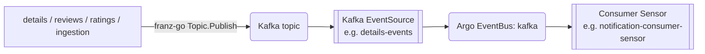

Live inventory (verified 2026-04-27):

| Producer | Kafka topic | Kafka EventSource (`events.exposed`) |
|---|---|---|
| details | `bookinfo_details_events` | `details-events` |
| reviews | `bookinfo_reviews_events` | `reviews-events` |
| ratings | `bookinfo_ratings_events` | `ratings-events` |
| ingestion | `raw_books_details` | `ingestion-raw-books-details` |

The Kafka EventSource is the broker-to-EventBus bridge. There is no GCP equivalent — Pub/Sub Subscriptions attach directly to a Topic. The `events.exposed` config has no analogue in the GCP design; producers and consumers communicate through the Topic itself.
````

- [ ] **Step 2: Append the Alternative section for exposed events**

````markdown
## Alternative — Pub/Sub Topic per stream

The producer service uses the Pub/Sub Go client (`cloud.google.com/go/pubsub`) and publishes to a Pub/Sub Topic. There is no separate "EventSource" object — the Topic is the publish surface and the subscribe surface.

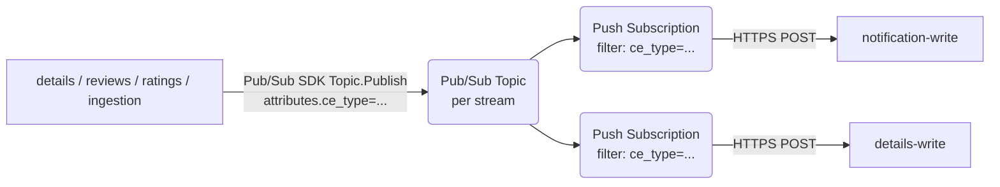

Two topology options for the topic→stream mapping:

- **One topic per logical stream** (mirrors today: `bookinfo_details_events` → `details-events` Pub/Sub topic). Subscribers filter by `ce_type` attribute.
- **One topic per ce_type** (more granular). Subscribers don't need a filter expression; just attach. This collapses the filter complexity but multiplies the Topic count and IAM bindings.

The doc uses the per-stream model in examples because it matches today's Kafka topology and keeps Topic count comparable.
````

- [ ] **Step 3: Append the Crossplane YAML for `details-events`**

````markdown
### Crossplane resources (details-events example)

```yaml
# upbound/provider-upjet-gcp@vX.Y.Z
apiVersion: pubsub.gcp.upbound.io/v1beta1
kind: Topic
metadata:
  name: bookinfo-details-events
spec:
  forProvider:
    messageRetentionDuration: 604800s
  providerConfigRef:
    name: gcp-default
---
apiVersion: cloudplatform.gcp.upbound.io/v1beta1
kind: ServiceAccount
metadata:
  name: details-publisher
spec:
  forProvider:
    accountId: details-publisher
    displayName: details producer identity
  providerConfigRef:
    name: gcp-default
---
apiVersion: pubsub.gcp.upbound.io/v1beta1
kind: TopicIAMMember
metadata:
  name: details-publisher-binding
spec:
  forProvider:
    topicRef:
      name: bookinfo-details-events
    role: roles/pubsub.publisher
    member: serviceAccount:details-publisher@<PROJECT_ID>.iam.gserviceaccount.com
  providerConfigRef:
    name: gcp-default
---
apiVersion: iam.gcp.upbound.io/v1beta1
kind: ServiceAccountIAMMember
metadata:
  name: details-publisher-wi
spec:
  forProvider:
    serviceAccountIdRef:
      name: details-publisher
    role: roles/iam.workloadIdentityUser
    member: serviceAccount:<PROJECT_ID>.svc.id.goog[bookinfo/details]
  providerConfigRef:
    name: gcp-default
```

KSA annotation on the chart-managed `details` ServiceAccount:

```yaml
metadata:
  annotations:
    iam.gke.io/gcp-service-account: details-publisher@<PROJECT_ID>.iam.gserviceaccount.com
```
````

- [ ] **Step 4: Render check, then stage but do not commit.**

---

## Task 10: `02-events-catalog.md` — `events.consumed` section (notification fan-in)

**Files:**
- Modify: `docs/comparisons/argo-events-vs-pubsub-eventarc/02-events-catalog.md`

- [ ] **Step 1: Append the Today section for consumed events**

````markdown
## Today — `events.consumed`

The consumer service declares one or more dependencies on an existing Kafka EventSource, optionally filtering by CloudEvents `ce_type`. The chart renders one Consumer Sensor per service that aggregates all consumed events into a single CR.

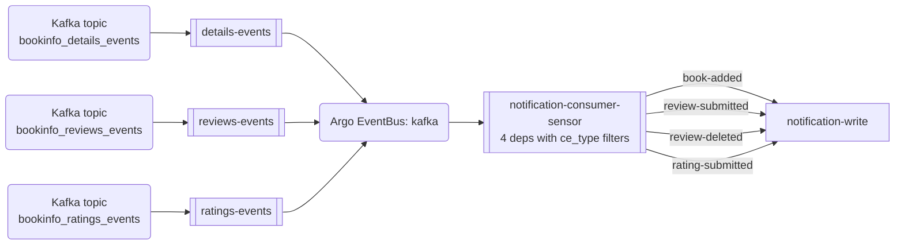

Live `notification-consumer-sensor` dependencies (verified 2026-04-27):

| Dependency name | EventSource.eventName | ce_type filter |
|---|---|---|
| `book-added-dep` | `details-events.events` | `com.bookinfo.details.book-added` |
| `review-submitted-dep` | `reviews-events.events` | `com.bookinfo.reviews.review-submitted` |
| `review-deleted-dep` | `reviews-events.events` | `com.bookinfo.reviews.review-deleted` |
| `rating-submitted-dep` | `ratings-events.events` | `com.bookinfo.ratings.rating-submitted` |

Fan-in cost: **1 Sensor CR with 4 dependencies and 4 triggers**. Adding a 5th ce_type adds two YAML entries and zero new CRs.

The other consumer Sensor in the cluster, `details-consumer-sensor`, has 1 dependency (`ingestion-raw-books-details`, no ce_type filter) and is shown in [`04-ingestion-producer.md`](04-ingestion-producer.md).
````

- [ ] **Step 2: Append the Alternative section for consumed events**

````markdown
## Alternative — Per-ce_type push Subscriptions

Pub/Sub Subscription `filter` expressions match on message attributes. To replicate the notification fan-in, you provision four push Subscriptions on the relevant Topics, each with a filter expression on `attributes.ce_type`.

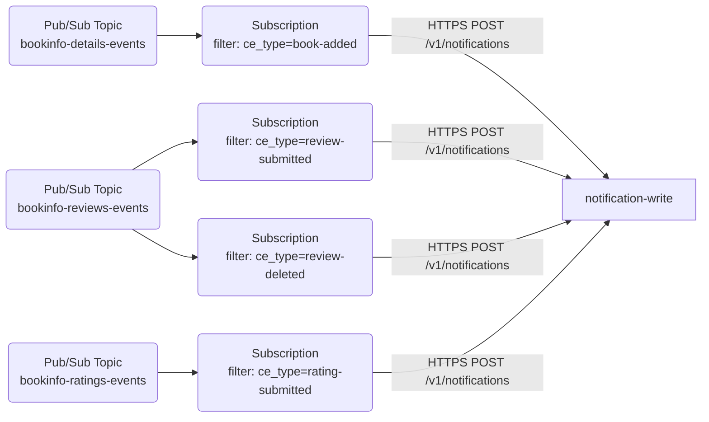

Fan-in cost: **4 Subscriptions** + **4 IAM `roles/pubsub.subscriber` bindings** + **1 GSA for the push delivery identity** + **1 KSA annotation**. Adding a 5th ce_type adds 1 Subscription + 1 IAM binding.
````

- [ ] **Step 3: Append the Crossplane YAML for one of the four Subscriptions**

````markdown
### Crossplane resources (one Subscription example: book-added → notification)

```yaml
# upbound/provider-upjet-gcp@vX.Y.Z
apiVersion: cloudplatform.gcp.upbound.io/v1beta1
kind: ServiceAccount
metadata:
  name: notification-subscriber
spec:
  forProvider:
    accountId: notification-subscriber
    displayName: notification consumer identity
  providerConfigRef:
    name: gcp-default
---
apiVersion: pubsub.gcp.upbound.io/v1beta1
kind: Subscription
metadata:
  name: notification-book-added
spec:
  forProvider:
    topicRef:
      name: bookinfo-details-events
    filter: 'attributes.ce_type = "com.bookinfo.details.book-added"'
    ackDeadlineSeconds: 30
    retryPolicy:
      minimumBackoff: 2s
      maximumBackoff: 60s
    deadLetterPolicy:
      deadLetterTopicRef:
        name: bookinfo-dlq
      maxDeliveryAttempts: 5
    pushConfig:
      pushEndpoint: https://notification-write.bookinfo.svc.cluster.local/v1/notifications
      oidcToken:
        serviceAccountEmail: notification-subscriber@<PROJECT_ID>.iam.gserviceaccount.com
  providerConfigRef:
    name: gcp-default
---
apiVersion: pubsub.gcp.upbound.io/v1beta1
kind: SubscriptionIAMMember
metadata:
  name: notification-book-added-binding
spec:
  forProvider:
    subscriptionRef:
      name: notification-book-added
    role: roles/pubsub.subscriber
    member: serviceAccount:notification-subscriber@<PROJECT_ID>.iam.gserviceaccount.com
  providerConfigRef:
    name: gcp-default
```

The remaining three ce_types (`review-submitted`, `review-deleted`, `rating-submitted`) each get a near-identical Subscription + binding pair. The GSA and DLQ Topic are reused.

The pushEndpoint shown is illustrative — Pub/Sub push to an in-cluster service requires either an internal-facing public hostname or the Eventarc GKE destination flavor. See [`01-cqrs.md`](01-cqrs.md) for the GKE-internal channel discussion.
````

- [ ] **Step 4: Render check, then stage but do not commit.**

---

## Task 11: `02-events-catalog.md` — Side-by-side table + tradeoffs

**Files:**
- Modify: `docs/comparisons/argo-events-vs-pubsub-eventarc/02-events-catalog.md`

- [ ] **Step 1: Append the side-by-side resource table**

```markdown
## Side-by-side resources

For exposing one event:

| Resource | Argo Events | Pub/Sub + Eventarc | Notes |
|---|---|---|---|
| Topic / stream | Kafka topic (Strimzi `KafkaTopic`) | Pub/Sub Topic (Crossplane `Topic`) | Equivalent at concept level |
| Bus bridge | Kafka EventSource CR | n/a | GCP has no equivalent construct |
| Producer identity | Chart KSA (in-cluster) | GSA + IAM publisher binding + KSA annotation | |
| Producer SDK | franz-go (Kafka client) | `cloud.google.com/go/pubsub` | |

For consuming one event with a ce_type filter:

| Resource | Argo Events | Pub/Sub + Eventarc | Notes |
|---|---|---|---|
| Filter | Sensor `filters.data.path: headers.ce_type` (in-Sensor) | `Subscription.filter` expression on `attributes.ce_type` (managed-side) | |
| Routing rule | Sensor dependency + trigger entry | Subscription with push config | |
| Aggregation | One Sensor CR per consumer service, N dependencies | One Subscription per ce_type | argo collapses, GCP fans out |
| Identity | Chart KSA | GSA + WI binding for push identity (OIDC) | |
| IAM binding for delivery | n/a (in-cluster RBAC) | `roles/pubsub.subscriber` on Subscription | |
```

- [ ] **Step 2: Append the Tradeoffs section**

```markdown
## Tradeoffs

- **Filter location matters for cost.** Argo's Sensor filter runs in-cluster after the message arrives at the EventBus, so unmatched messages still cross the bus. Pub/Sub's Subscription filter runs server-side — unmatched messages don't get delivered and don't cost ack/nack budget. For high-volume topics with low-match consumers, this is a real win for GCP.
- **Subscription explosion vs Sensor multiplexing.** N ce_types in one consumer = 1 Argo Sensor or N Pub/Sub Subscriptions. The Sensor change is "add 2 YAML entries"; the Pub/Sub change is "add 1 Subscription + 1 IAM binding per ce_type". Adding a 5th notification ce_type today is ~5 lines of values change; on Pub/Sub it's a fresh Crossplane manifest.
- **The Kafka EventSource bridge has no analogue.** This collapses a layer in the GCP design: producers publish straight to the Topic, consumers subscribe straight to the Topic. One less concept to learn, one less CR per producer.
- **Pub/Sub `filter` expression syntax has limits.** No nested attribute paths, no string functions. The four current notification ce_types are exact matches and translate cleanly; if you ever need prefix matching (e.g. `ce_type starts_with "com.bookinfo.reviews."`), you'll need to either flatten the attribute set, fan out further, or filter app-side.

The macro architecture is roughly a wash, with one nuance: the events catalog pattern is the place where Pub/Sub's lack of a "bus" object actually simplifies the topology. The Kafka EventSource exists in argo because the EventBus is a separate primitive from Kafka; Pub/Sub merges them.
```

- [ ] **Step 3: Render check, then commit `02-events-catalog.md`**

```bash
git add docs/comparisons/argo-events-vs-pubsub-eventarc/02-events-catalog.md
git commit -s -m "docs(comparisons): write 02-events-catalog.md (exposed + consumed)"
```

---

## Task 12: `03-dlq.md` — Full file

**Files:**
- Modify: `docs/comparisons/argo-events-vs-pubsub-eventarc/03-dlq.md`

- [ ] **Step 1: Append the Today section**

````markdown
## Today — `dlqTrigger` to dlqueue

Every Argo Sensor trigger automatically renders a `dlqTrigger` block when `sensor.dlq.enabled: true` (default). On retry exhaustion, the Sensor POSTs a structured payload to the `dlq-event-received` webhook EventSource, which forwards into the EventBus and lands at `dlqueue-write` via `dlqueue-sensor`.

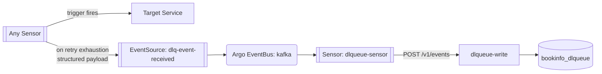

The `dlqTrigger` payload includes:

- `original_payload`, `original_headers` — the message that failed
- CloudEvents context keys: `event_id`, `event_type`, `event_source`, `event_subject`, `event_timestamp`, `datacontenttype`
- Sensor-side metadata: `sensor_name`, `failed_trigger`, `eventsource_url` (or `eventsource_name`), `namespace`

Dedup key on the dlqueue side: `SHA-256(sensor_name + failed_trigger + payload)`. State machine: `pending → replayed → resolved / poisoned`.

Resource cost: **0 new resources per consumer** to enable DLQ. The trigger renders inside the existing Sensor.
````

- [ ] **Step 2: Append the Alternative section**

````markdown
## Alternative — Subscription `dead_letter_policy`

GCP-native DLQ is configured per Subscription. After `maxDeliveryAttempts` failures (subject to `Subscription.retryPolicy`), the Pub/Sub service agent re-publishes the message to a designated DLQ Topic. A second Subscription on that Topic pushes to dlqueue-write.

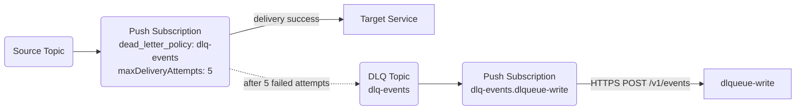

Resource cost per consumer that wants DLQ enabled: 1 `dead_letter_policy` field on its Subscription + (one-time) 1 DLQ Topic + 1 Subscription on the DLQ Topic + IAM binding granting `roles/pubsub.publisher` on the DLQ Topic to the project's Pub/Sub service agent (`service-<project-number>@gcp-sa-pubsub.iam.gserviceaccount.com`).
````

- [ ] **Step 3: Append Crossplane YAML and side-by-side table**

````markdown
### Crossplane resources (DLQ Topic + project-wide IAM)

```yaml
# upbound/provider-upjet-gcp@vX.Y.Z
apiVersion: pubsub.gcp.upbound.io/v1beta1
kind: Topic
metadata:
  name: bookinfo-dlq
spec:
  forProvider:
    messageRetentionDuration: 604800s
  providerConfigRef:
    name: gcp-default
---
apiVersion: pubsub.gcp.upbound.io/v1beta1
kind: TopicIAMMember
metadata:
  name: bookinfo-dlq-pubsub-agent-publisher
spec:
  forProvider:
    topicRef:
      name: bookinfo-dlq
    role: roles/pubsub.publisher
    member: serviceAccount:service-<PROJECT_NUMBER>@gcp-sa-pubsub.iam.gserviceaccount.com
  providerConfigRef:
    name: gcp-default
---
apiVersion: pubsub.gcp.upbound.io/v1beta1
kind: Subscription
metadata:
  name: bookinfo-dlq-to-dlqueue
spec:
  forProvider:
    topicRef:
      name: bookinfo-dlq
    ackDeadlineSeconds: 30
    pushConfig:
      pushEndpoint: https://dlqueue-write.bookinfo.svc.cluster.local/v1/events
      oidcToken:
        serviceAccountEmail: dlqueue-subscriber@<PROJECT_ID>.iam.gserviceaccount.com
  providerConfigRef:
    name: gcp-default
```

Each consumer Subscription that wants DLQ adds (in its own manifest):

```yaml
spec:
  forProvider:
    deadLetterPolicy:
      deadLetterTopicRef:
        name: bookinfo-dlq
      maxDeliveryAttempts: 5
```

## Side-by-side

| Resource | Argo Events | Pub/Sub + Eventarc |
|---|---|---|
| Per-consumer DLQ enablement | `sensor.dlq.enabled: true` (1 boolean, default true) | `deadLetterPolicy` block on each Subscription |
| Shared DLQ destination | `dlq-event-received` EventSource (1 cluster-wide) | DLQ Topic (1 cluster-wide) |
| DLQ delivery path | Sensor → EventSource → Bus → dlqueue-sensor → dlqueue-write | DLQ Topic → Subscription → dlqueue-write |
| Payload enrichment | Sensor adds `sensor_name`, `failed_trigger`, etc. via `payload` mapping | Pub/Sub forwards original message; metadata goes in attributes (`googclient_deliveryattempt`, original Subscription path) |
| Per-Subscription IAM | n/a (in-cluster RBAC) | `roles/pubsub.publisher` for the Pub/Sub service agent on the DLQ Topic |
````

- [ ] **Step 4: Append Tradeoffs**

```markdown
## Tradeoffs

- **Payload shape changes.** Argo enriches the failed message with sensor-side metadata before it lands at dlqueue. Pub/Sub forwards the original message as-is and adds metadata only as Pub/Sub attributes. The current dlqueue dedup key (`sensor_name + failed_trigger + payload`) doesn't translate directly: the GCP equivalent would dedup on `(subscription_name, message_id, payload)` or carry the same metadata as Pub/Sub attributes deliberately added by the publisher. Migrating dlqueue to GCP would require reshaping the DLQ message contract.
- **Default-on vs opt-in.** Argo's chart defaults `sensor.dlq.enabled: true` — every consumer gets DLQ for free. Pub/Sub's `deadLetterPolicy` is an explicit field per Subscription; the chart-equivalent would have to render it by default for parity.
- **One DLQ Topic vs one DLQ EventSource.** Both stacks centralize the dead-letter destination. The big difference is the IAM ceremony around granting the Pub/Sub service agent rights to publish into the DLQ Topic — a one-time setup, but one more identity to track.
- **0 vs >0 new resources to enable DLQ on a new consumer.** Argo: 0. GCP: 1 `deadLetterPolicy` block + 1 IAM binding (already in place if the DLQ is reused). The argo wins here is real.
```

- [ ] **Step 5: Render check, then commit `03-dlq.md`**

```bash
git add docs/comparisons/argo-events-vs-pubsub-eventarc/03-dlq.md
git commit -s -m "docs(comparisons): write 03-dlq.md (dlqTrigger vs dead_letter_policy)"
```

---

## Task 13: `04-ingestion-producer.md` — Full file

**Files:**
- Modify: `docs/comparisons/argo-events-vs-pubsub-eventarc/04-ingestion-producer.md`

- [ ] **Step 1: Append the Today section**

````markdown
## Today — In-cluster producers

Four producers in the cluster, each publishing to a Kafka topic via franz-go. The chart's `events.exposed` map renders one Kafka EventSource per producer for downstream consumption.

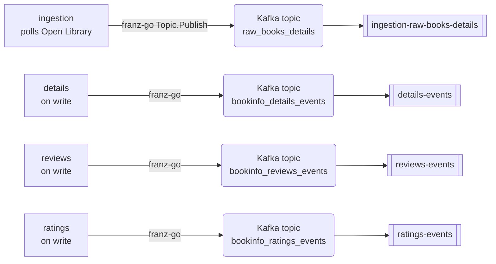

| Producer | Topic | Kafka EventSource | Trigger |
|---|---|---|---|
| ingestion | `raw_books_details` | `ingestion-raw-books-details` | poll-on-interval (`POLL_INTERVAL`) |
| details | `bookinfo_details_events` | `details-events` | on successful write |
| reviews | `bookinfo_reviews_events` | `reviews-events` | on successful write |
| ratings | `bookinfo_ratings_events` | `ratings-events` | on successful write |

ingestion is the standout case: stateless, single Deployment (no CQRS split), no inbound HTTP at all — it polls and emits. The other three producers emit as a side effect of CQRS write handling.

Per-producer cost: 1 Kafka topic (Strimzi `KafkaTopic`) + 1 Kafka EventSource (CR). The franz-go client does the work; no separate adapter needed.
````

- [ ] **Step 2: Append the Alternative section**

````markdown
## Alternative — Pub/Sub publish via SDK with Workload Identity

The producer service uses `cloud.google.com/go/pubsub` to publish straight to a Pub/Sub Topic. Authentication via GKE Workload Identity (the KSA the chart already creates is annotated with the GSA email; the GSA holds `roles/pubsub.publisher` on the Topic).

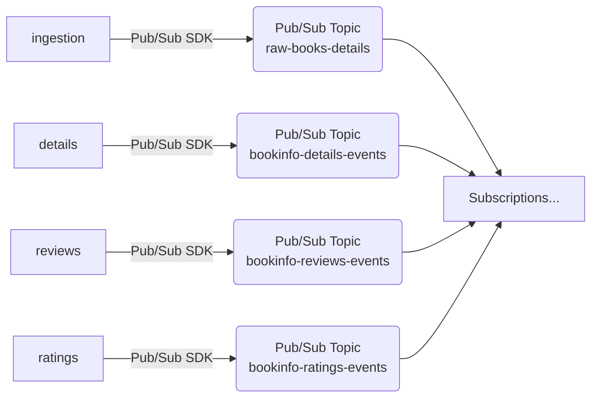

The `events.exposed` bridge collapses entirely: subscribers attach directly to the Topic. Producers don't know about subscribers.

Per-producer cost: 1 Pub/Sub Topic + 1 GSA + 1 `TopicIAMMember` (`roles/pubsub.publisher`) + 1 `ServiceAccountIAMMember` (`roles/iam.workloadIdentityUser` on the GSA for the KSA principal) + 1 KSA annotation on the chart-managed ServiceAccount.
````

- [ ] **Step 3: Append the Crossplane YAML and side-by-side table**

````markdown
### Crossplane resources (ingestion example)

See [`02-events-catalog.md`](02-events-catalog.md#crossplane-resources-details-events-example) for the full pattern. ingestion's manifest is the same shape, with `metadata.name` and the GSA name swapped:

```yaml
# upbound/provider-upjet-gcp@vX.Y.Z
apiVersion: pubsub.gcp.upbound.io/v1beta1
kind: Topic
metadata:
  name: raw-books-details
spec:
  forProvider:
    messageRetentionDuration: 604800s
---
apiVersion: cloudplatform.gcp.upbound.io/v1beta1
kind: ServiceAccount
metadata:
  name: ingestion-publisher
spec:
  forProvider:
    accountId: ingestion-publisher
---
apiVersion: pubsub.gcp.upbound.io/v1beta1
kind: TopicIAMMember
metadata:
  name: ingestion-publisher-binding
spec:
  forProvider:
    topicRef:
      name: raw-books-details
    role: roles/pubsub.publisher
    member: serviceAccount:ingestion-publisher@<PROJECT_ID>.iam.gserviceaccount.com
---
apiVersion: iam.gcp.upbound.io/v1beta1
kind: ServiceAccountIAMMember
metadata:
  name: ingestion-publisher-wi
spec:
  forProvider:
    serviceAccountIdRef:
      name: ingestion-publisher
    role: roles/iam.workloadIdentityUser
    member: serviceAccount:<PROJECT_ID>.svc.id.goog[bookinfo/ingestion]
```

(`providerConfigRef: name: gcp-default` is implied for all four — omitted for brevity.)

## Side-by-side resources for one producer

| Resource | Argo Events | Pub/Sub + Eventarc | Notes |
|---|---|---|---|
| Stream object | Strimzi `KafkaTopic` | `Topic` (Pub/Sub) | 1:1 |
| Bus bridge | Kafka EventSource CR | n/a | Removed |
| Producer SDK | franz-go | `cloud.google.com/go/pubsub` | |
| Producer identity | Chart KSA | GSA + WI binding + IAM publisher binding + KSA annotation | |
| Total provisioned | 2 (KafkaTopic + EventSource) | 4 (Topic + GSA + IAMMember + WI binding) + 1 KSA annotation | argo: 2 / GCP: 4 + annotation |
````

- [ ] **Step 4: Append the Tradeoffs section**

```markdown
## Tradeoffs

- **Schema enforcement.** Today: none — Kafka topics are byte streams; producers and consumers agree by convention. GCP wins on this axis: Pub/Sub Schemas (Avro / Protobuf) attach to a Topic and reject mismatched publishes. If the project ever wants typed contracts, this is essentially free on Pub/Sub and a build-it-yourself effort on Kafka.
- **Idempotent publish.** Kafka producer idempotence is a client config flag (`enable.idempotence=true`), already a common franz-go default. Pub/Sub is at-least-once; ordering keys give per-key in-order delivery. Either stack lets the consumer dedup by `idempotency_key`, which is what the bookinfo write services already do.
- **Identity overhead.** Today the chart KSA is sufficient — Kafka in-cluster has no GCP-side identity. GCP adds GSA + IAM publisher binding + WI binding + KSA annotation per producer. For four producers, that's 16 GCP-side artifacts (4 each) plus 4 KSA annotations.
- **Observability.** The franz-go producer span is already hooked into the OTel pipeline today. The Pub/Sub Go client emits its own OpenTelemetry spans; correlating them with downstream subscriber spans needs the standard `googclient_*` propagation. Roughly equivalent — both stacks integrate cleanly with the project's existing OTel setup.
```

- [ ] **Step 5: Render check, then commit `04-ingestion-producer.md`**

```bash
git add docs/comparisons/argo-events-vs-pubsub-eventarc/04-ingestion-producer.md
git commit -s -m "docs(comparisons): write 04-ingestion-producer.md"
```

---

## Task 14: `05-resource-checklists.md` — Scenarios A and B

**Files:**
- Modify: `docs/comparisons/argo-events-vs-pubsub-eventarc/05-resource-checklists.md`

- [ ] **Step 1: Append the Reading-conventions section**

```markdown
## Reading conventions

Each scenario lists the operator-side artifacts to add for each stack. **K8s objects** count = CRs + the Deployments and Services they auto-create. **GCP-side objects** count = Crossplane managed resources. **IAM bindings** count separately. **KSA annotations** are flagged but not counted.

Counts assume the relevant shared infrastructure is already in place (EventBus / DLQ Topic / chart KSA pattern).
```

- [ ] **Step 2: Append Scenario A**

````markdown
## Scenario A — Service exposes a new event

Example: ratings adds a `rating-deleted` event on its existing topic.

### Argo Events

- Add an entry under `events.exposed` in `deploy/ratings/values-local.yaml`:

  ```yaml
  events:
    exposed:
      events:                 # existing
        topic: bookinfo_ratings_events
  ```

  No new entry needed if the topic and Kafka EventSource already exist (the new event is a new ce_type on the existing topic).

- The producer code emits the new ce_type via franz-go.

**K8s objects added: 0.** No new CRs.

### Pub/Sub + Eventarc

If reusing the existing `bookinfo-ratings-events` Topic:

- Producer code emits with `attributes.ce_type = "com.bookinfo.ratings.rating-deleted"`.

**GCP-side objects added: 0.** **IAM bindings added: 0.**

If you split per ce_type into its own Topic instead:

- 1 new `Topic` (Crossplane).
- 1 new `TopicIAMMember` granting the existing `ratings-publisher` GSA `roles/pubsub.publisher` on the new Topic.

**GCP-side objects added: 2.** **IAM bindings added: 1.**

**Delta:** argo +0 / GCP +0 (per-stream model) or +2 GCP-side + 1 IAM (per-ce_type model).
````

- [ ] **Step 3: Append Scenario B**

````markdown
## Scenario B — Service consumes a new event with a ce_type filter

Example: notification adds a 5th ce_type, `com.bookinfo.reviews.review-edited`, sourced from the existing `reviews-events` stream.

### Argo Events

- Add to `deploy/notification/values-local.yaml` under `events.consumed`:

  ```yaml
  review-edited:
    eventSourceName: reviews-events
    eventName: events
    filter:
      ceType: com.bookinfo.reviews.review-edited
    triggers:
      - name: notify-review-edited
        url: self
        path: /v1/notifications
        method: POST
        payload:
          - src: { dependencyName: review-edited-dep, dataKey: body.review_id }
            dest: subject
          - src: { value: "Review edited" }
            dest: body
          - src: { value: "system@bookinfo" }
            dest: recipient
          - src: { value: "email" }
            dest: channel
    dlq:
      enabled: true
      url: "http://dlq-event-received-eventsource-svc.bookinfo.svc.cluster.local:12000/v1/events"
  ```

The chart re-renders the existing `notification-consumer-sensor` with one more dependency and one more trigger. **K8s objects added: 0.**

### Pub/Sub + Eventarc

- 1 new `Subscription` on `bookinfo-reviews-events` with filter `attributes.ce_type = "com.bookinfo.reviews.review-edited"` + `pushConfig` to `notification-write` + `deadLetterPolicy` to the shared DLQ Topic.
- 1 new `SubscriptionIAMMember` granting `roles/pubsub.subscriber` to the existing `notification-subscriber` GSA.

**GCP-side objects added: 1.** **IAM bindings added: 1.**

**Delta:** argo +0 / GCP +1 + 1 IAM.
````

- [ ] **Step 4: Render check, then stage but do not commit yet (committed at end of Task 15).**

---

## Task 15: `05-resource-checklists.md` — Scenarios C, D, E + commit

**Files:**
- Modify: `docs/comparisons/argo-events-vs-pubsub-eventarc/05-resource-checklists.md`

- [ ] **Step 1: Append Scenario C**

````markdown
## Scenario C — New CQRS write-path service with 1 endpoint

Example: a new `wishlist` service with one CQRS endpoint `/v1/wishlists` listening for `wishlist-added`.

### Argo Events

Helm values changes:

```yaml
cqrs:
  enabled: true
  endpoints:
    wishlist-added:
      port: 12000
      triggers:
        - name: create-wishlist
          url: self
          payload: [passthrough]
```

Chart-rendered cluster resources:

- 1 webhook `EventSource` (`wishlist-added`) + the auto-created Deployment + ClusterIP Service (`wishlist-added-eventsource-svc`).
- 1 `Sensor` (`wishlist-sensor`) with one dependency on `wishlist-added` and one HTTP trigger to `wishlist-write`.
- 1 `HTTPRoute` matching `POST /v1/wishlists` and forwarding to the EventSource Service.

**K8s objects added: 3 CRs (EventSource, Sensor, HTTPRoute) + 1 Deployment + 1 Service (auto-created).**

### Pub/Sub + Eventarc

- 1 `Topic` (`cqrs-wishlist-added`).
- 1 `ServiceAccount` (GSA) for the wishlist-write push delivery identity.
- 1 `ServiceAccountIAMMember` (WI binding) for the new GSA + KSA pair.
- 1 `Trigger` (Eventarc) targeting the GKE destination `wishlist-write` at path `/v1/wishlists`.
- 1 publisher-adapter Service (in-cluster) OR Eventarc generic HTTP source for the inbound POST.
- 1 KSA annotation on the chart-managed `wishlist` ServiceAccount.

**GCP-side objects added: 4** (Topic, GSA, WI binding, Trigger). **IAM bindings added: 0** beyond what the WI binding covers (Eventarc Trigger spec ties the GSA to the destination implicitly). **K8s objects added in-cluster: 1** (publisher adapter Service).

**Delta:** argo: 3 CRs + 1 Deployment + 1 Service / GCP: 4 GCP-side + 1 in-cluster Service + KSA annotation.
````

- [ ] **Step 2: Append Scenario D**

````markdown
## Scenario D — Enable DLQ on a new consumer

Assume the consumer exists and the shared DLQ destination (Argo `dlq-event-received` EventSource / Pub/Sub `bookinfo-dlq` Topic) is already provisioned.

### Argo Events

Helm values changes:

```yaml
events:
  consumed:
    <event-name>:
      dlq:
        enabled: true              # already default true
        url: "http://dlq-event-received-eventsource-svc.bookinfo.svc.cluster.local:12000/v1/events"
```

Or simply rely on `sensor.dlq.enabled: true` (default) — the chart auto-renders the `dlqTrigger` block on every Sensor trigger. **K8s objects added: 0.**

### Pub/Sub + Eventarc

Append to the consumer's `Subscription` manifest:

```yaml
spec:
  forProvider:
    deadLetterPolicy:
      deadLetterTopicRef:
        name: bookinfo-dlq
      maxDeliveryAttempts: 5
```

Plus a one-time IAM binding granting the project's Pub/Sub service agent `roles/pubsub.publisher` on `bookinfo-dlq` (already in place if any other consumer DLQ uses the same Topic).

**GCP-side objects added: 0.** **IAM bindings added: 0** (assuming the one-time service-agent binding is in place).

**Delta:** argo +0 / GCP +0 (after one-time setup). Both stacks are equally cheap once the DLQ destination exists; argo wins on the very first DLQ enablement (no service-agent IAM dance).
````

- [ ] **Step 3: Append Scenario E**

````markdown
## Scenario E — Bootstrap a brand-new producer service

Example: a new `inventory` service that polls an external API and publishes to a new event stream `inventory-events`.

### Argo Events

Helm values + chart-rendered cluster resources:

- 1 Strimzi `KafkaTopic` for `bookinfo_inventory_events`.
- 1 Kafka `EventSource` (`inventory-events`).
- The service Deployment + Service (auto-created by the chart).
- 1 chart-managed KSA (auto-created).

**K8s objects added: 1 KafkaTopic + 1 EventSource + 1 Deployment + 1 Service + 1 ServiceAccount = 5.**

### Pub/Sub + Eventarc

GCP-side, all via Crossplane:

- 1 `Topic` (`bookinfo-inventory-events`).
- 1 `ServiceAccount` (GSA, e.g. `inventory-publisher`).
- 1 `TopicIAMMember` (`roles/pubsub.publisher`).
- 1 `ServiceAccountIAMMember` (WI binding).

In-cluster:

- The service Deployment + Service (chart).
- 1 chart-managed KSA + 1 KSA annotation pointing at the GSA.

**GCP-side objects added: 4.** **IAM bindings added: 1.** **K8s objects added: 3** (Deployment, Service, KSA — same as before, plus the annotation).

**Delta:** argo: 5 K8s objects (1 messaging-related: KafkaTopic + EventSource = 2) / GCP: 4 GCP-side + 1 IAM + 3 K8s + KSA annotation.

The headline number — **+5 messaging-related objects on GCP vs +2 on argo for a fresh producer** — is the resource-burden gap that scales with producer count. For the four producers in the project today (details, reviews, ratings, ingestion), GCP would have provisioned **+12 extra GCP-side artifacts and +4 extra IAM bindings** that argo collapses into in-cluster RBAC.
````

- [ ] **Step 4: Render check, then commit `05-resource-checklists.md`**

```bash
git add docs/comparisons/argo-events-vs-pubsub-eventarc/05-resource-checklists.md
git commit -s -m "docs(comparisons): write 05-resource-checklists.md (scenarios A-E)"
```

---

## Task 16: Final cross-link, glossary completeness, and validation gates

**Files:**
- Modify: any of the six files as needed

- [ ] **Step 1: Glossary completeness check**

Run a manual scan: open each file `01`-`05` and grep for terms used in tables and prose. For each term, confirm there's a row in `00-overview.md`'s glossary table (Task 3 Step 3). Examples to confirm:

- "EventBus", "EventSource", "Sensor", "Trigger" (Argo)
- "Topic", "Subscription", "Eventarc Trigger", "Workload Identity"
- "ce_type", "CloudEvents", "Pub/Sub service agent"
- "Crossplane", "upjet-gcp", "providerConfigRef"

If any term appears in a later file but not in the glossary, add a row to the glossary in `00-overview.md`.

- [ ] **Step 2: Cross-link check**

Open each file. Confirm every relative link `[text](path.md)` and `[text](path.md#anchor)` resolves. Quick test:

```bash
cd docs/comparisons/argo-events-vs-pubsub-eventarc
for f in *.md; do
  echo "=== $f ==="
  grep -oE '\]\([^)]+\.md[^)]*\)' "$f" | sort -u
done
```

For each linked path, verify the target file exists. For each anchor (`#fragment`), open the target file and confirm a heading produces that anchor (lowercase + hyphenated heading text).

- [ ] **Step 3: Resource count cross-check**

Re-read the live state section in the spec (`docs/superpowers/specs/2026-04-27-argo-events-vs-pubsub-eventarc-comparison-design.md`). Confirm every resource-count claim in the doc set matches:

- 1 EventBus (`kafka`)
- 5 webhook EventSources, all on port 12000
- 4 Kafka EventSources
- 4 CQRS Sensors (one of which, `reviews-sensor`, multiplexes 2 endpoints)
- 2 Consumer Sensors (`details-consumer-sensor` with 1 dependency, `notification-consumer-sensor` with 4)

If any number is wrong, fix it in place and note the source-of-truth section in the spec.

- [ ] **Step 4: Mermaid render check**

Open each file in a markdown preview that supports mermaid (VS Code with the mermaid extension, or push to a remote branch and view on GitHub). Confirm every mermaid block renders without parse errors. Common failure mode: HTML entities (`<`, `>`, `&`) inside node labels — wrap such labels in double quotes.

- [ ] **Step 5: YAML pin check**

Search the doc set for the placeholder `vX.Y.Z` and confirm every occurrence has been replaced with the version pinned in Task 1:

```bash
grep -rn 'vX\.Y\.Z' docs/comparisons/argo-events-vs-pubsub-eventarc/
```

Expected: no matches.

- [ ] **Step 6: Commit any final fixes**

```bash
git add docs/comparisons/argo-events-vs-pubsub-eventarc/
git commit -s -m "docs(comparisons): cross-link, glossary, and version-pin pass"
```

If there are no changes, skip this commit.

- [ ] **Step 7: Push branch and open PR**

```bash
git push -u origin docs/argo-events-vs-pubsub-eventarc-comparison
gh pr create --title "docs(comparisons): argo-events vs pub/sub+eventarc comparison" --body "$(cat <<'EOF'
## Summary

Adds a six-file comparison doc set under `docs/comparisons/argo-events-vs-pubsub-eventarc/` covering the project's current Argo Events implementation side-by-side with an equivalent Pub/Sub + Eventarc design on GKE. Includes resource counts, Crossplane YAML, and tradeoff matrices.

Spec: `docs/superpowers/specs/2026-04-27-argo-events-vs-pubsub-eventarc-comparison-design.md`.

## Test plan

- [ ] All six markdown files render cleanly in GitHub preview (tables + mermaid).
- [ ] Resource counts in `05-resource-checklists.md` match the live cluster inventory verified on 2026-04-27.
- [ ] Crossplane YAML snippets cite the pinned `provider-upjet-gcp` version.
- [ ] Cross-links between files resolve.
EOF
)"
```

---

## Self-Review

After writing the plan, the planner walked the spec sections and confirmed coverage:

- **Spec § Purpose** → Tasks 3-15 produce the six files (hybrid stance).
- **Spec § Audience / Out of scope** → Captured in Task 3 Step 1 (Scope section in `00-overview.md`).
- **Spec § Outputs** → Task 2 scaffolds; Tasks 3-15 fill.
- **Spec § Verified current state** → Resource counts surface in Task 6 (CQRS), Task 9 (catalog exposed), Task 10 (notification fan-in), Task 13 (producers); cross-checked in Task 16 Step 3.
- **Spec § GCP equivalent — design assumptions / Mapping decisions** → Glossary (Task 3 Step 3) covers Mapping; Topology + Identity surface in Tasks 7, 9, 10, 13.
- **Spec § Resource accounting basis** → Used as the counting unit in Task 5 (snapshot table), Tasks 8, 11, 12, 14, 15 (per-pattern tables and scenarios).
- **Spec § Diagrams** → Conventions section near top of plan; mermaid sources provided in Tasks 3, 6, 7, 9, 10, 12, 13.
- **Spec § Style and content rules** → Conventions section; YAML rule enforced via `vX.Y.Z` substitution gate (Task 1, Task 16 Step 5); table-shape rule reflected in every table-defining task.
- **Spec § Closing structure (macro tradeoff matrix)** → Task 4.
- **Spec § Validation gates** → Task 16 Steps 1-5.
- **Spec § Risks and notes** → Crossplane pin (Task 1, Task 16 Step 5); Pub/Sub `filter` syntax limit (Task 11 Tradeoffs); Eventarc destination GKE-internal channel (Task 7 Step 1, referenced in Tasks 10, 13).

No placeholder language. Type/name consistency: `book-added`, `details-events`, `notification-consumer-sensor`, `bookinfo-details-events` (GCP-side), `details-publisher`/`notification-subscriber` (GSA names) used identically across tasks.

---

## Execution Handoff

Plan complete and saved to `docs/superpowers/plans/2026-04-27-argo-events-vs-pubsub-eventarc-comparison.md`. Two execution options:

1. **Subagent-Driven (recommended)** — dispatch a fresh subagent per task, review between tasks, fast iteration. Uses the `superpowers:subagent-driven-development` skill.
2. **Inline Execution** — execute tasks in this session using `superpowers:executing-plans`, batch execution with checkpoints for review.

Which approach?
