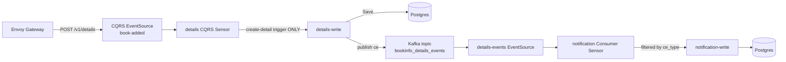
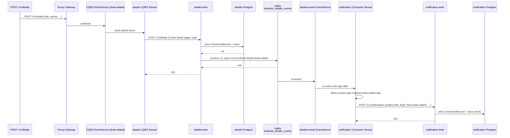
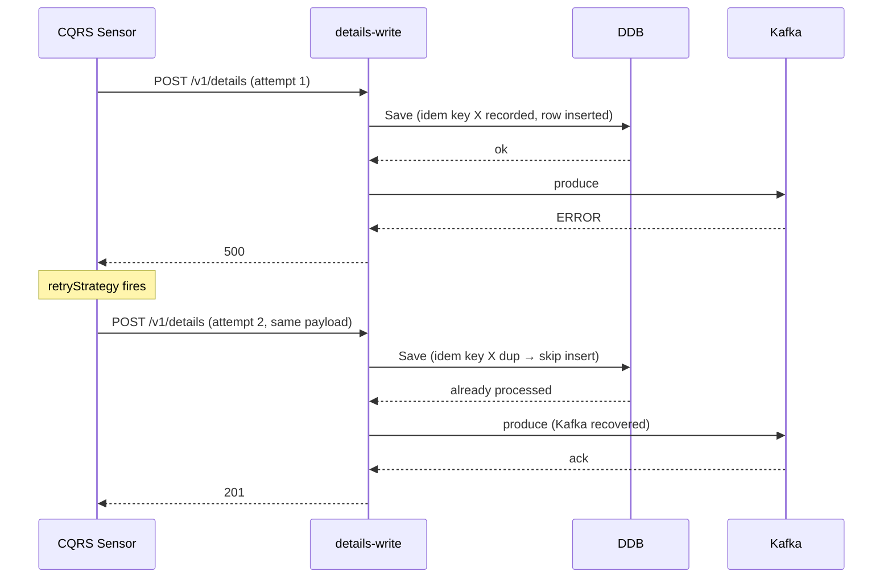

# Event-Driven Notifications — Design

**Date:** 2026-04-24
**Status:** Design — pending implementation

## Problem

Today, CQRS sensors for `details`, `reviews`, and `ratings` fan out to two triggers in parallel: one writes to the service (`create-detail`, `create-review`, `delete-review-write`, `create-rating`) and one POSTs the notification service (`notify-book-added`, `notify-review-submitted`, `notify-review-deleted`, `notify-rating-submitted`). Argo Events runs sensor triggers concurrently, so the notification request leaves regardless of whether the write succeeded. A failed `Save` still produces a notification — the system claims work happened that didn't.

Concrete example (`deploy/details/values-local.yaml`):
```yaml
cqrs.endpoints.book-added.triggers:
  - name: create-detail              # may fail
    url: self
  - name: notify-book-added          # fires anyway, in parallel
    url: http://notification.bookinfo.svc.cluster.local/v1/notifications
```

## Goal

Notifications must reflect actual persisted state. A notification fires if and only if the corresponding write succeeded.

## Approach

Write services publish a CloudEvents-formatted Kafka event after their `Save` returns (success or idempotency-dedup). Notification subscribes to those events via a Consumer Sensor with `ce_type` filtering. The `notify-*` triggers are removed from CQRS sensors entirely — CQRS sensors return to the single-purpose role of driving the write service.



## Decisions

| # | Decision | Rationale |
|---|---|---|
| 1 | Scope: all four events | `details.book-added`, `reviews.review-submitted`, `reviews.review-deleted`, `ratings.rating-submitted`. One coordinated change; leaving any `notify-*` trigger on the parallel pattern keeps the bug alive. |
| 2 | Failure handling: return 500, sensor retries | Stronger guarantee than fire-and-forget without the outbox machinery. Existing idempotency keys make the retry loop safe. |
| 3 | Event payload: full entity + CloudEvents headers | Mirrors ingestion's producer. Producer stays domain-focused; mapping (`title → subject`, etc.) lives in consumer sensor YAML where it's already configured today. |
| 4 | One topic per service, multiple `ce_type` carried | `bookinfo_<service>_events` carries every event type the service emits. Reviews emits both `review-submitted` and `review-deleted` to the same topic, distinguished by `ce_type`. Avoids topic proliferation. |
| 5 | Publish location: always-publish in service layer | Service calls `repo.Save` (which dedups), then unconditionally calls `publisher.Publish`. On retry-after-Kafka-blip, Save dedups but publish fires → consumer sensor delivers → notification dedupes via natural-key. No new repo methods. |
| 6 | EventSource naming: chart unchanged | Keep current `{fullname}-{eventName}` template. New keys are `events.exposed.events` per service (rendering `details-events`, `reviews-events`, `ratings-events`). Tautology in YAML accepted; rendered k8s names are clean. |
| 7 | ce_type contract via annotation | Producer values declare `eventTypes:` list; chart renders it as `bookinfo.io/emitted-ce-types` annotation on the EventSource. Discoverable via `kubectl describe`. |

## Components

### Producer side — details, reviews, ratings

Each write service gains:

**Outbound port** (`internal/core/port/outbound.go`):
```go
type EventPublisher interface {
    Publish(ctx context.Context, event domain.Event) error
}
```

**Kafka adapter** (`internal/adapter/outbound/kafka/producer.go`): franz-go client mirroring `services/ingestion/internal/adapter/outbound/kafka/producer.go`. Same `kgo.NewClient`, `ProduceSync`, CloudEvents headers (`ce_specversion`, `ce_type`, `ce_id`, `ce_source`, `ce_time`, `ce_subject`, `content-type`). `ensureTopic` on startup. Per-service `ce_type` constants.

| Service | `ce_source` | `ce_type` values | Topic |
|---|---|---|---|
| details | `details` | `com.bookinfo.details.book-added` | `bookinfo_details_events` |
| reviews | `reviews` | `com.bookinfo.reviews.review-submitted`, `com.bookinfo.reviews.review-deleted` | `bookinfo_reviews_events` |
| ratings | `ratings` | `com.bookinfo.ratings.rating-submitted` | `bookinfo_ratings_events` |

**Service-layer change**: constructor accepts `EventPublisher`. Each write method (`AddDetail`, `AddReview`, `DeleteReview`, `AddRating`) calls `publisher.Publish` after the idempotency branch joins. On publish error → returns error → handler 500 → sensor retries.

**Composition root** (`cmd/main.go`): wire kafka producer when `KAFKA_BROKERS` is set; inject a no-op publisher when unset (for docker-compose e2e and unit tests).

**Config additions** (handled in `pkg/config`): `KAFKA_BROKERS`, `KAFKA_TOPIC` env vars per service.

### Consumer side — notification

No Go code changes. Notification stays HTTP-only — events arrive as POSTs to `/v1/notifications` from the consumer sensor. Mapping from event payload to notification fields lives in chart YAML.

`deploy/notification/values-local.yaml`:
```yaml
events:
  kafka:
    broker: "bookinfo-kafka-kafka-bootstrap.platform.svc.cluster.local:9092"
  consumed:
    book-added:
      eventSourceName: details-events
      eventName: events
      filter:
        ceType: com.bookinfo.details.book-added
      triggers:
        - name: notify-book-added
          url: self
          path: /v1/notifications
          method: POST
          payload:
            - src: { dataKey: body.title }
              dest: subject
            - src: { value: "New book added" }
              dest: body
            - src: { value: "system@bookinfo" }
              dest: recipient
            - src: { value: "email" }
              dest: channel
      dlq:
        enabled: true
        url: "http://dlq-event-received-eventsource-svc.bookinfo.svc.cluster.local:12004/v1/events"
    review-submitted:
      eventSourceName: reviews-events
      eventName: events
      filter:
        ceType: com.bookinfo.reviews.review-submitted
      triggers:
        - name: notify-review-submitted
          url: self
          path: /v1/notifications
          payload:
            - src: { dataKey: body.product_id }
              dest: subject
            - src: { value: "New review submitted" }
              dest: body
            - src: { value: "system@bookinfo" }
              dest: recipient
            - src: { value: "email" }
              dest: channel
      dlq: { enabled: true, url: "..." }
    review-deleted:
      eventSourceName: reviews-events
      eventName: events
      filter:
        ceType: com.bookinfo.reviews.review-deleted
      triggers:
        - name: notify-review-deleted
          url: self
          path: /v1/notifications
          payload:
            - src: { dataKey: body.product_id }
              dest: subject
            - src: { value: "Review deleted" }
              dest: body
            - src: { value: "system@bookinfo" }
              dest: recipient
            - src: { value: "email" }
              dest: channel
      dlq: { enabled: true, url: "..." }
    rating-submitted:
      eventSourceName: ratings-events
      eventName: events
      filter:
        ceType: com.bookinfo.ratings.rating-submitted
      triggers:
        - name: notify-rating-submitted
          url: self
          path: /v1/notifications
          payload:
            - src: { dataKey: body.product_id }
              dest: subject
            - src: { value: "New rating submitted" }
              dest: body
            - src: { value: "system@bookinfo" }
              dest: recipient
            - src: { value: "email" }
              dest: channel
      dlq: { enabled: true, url: "..." }
```

### Chart additions — `bookinfo-service`

`charts/bookinfo-service/templates/kafka-eventsource.yaml`: render `eventTypes` list as annotation:
```yaml
metadata:
  name: {{ include "bookinfo-service.fullname" $ }}-{{ $eventName }}
  labels:
    {{- include "bookinfo-service.labels" $ | nindent 4 }}
  {{- with $event.eventTypes }}
  annotations:
    bookinfo.io/emitted-ce-types: {{ join "," . | quote }}
  {{- end }}
```

`charts/bookinfo-service/templates/consumer-sensor.yaml`: add optional ce_type filter inside `dependencies[]`:
```yaml
- name: {{ $eventName }}-dep
  eventSourceName: {{ $event.eventSourceName }}
  eventName: {{ $event.eventName }}
  {{- with $event.filter.ceType }}
  filters:
    context:
      type: {{ . | quote }}
  {{- end }}
```

`charts/bookinfo-service/values.yaml`: document the new fields in the commented schema:
```yaml
events:
  exposed: {}
    # event-name:
    #   topic: kafka_topic_name
    #   eventBusName: kafka
    #   contentType: application/json
    #   eventTypes:                       # optional, rendered as bookinfo.io/emitted-ce-types annotation
    #     - com.bookinfo.<service>.<event>
  consumed: {}
    # event-name:
    #   eventSourceName: producer-event-name
    #   eventName: event-name
    #   filter:                            # optional
    #     ceType: com.bookinfo.<service>.<event>
    #   triggers: [...]
    #   dlq: {...}
```

### Removed configuration

Per-service `values-local.yaml` for details, reviews, ratings:
- Remove `notify-*` triggers from `cqrs.endpoints.<event>.triggers` — leaves only the `create-*` / `delete-*` triggers
- Add `events.exposed.events` block with the topic and `eventTypes` list
- Add `events.kafka.broker` and `KAFKA_BROKERS` / `KAFKA_TOPIC` env vars under `config`

Example (`deploy/reviews/values-local.yaml` after change):
```yaml
config:
  LOG_LEVEL: "debug"
  RATINGS_SERVICE_URL: "http://ratings.bookinfo.svc.cluster.local"
  KAFKA_BROKERS: "bookinfo-kafka-kafka-bootstrap.platform.svc.cluster.local:9092"
  KAFKA_TOPIC: "bookinfo_reviews_events"

events:
  kafka:
    broker: "bookinfo-kafka-kafka-bootstrap.platform.svc.cluster.local:9092"
  exposed:
    events:
      topic: bookinfo_reviews_events
      eventBusName: kafka
      contentType: application/json
      eventTypes:
        - com.bookinfo.reviews.review-submitted
        - com.bookinfo.reviews.review-deleted

cqrs:
  enabled: true
  endpoints:
    review-submitted:
      port: 12001
      method: POST
      endpoint: /v1/reviews
      triggers:
        - name: create-review        # only the write trigger remains
          url: self
          payload:
            - passthrough
    review-deleted:
      port: 12003
      method: POST
      endpoint: /v1/reviews/delete
      triggers:
        - name: delete-review-write  # only the write trigger remains
          url: self
          payload:
            - src:
                dependencyName: review-deleted-dep
                dataKey: body.review_id
              dest: review_id
```

## Data flow

### Happy path (book added)



### Failure recovery (Kafka blip)



## Error handling

| Failure | Behavior |
|---|---|
| DB Save error | service returns error → handler 500 → CQRS sensor retries |
| Save dedups (idem hit) | publish proceeds anyway (always-publish semantics) |
| Kafka publish error | service returns error → 500 → sensor retries whole call → Save dedups → publish retries |
| `KAFKA_BROKERS` unset | no-op publisher injected at composition root (docker-compose / unit tests) |
| Topic missing on startup | `ensureTopic` creates it (mirrors ingestion); startup fails if Kafka unreachable |
| `ce_type` matches no consumer filter | dependency doesn't fire, message ack'd silently |
| Notification HTTP 5xx | consumer sensor retry per `retryStrategy` |
| Consumer retries exhausted | DLQ trigger writes to dlqueue (existing infra) |
| Notification idempotency dup | returns 200 OK → sensor stops retrying |

## Testing & validation

### Unit tests

Per producer service (details, reviews, ratings):
- `internal/adapter/outbound/kafka/producer_test.go` mirrors `services/ingestion/internal/adapter/outbound/kafka/producer_test.go`. Fake `Client` matching `ProduceSync(ctx, rs ...*kgo.Record) kgo.ProduceResults`. Asserts: topic, key, marshaled body, all CE headers.
- `internal/core/service/<entity>_service_test.go` extended with a fake `EventPublisher`. Asserts: publish called on fresh save AND on idempotency dedup; publish error propagates as service error.

### Helm tests

```bash
make helm-lint
make helm-template SERVICE=reviews   # verify EventSource carries bookinfo.io/emitted-ce-types annotation
make helm-template SERVICE=notification  # verify Consumer Sensor renders 4 deps with filters.context.type
```

### End-to-end on k8s

```bash
make stop-k8s && make run-k8s
make k8s-status   # all pods Ready, EventSources running
```

**Smoke tests (manual curl)**, repeated for each event:
```bash
# Add a book → triggers details create + book-added event
curl -X POST http://localhost:8080/v1/details \
  -H 'Content-Type: application/json' \
  -d '{"title":"Smoke","author":"Test","year":2026,"type":"paperback"}'

# Verify details persisted
curl http://localhost:8080/v1/details | jq '.[] | select(.title=="Smoke")'

# Verify Kafka event landed with the right CE headers
kubectl --context=k3d-bookinfo-local -n platform exec bookinfo-kafka-cluster-kafka-0 -- \
  bin/kafka-console-consumer.sh --bootstrap-server localhost:9092 \
  --topic bookinfo_details_events --from-beginning --max-messages 1 --property print.headers=true

# Verify notification dispatched (matches book title in subject)
curl 'http://localhost:8080/v1/notifications?recipient=system@bookinfo' | jq '.[] | select(.subject=="Smoke")'
```

**Failure-recovery smoke test:**
```bash
# Scale Kafka down → POST a book → expect 5xx
kubectl --context=k3d-bookinfo-local -n platform scale strimzipodset bookinfo-kafka-cluster-kafka --replicas=0
curl -i -X POST http://localhost:8080/v1/details -d '{...}'   # expect 500

# Scale Kafka back up
kubectl --context=k3d-bookinfo-local -n platform scale strimzipodset bookinfo-kafka-cluster-kafka --replicas=1

# Within retry window: book persisted exactly once + notification fires exactly once
```

**k6 load:**
```bash
DURATION=2m BASE_RATE=5 make k8s-load
```
Existing scenarios POST details/reviews/ratings. Asserts (qualitative): notification dispatch count tracks successful write count 1:1.

**Grafana / Tempo trace check:**
- Open `http://localhost:3000` → Explore → Tempo
- Query: `{service.name="details-write"}` → pick a span from a load-test request
- Verify trace contains the full chain:
  ```
  envoy-gateway → details-eventsource → details-cqrs-sensor →
    details-write (HTTP) → details-write (kafka producer span) →
    details-events-eventsource (kafka consumer span) →
    notification-consumer-sensor → notification-write (HTTP)
  ```
- Verify CloudEvents headers populate span attributes (`messaging.kafka.message.key`, `cloudevents.type`)
- Compare against ingestion's existing trace shape (validated end-to-end in prior work)

## Acceptance criteria

1. POST a successful `book-added` / `review-submitted` / `review-deleted` / `rating-submitted` → notification persisted with matching subject
2. POST that fails the write → no notification persisted (the bug being fixed)
3. Kafka outage scenario → sensor retries → eventual notification when Kafka recovers; book persisted exactly once via idempotency dedup
4. k6 run produces Tempo traces with the full chain end-to-end
5. `kubectl describe eventsource details-events` shows `bookinfo.io/emitted-ce-types: com.bookinfo.details.book-added` annotation; same for reviews-events (two values) and ratings-events
6. No `notify-*` triggers remain in any CQRS sensor across details/reviews/ratings values files
7. `make helm-lint` passes; `make test` passes including new producer + service tests

## Out of scope

- Transactional outbox pattern (deferred — `Option C` from publish-failure-handling)
- Renaming the EventSource template / fullname prefix migration (deferred — chart stays as-is)
- Migrating ingestion's `raw-books-details` topic naming (deferred — semantic of "raw_" preserved)
- Productpage notification rendering (notifications today are an audit log; UI surface unchanged)
