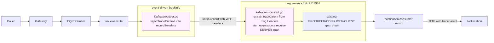
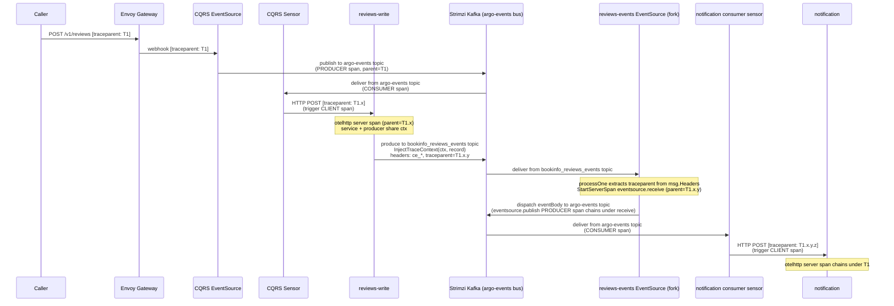

# End-to-End Distributed Tracing Across Kafka — Design

**Date:** 2026-04-25
**Status:** Design — pending implementation

## Problem

A request flowing from Envoy Gateway → CQRS Sensor → write service → Kafka → Argo Events → Notification produces **two disjoint traces** in Tempo:

- **Trace A** ends at the Go Kafka producer (no `traceparent` injected into the record).
- **Trace B** starts as a fresh root in the Argo Events Kafka EventSource (no extraction from `msg.Headers`).

Audit run on the live cluster (2026-04-25):

| Hop | trace_id |
|---|---|
| reviews-write (HTTP server, OTel-instrumented) | `1decff1e46c3af2f4b87b38515d0ffbc` |
| notification (HTTP server, OTel-instrumented) | `31103ad019a882a199acf7572d7c439c` |

`bookinfo_reviews_events` Kafka records contain only `ce_*` headers — no `traceparent`. Argo Events fork (branch `feat/combined-prs-3961-3983`) propagates trace correctly through eventbus → sensor → HTTP trigger via PRs 3961 + 3983, but the Kafka EventSource itself starts a fresh root span because nothing in `msg.Headers` is extracted.

Webhook source already extracts trace context (`pkg/eventsources/sources/webhook/start.go:108`); Kafka source does not.

## Goal

A single connected trace from the originating client request through to the notification persist, regardless of which producer service emits the event.

## Approach

Two coordinated changes across two repos:

1. **Producer side (`event-driven-bookinfo`):** Each Go Kafka producer injects W3C `traceparent` + `tracestate` from the active span context into the record headers via a shared `pkg/telemetry/kafka.go` helper.
2. **Argo Events fork (`feat/cloudevents-compliance-otel-tracing` branch, PR 3961):** The Kafka source extracts the upstream trace context from `msg.Headers` and starts an `eventsource.receive` SERVER span as the parent of the existing `eventsource.publish` PRODUCER span — mirroring the webhook source's pattern verbatim.

After both land and the fork image rebuilds, the existing PR 3961 + 3983 chain (PRODUCER → CONSUMER → CLIENT spans) inherits the upstream trace and produces one connected tree.

## Architecture



## Decisions

| # | Decision | Rationale |
| --- | --- | --- |
| 1 | Two-repo change | Producer-only fix is invisible (header on wire but no extractor); fork-only fix has nothing to extract. Both required to close the loop. |
| 2 | Cherry-pick fork branch propagation | Land commit on `feat/cloudevents-compliance-otel-tracing` (PR 3961), cherry-pick onto `feat/combined-prs-3961-3983` (consumed branch). No force-push, no history rewrite. |
| 3 | Mirror webhook source pattern in Kafka source | Existing established pattern in the same fork at `pkg/eventsources/sources/webhook/start.go:108`. Minimum surface area, maximum review velocity. |
| 4 | All 4 producer flows in scope | Details book-added, reviews submitted/deleted, ratings submitted, ingestion book-added. Single shared helper in `pkg/telemetry/kafka.go`; per-service additions are one-liners. |
| 5 | DCO sign-off + no Claude trailer on fork commits | Argoproj/argo-events upstream requires DCO. Memory rule `feedback_no_coauthor_argo` excludes the Claude co-author trailer on argo-events fork commits. |

## Components

### `event-driven-bookinfo` — producer side

**New file: `pkg/telemetry/kafka.go`**

```go
// Package telemetry exports observability helpers shared across services.
package telemetry

import (
    "context"

    "github.com/twmb/franz-go/pkg/kgo"
    "go.opentelemetry.io/otel"
    "go.opentelemetry.io/otel/propagation"
)

// kafkaHeaderCarrier adapts a *kgo.Record's Headers to TextMapCarrier for
// W3C trace context propagation.
type kafkaHeaderCarrier struct {
    record *kgo.Record
}

func (c *kafkaHeaderCarrier) Get(key string) string {
    for _, h := range c.record.Headers {
        if h.Key == key {
            return string(h.Value)
        }
    }
    return ""
}

func (c *kafkaHeaderCarrier) Set(key, value string) {
    for i := range c.record.Headers {
        if c.record.Headers[i].Key == key {
            c.record.Headers[i].Value = []byte(value)
            return
        }
    }
    c.record.Headers = append(c.record.Headers, kgo.RecordHeader{Key: key, Value: []byte(value)})
}

func (c *kafkaHeaderCarrier) Keys() []string {
    keys := make([]string, 0, len(c.record.Headers))
    for _, h := range c.record.Headers {
        keys = append(keys, h.Key)
    }
    return keys
}

// InjectTraceContext writes W3C traceparent and tracestate from ctx into the
// Kafka record headers. No-op when ctx carries no active span.
func InjectTraceContext(ctx context.Context, record *kgo.Record) {
    otel.GetTextMapPropagator().Inject(ctx, &kafkaHeaderCarrier{record: record})
}
```

**Per-service producer change:**

Each of `services/{details,reviews,ratings,ingestion}/internal/adapter/outbound/kafka/producer.go` adds one line before `ProduceSync`:

```go
record := &kgo.Record{ /* topic, key, value, headers */ }
telemetry.InjectTraceContext(ctx, record) // <-- new line
results := p.client.ProduceSync(ctx, record)
```

Imports the shared helper: `"github.com/kaio6fellipe/event-driven-bookinfo/pkg/telemetry"`.

### `argo-events` fork — consumer side

**Modified file: `pkg/eventsources/sources/kafka/start.go`**

Two call sites need updating: `processOne` (around line 249) and the partition-consumer variant (around line 449). Both currently dump `msg.Headers` into `eventData.Headers` without trace propagation.

The new logic mirrors the webhook source pattern at `pkg/eventsources/sources/webhook/start.go:97-119`:

```go
// Existing:
headers := make(map[string]string)
for _, recordHeader := range msg.Headers {
    headers[string(recordHeader.Key)] = string(recordHeader.Value)
}
eventData.Headers = headers

// New: extract upstream W3C trace context and start a SERVER span
ctx := otel.GetTextMapPropagator().Extract(parentCtx, propagation.MapCarrier(headers))
ctx, receiveSpan := tracing.StartServerSpan(ctx, otel.Tracer("argo-events-eventsource"), "eventsource.receive",
    attribute.String("eventsource.name", el.GetEventSourceName()),
    attribute.String("eventsource.type", "kafka"),
    attribute.String("messaging.system", "kafka"),
    attribute.String("messaging.destination.name", msg.Topic),
    attribute.Int("messaging.kafka.message.partition", int(msg.Partition)),
    attribute.Int64("messaging.kafka.message.offset", msg.Offset),
)
defer receiveSpan.End()

// Pass ctx to dispatch so eventsource.publish PRODUCER span chains under receiveSpan
if err = dispatch(eventBody, eventsourcecommon.WithID(kafkaID), eventsourcecommon.WithContext(ctx)); err != nil {
    receiveSpan.RecordError(err)
    receiveSpan.SetStatus(codes.Error, err.Error())
    return fmt.Errorf("failed to dispatch a Kafka event, %w", err)
}
```

**Possible secondary change: `pkg/eventsources/common/options.go`**

If `WithContext` is not already an option for the `dispatch` callback, add one. Verify before the patch lands; webhook source's equivalent is `WithHTTPHeaders`, so the pattern of context-carrying options exists.

**Imports needed in `kafka/start.go`:**

```go
"go.opentelemetry.io/otel"
"go.opentelemetry.io/otel/attribute"
"go.opentelemetry.io/otel/codes"
"go.opentelemetry.io/otel/propagation"

"github.com/argoproj/argo-events/pkg/shared/tracing"
```

### Image release flow

```text
1. Add commit to feat/cloudevents-compliance-otel-tracing (signed off, no Claude trailer)
2. git push origin feat/cloudevents-compliance-otel-tracing  (fast-forward; updates PR 3961)
3. git checkout feat/combined-prs-3961-3983
4. git cherry-pick <new-sha>
5. git push origin feat/combined-prs-3961-3983
6. CI builds + pushes ghcr.io/kaio6fellipe/argo-events:<tag>
7. event-driven-bookinfo: `make k8s-rebuild` to pull new image
8. Run smoke test (Section "Testing & validation")
```

## Constraints on the fork branch

`feat/cloudevents-compliance-otel-tracing` already contains 12 substantive PR-3961 commits (`7e5371a8` through `30401397`). The new commit is **append-only**:

- Preserve all 12 existing commits unchanged. No rebase, amend, or squash that touches them.
- New commit signed off via `git commit -s`. DCO required by argoproj/argo-events upstream.
- No `Co-Authored-By: Claude ... <noreply@anthropic.com>` trailer.
- Fast-forward push only — no `--force` / `--force-with-lease`.

**Verification before push:**

```bash
git log --oneline master..feat/cloudevents-compliance-otel-tracing | head -12   # 12 SHAs match pre-change list
git diff <last-existing-sha>..HEAD -- pkg/eventsources/sources/kafka/           # diff scoped to Kafka source
git log -1 --format=%B                                                          # trailer block: only "Signed-off-by: ..."
```

## Data flow (target state)

`bookinfo_reviews_events` and `argo-events` are both topics on the same Strimzi Kafka cluster, which serves as the Argo Events bus. The diagram shows Kafka as a single participant with topic names called out per arrow.



## Error handling

| Failure | Behavior |
| --- | --- |
| No active span at producer call | `InjectTraceContext` is a no-op; record sent without traceparent. Existing flow continues; no new error. |
| `traceparent` header malformed at consumer | `propagation.MapCarrier.Extract` returns the original ctx unchanged; SERVER span starts as a fresh root (current behavior). |
| `tracing.StartServerSpan` panics | Existing argo-events panic-recovery in source listeners catches and logs. Event still dispatches. |
| Kafka producer fails entirely | Existing error path returns; record never produced; no trace gap concern. |

## Testing & validation

### Producer side — unit tests

`pkg/telemetry/kafka_test.go`:

- Carrier `Get`/`Set`/`Keys` round-trip a known `traceparent` value.
- `InjectTraceContext` with active ctx writes both `traceparent` and `tracestate` headers.
- `InjectTraceContext` with empty ctx writes nothing.

Per-service `producer_test.go` extension — one new test per service:

```go
func TestPublishX_InjectsTraceparent(t *testing.T) {
    tp := sdktrace.NewTracerProvider()
    otel.SetTracerProvider(tp)
    otel.SetTextMapPropagator(propagation.TraceContext{})
    ctx, span := otel.Tracer("test").Start(context.Background(), "parent")
    defer span.End()

    fc := &fakeClient{}
    p := kafkaadapter.NewProducerWithClient(fc, "topic")
    if err := p.PublishX(ctx, evt); err != nil { t.Fatal(err) }

    fc.mu.Lock()
    defer fc.mu.Unlock()
    headers := map[string]string{}
    for _, h := range fc.records[0].Headers { headers[h.Key] = string(h.Value) }
    if headers["traceparent"] == "" {
        t.Error("expected traceparent header, got none")
    }
}
```

### Argo-events fork — unit test

`pkg/eventsources/sources/kafka/start_test.go` (new test):

- Build a sarama `ConsumerMessage` with `traceparent` in `Headers` (e.g. `00-<hex32>-<hex16>-01`).
- Capture ctx passed to a fake `dispatch` shim.
- Assert the ctx carries a valid `SpanContext` with the expected `TraceID`.

### End-to-end on local k8s

After image rebuild + cluster rollout:

1. `curl -sS -X POST http://localhost:8080/v1/reviews -H 'Content-Type: application/json' -d '{"product_id":"trace-e2e","reviewer":"u","text":"trace check"}'`
2. `kubectl logs deploy/reviews-write --since=10s | grep trace-e2e | jq -r .trace_id` → capture A
3. `kubectl logs deploy/notification --since=10s | grep trace-e2e | jq -r .trace_id` → capture B
4. **Acceptance:** A == B
5. Open Tempo, query `{traceID="<A>"}`, verify the span tree includes:
   - `envoy-gateway` server span
   - `reviews-write-api` server span
   - `eventsource.receive` SERVER span on `reviews-events` (the new span)
   - `eventsource.publish` PRODUCER span
   - sensor CONSUMER + CLIENT spans
   - `notification-api` server span
6. Repeat for `book-added`, `review-deleted`, `rating-submitted` — confirm all 4 producer flows propagate.

## Acceptance criteria

1. Producer-side unit tests assert traceparent presence/absence per active span state
2. Fork-side unit test asserts trace extraction from `msg.Headers`
3. Local k8s e2e: `trace_id` matches between producing service and notification logs for the same request
4. Tempo trace tree spans all 9 hops as one connected trace
5. PR 3961 contains exactly 13 substantive commits (12 existing + 1 new); all signed off; no Claude co-author trailer
6. `feat/combined-prs-3961-3983` cleanly cherry-picks the new commit (no manual conflict resolution)
7. Combined image builds successfully and runs without regressions in the bookinfo cluster

## Out of scope

- Patching upstream argoproj/argo-events directly (this PR builds on top of in-flight PR 3961)
- Trace propagation for non-Kafka EventSource types (Redis, NATS, etc.) — only the kafka source is patched here
- Trace propagation through the Schema Registry path (`toJson(el.SchemaRegistry, msg)`) — out of scope; that branch flows the same context through dispatch unchanged
- Adding span attributes for CloudEvents `ce_*` headers as separate semantic attributes — current implementation logs them as part of `messaging.*` attributes only
