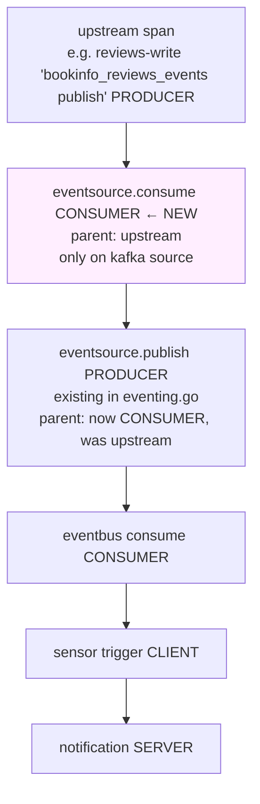

# Kafka EventSource Consume Span — Design

**Date:** 2026-04-25
**Status:** Design — pending implementation

## Problem

In Tempo, a request to `POST /v1/reviews` shows the following span tree on the producer side:

```
reviews-write-api POST /v1/reviews                  [SERVER]
├── pool.acquire / INSERT / etc                     [INTERNAL via otelpgx]
└── bookinfo_reviews_events publish                 [PRODUCER]
    └── eventsource.publish                         [PRODUCER]   ← starts here on the EventSource side
        └── eventbus consume                        [CONSUMER]
            └── trigger HTTP                        [CLIENT]
                └── notification-api POST           [SERVER]
```

The Kafka EventSource opens its work with `eventsource.publish` — which is misleading. Before forwarding the event to the eventbus, the source first **consumes** the message from the upstream Kafka topic. There is no span representing that consume step, so the trace conflates the read-from-topic with the publish-to-eventbus into a single PRODUCER span.

## Goal

Insert an explicit `eventsource.consume` span (`SpanKindConsumer`) as the parent of the existing `eventsource.publish` PRODUCER span on the Kafka EventSource side. The consume span follows OTel messaging semantic conventions and carries the Kafka coordinates (topic, partition, offset, key) of the consumed message. The change applies **only to the Kafka source** — webhook and other source types are not affected.

## Approach

Modify `pkg/eventsources/sources/kafka/start.go` (both `processOne` closures: `consumerGroupConsumer` and `partitionConsumer`). After building the `headers` map from `msg.Headers`:

1. Extract upstream W3C trace context from the headers (was implicitly done later via `WithKafkaHeaders` + `SpanFromCloudEvent`)
2. Start `eventsource.consume` CONSUMER span as a child of the upstream context
3. **Re-inject the CONSUMER span's traceparent into the `headers` map**, overwriting the upstream value
4. Continue with existing dispatch — `WithKafkaHeaders(headers)` now writes the CONSUMER's traceparent as the CloudEvent extension; `SpanFromCloudEvent` extracts it; the existing `eventsource.publish` PRODUCER span chains under the CONSUMER

This re-inject step is the load-bearing mechanic. It's the only way to inject a span into the existing chain without modifying shared dispatch code in `eventing.go` (which the user requires stay untouched, since the change must be Kafka-only).

## Architecture



## Decisions

| # | Decision | Rationale |
| --- | --- | --- |
| 1 | Span name `eventsource.consume` | Matches the user's explicit request. Aligns with the existing `eventsource.publish` and `eventsource.receive` (webhook) naming conventions in the fork. |
| 2 | `SpanKindConsumer` | OTel messaging semconv: receive operations are CONSUMER kind. Helper `tracing.StartConsumerSpan` already exists in the fork. |
| 3 | Modify only the Kafka source | User requirement: "the eventsource.consume should be only added at kafka eventsource". No edits to `eventing.go` or other sources. |
| 4 | Re-inject CONSUMER traceparent into the headers map | Lets the existing `WithKafkaHeaders` + `SpanFromCloudEvent` chain pick the CONSUMER as parent for `eventsource.publish` without touching shared code. |
| 5 | Append-only on `feat/cloudevents-compliance-otel-tracing` (PR 3961) | User requirement: PR 3961 stays at its existing commits + 1 new. No rebase, no force-push. |
| 6 | Cherry-pick to `feat/combined-prs-3961-3983` | Same workflow as the prior trace-propagation work. Build + push image locally with `GOFLAGS=-mod=mod` after deleting stale `dist/` artifacts. |
| 7 | Sign-off `-s`, no Claude trailer | DCO required by argoproj/argo-events upstream; memory rule excludes Claude co-author trailer on argo-events fork commits. |

## Components

### Modified file (only)

`/Users/kaio.fellipe/Documents/git/others/argo-events/pkg/eventsources/sources/kafka/start.go`

Two call sites get the same edit (`processOne` inside `consumerGroupConsumer` ~line 263 and inside `partitionConsumer` ~line 449).

### Replacement pattern

Existing code in each `processOne` closure (already updated by the prior PR-3961 commit):

```go
headers := make(map[string]string)
for _, recordHeader := range msg.Headers {
    headers[string(recordHeader.Key)] = string(recordHeader.Value)
}
eventData.Headers = headers
// ... json marshaling ...
if err = dispatch(eventBody, eventsourcecommon.WithID(kafkaID), eventsourcecommon.WithKafkaHeaders(headers)); err != nil {
    return fmt.Errorf("failed to dispatch a Kafka event, %w", err)
}
```

New code:

```go
headers := make(map[string]string)
for _, recordHeader := range msg.Headers {
    headers[string(recordHeader.Key)] = string(recordHeader.Value)
}

// Extract upstream W3C trace context from the Kafka record headers
parentCtx := otel.GetTextMapPropagator().Extract(ctx, propagation.MapCarrier(headers))

// Start an eventsource.consume CONSUMER span as the parent for the
// downstream eventsource.publish PRODUCER span emitted in eventing.go.
spanCtx, consumeSpan := tracing.StartConsumerSpan(parentCtx, otel.Tracer("argo-events-eventsource"), "eventsource.consume",
    attribute.String("eventsource.name", el.GetEventSourceName()),
    attribute.String("eventsource.type", "kafka"),
    attribute.String("messaging.system", "kafka"),
    attribute.String("messaging.destination.name", msg.Topic),
    attribute.String("messaging.operation.type", "receive"),
    attribute.String("messaging.kafka.message.key", string(msg.Key)),
    attribute.Int("messaging.kafka.message.partition", int(msg.Partition)),
    attribute.Int64("messaging.kafka.message.offset", msg.Offset),
)
defer consumeSpan.End()

// Re-inject the CONSUMER span's trace context into the headers map so
// WithKafkaHeaders writes the CONSUMER traceparent as the CloudEvent
// extension. eventing.go's SpanFromCloudEvent then makes the
// eventsource.publish PRODUCER span a child of CONSUMER (instead of
// directly under upstream).
otel.GetTextMapPropagator().Inject(spanCtx, propagation.MapCarrier(headers))

eventData.Headers = headers
// ... json marshaling unchanged ...
if err = dispatch(eventBody, eventsourcecommon.WithID(kafkaID), eventsourcecommon.WithKafkaHeaders(headers)); err != nil {
    consumeSpan.RecordError(err)
    consumeSpan.SetStatus(codes.Error, err.Error())
    return fmt.Errorf("failed to dispatch a Kafka event, %w", err)
}
```

`eventData.Headers = headers` MUST move to after the inject so the dispatched event body carries the consume-span's traceparent (in `data.headers.traceparent`).

### Imports needed

The file already imports `otel`, `propagation`, `attribute`, `eventsourcecommon`, and `tracing` (used by adjacent code in the fork). Need to add (if absent):

```go
"go.opentelemetry.io/otel/codes"
```

`codes.Error` is needed for the error-recording branch. Verify before edit.

### Branch state

Snapshot before commit:

```bash
git log --oneline master..feat/cloudevents-compliance-otel-tracing > /tmp/argo-events-pr3961-baseline-r2.txt
wc -l /tmp/argo-events-pr3961-baseline-r2.txt   # expect 21
```

After commit:

```bash
git log --oneline master..feat/cloudevents-compliance-otel-tracing | wc -l   # expect 22
diff <(git log --oneline master..HEAD | tail -21) /tmp/argo-events-pr3961-baseline-r2.txt   # must be no output
```

### Image build

Stale `dist/argo-events-linux-*` artifacts cache the previous build; Make's file-existence rule skips rebuild. Purge first:

```bash
cd /Users/kaio.fellipe/Documents/git/others/argo-events
rm -f dist/argo-events-linux-*
GOFLAGS=-mod=mod IMAGE_NAMESPACE=ghcr.io/kaio6fellipe DOCKER_PUSH=true VERSION=prs-3961-3983 make image-multi
```

Verify push:

```bash
docker pull --quiet ghcr.io/kaio6fellipe/argo-events:prs-3961-3983
docker create --name ae-inspect-r2 ghcr.io/kaio6fellipe/argo-events:prs-3961-3983
docker cp ae-inspect-r2:/bin/argo-events /tmp/argo-events-binary-r2
docker rm ae-inspect-r2
strings /tmp/argo-events-binary-r2 | grep -oE "gitCommit=[a-f0-9]{40}" | head -1
# expect: gitCommit=<the cherry-picked SHA on feat/combined-prs-3961-3983>
strings /tmp/argo-events-binary-r2 | grep -oE "buildDate=[0-9TZ:-]+" | head -1
# expect: today's UTC timestamp
```

Then import into k3d and restart EventSource pods:

```bash
k3d image import ghcr.io/kaio6fellipe/argo-events:prs-3961-3983 -c bookinfo-local
kubectl --context=k3d-bookinfo-local -n bookinfo delete pod -l eventsource-name
kubectl --context=k3d-bookinfo-local -n bookinfo delete pod -l sensor-name
```

## Data flow (target trace tree)

```
<service>-write-api POST /v1/<resource>             [SERVER]
├── pool.acquire / INSERT / etc                     [INTERNAL via otelpgx]
└── bookinfo_<service>_events publish               [PRODUCER]
    └── eventsource.consume                         [CONSUMER] ← NEW
        └── eventsource.publish                     [PRODUCER]
            └── eventbus consume                    [CONSUMER]
                └── trigger HTTP                    [CLIENT]
                    └── notification-api POST       [SERVER]
```

Span depth grows by one. trace_id remains constant across all hops (continuity preserved).

## Error handling

| Failure | Behavior |
| --- | --- |
| `propagation.Extract` finds no traceparent in headers | Returns ctx unchanged; CONSUMER span starts as a fresh root. Same as current behavior when upstream doesn't propagate. |
| `dispatch` returns error | `consumeSpan.RecordError(err)` + `consumeSpan.SetStatus(codes.Error, ...)`; error returned as before. Tempo highlights the failed CONSUMER span. |
| `tracing.StartConsumerSpan` panics | Existing argo-events panic-recovery in source listeners catches and logs. Event still dispatches. |
| `eventData.Headers` referenced before re-inject (caller order bug) | Caught at code review and by the spec — re-inject MUST precede the `eventData.Headers = headers` assignment. |

## Testing

### Build verification

```bash
GOFLAGS=-mod=mod go build ./pkg/eventsources/sources/kafka/...
GOFLAGS=-mod=mod go vet ./pkg/eventsources/sources/kafka/...
```

Both clean.

### Unit test

Skipped — building a sarama `ConsumerMessage` mock and asserting on span tree shape is heavy for a one-span addition. The combination of:
- Existing `WithKafkaHeaders` test (validates CE extension extraction)
- Cluster Tempo verification (validates the actual span tree)

provides sufficient confidence. Strict TDD not required for this commit.

### Cluster smoke test

After image push + pod restart:

1. POST a `/v1/reviews` request, capture trace_id from `reviews-write` log
2. Open Tempo, query the trace_id
3. **Verify** the span tree contains, in order:
   - `reviews-write-api POST /v1/reviews` (SERVER)
   - `bookinfo_reviews_events publish` (PRODUCER)
   - `eventsource.consume` (CONSUMER) ← the new span
   - `eventsource.publish` (PRODUCER)
   - downstream chain
4. Confirm `eventsource.consume` attributes include `messaging.system=kafka`, `messaging.destination.name=bookinfo_reviews_events`, `messaging.kafka.message.partition`, `.offset`, `.key`
5. Repeat for `book-added`, `review-deleted`, `rating-submitted`

## Acceptance criteria

1. PR 3961 picks up exactly **one new commit**; the existing 21 commits remain bit-identical (verified by `diff` against the baseline snapshot).
2. New commit on `feat/cloudevents-compliance-otel-tracing` is signed off and contains no `Co-Authored-By` trailer.
3. `feat/combined-prs-3961-3983` cherry-picks the new commit cleanly; build + push to `ghcr.io/kaio6fellipe/argo-events:prs-3961-3983` succeeds; embedded `gitCommit` matches the new combined-branch HEAD; `buildDate` is today.
4. After cluster restart: each of the four event types produces a Tempo trace containing the new `eventsource.consume` CONSUMER span between the producer-service publish and the eventbus publish.
5. trace_id continuity preserved: producer service trace_id == notification trace_id (no regression from the prior trace-propagation work).
6. `go build ./pkg/eventsources/sources/kafka/...` clean (with `GOFLAGS=-mod=mod`).

## Out of scope

- Equivalent CONSUMER spans for other source types (webhook already has `eventsource.receive` SERVER span; other sources unchanged)
- Changes to `eventing.go` or shared dispatch path
- Schema-registry-aware processing path (`toJson(el.SchemaRegistry, msg)`) — same change applies regardless; the inject precedes any branching
- Updating the bookinfo cluster's image reference (uses moving tag `prs-3961-3983`; pull on restart picks up the new digest)
