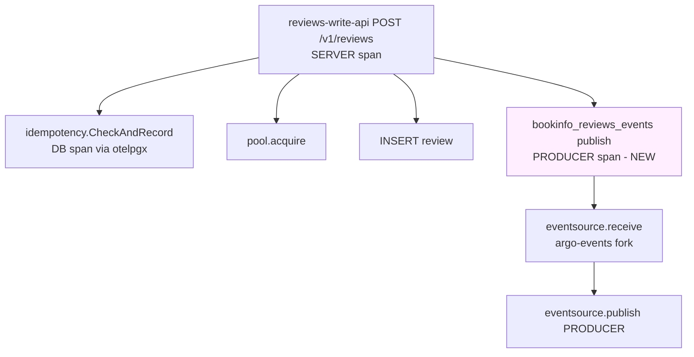

# Kafka Producer Span Instrumentation — Design

**Date:** 2026-04-25
**Status:** Design — pending implementation

## Problem

In Tempo, an API request like `POST /v1/reviews` shows the server span with child spans for the database operations (`pool.acquire`, `INSERT review`, etc.) emitted by `otelpgx` auto-instrumentation. But the actual Kafka publish operation is invisible — there is no span representing the call to `p.client.ProduceSync(ctx, record)`.

Today the producer code path looks like:

```go
record := &kgo.Record{ ... }
telemetry.InjectTraceContext(ctx, record)   // writes traceparent header
results := p.client.ProduceSync(ctx, record) // raw call, no span
```

Because the producer never starts a span of its own, the `traceparent` header that flows into the Kafka record is the *API server span's* context. So the consumer side (Argo Events Kafka source → eventbus → notification) chains directly under the API server span, skipping the publish operation entirely. The user observing a Tempo trace cannot see when the publish happened, how long it took, or whether it errored.

## Goal

Each Kafka publish in details, reviews, ratings, and ingestion emits a child span with `SpanKindProducer` and OTel messaging semantic-convention attributes, so Tempo shows the publish operation as a peer of the database spans under the API server span. The downstream consumer chain hangs under this new span.

## Approach

Add a single helper `telemetry.StartProducerSpan(ctx, topic, key)` to the existing `pkg/telemetry/kafka.go`. Each producer wraps its `ProduceSync` call in a 4-line block: start span (defer end) → inject traceparent (already present) → produce → record error on failure.

No new module dependency. Attributes use raw OTel messaging semantic-convention strings (stable across semconv versions).

## Architecture



The new span name follows `<topic> publish` per OTel messaging convention. SpanKind is `Producer`. The traceparent injected into the Kafka record header now carries THIS span's context, so the downstream consumer span chains under the publish span (not directly under the API server span).

## Decisions

| # | Decision | Rationale |
| --- | --- | --- |
| 1 | Hand-rolled span helper, not `kotel` | One small change in already-modified `pkg/telemetry/kafka.go`. No new module. Surgical. |
| 2 | Raw attribute strings, not `semconv` constants | Avoids version-pinning a separate `semconv/v1.X.Y` import. Keys (`messaging.system`, `messaging.destination.name`, etc.) are stable across semconv versions. |
| 3 | Span name `<topic> publish` | OTel messaging semantic convention recommends `<destination> <operation>` format. Renders as e.g. `bookinfo_reviews_events publish`. |
| 4 | All four producers in scope | Single helper used by details, reviews, ratings, ingestion. Consistent observability across all event flows. |
| 5 | Error recording via `span.RecordError` + `SetStatus(codes.Error, ...)` | OTel idiom for failed operations; lets Tempo highlight failed spans. |

## Components

### `pkg/telemetry/kafka.go` — append

```go
import (
    // existing imports...
    "go.opentelemetry.io/otel/attribute"
    "go.opentelemetry.io/otel/trace"
)

// StartProducerSpan starts a child span for a Kafka publish operation following
// OTel messaging semantic conventions. Caller must End() the span (use defer).
// Span name is "<topic> publish"; SpanKind is Producer.
func StartProducerSpan(ctx context.Context, topic, key string) (context.Context, trace.Span) {
    return otel.Tracer("kafka-producer").Start(ctx,
        topic+" publish",
        trace.WithSpanKind(trace.SpanKindProducer),
        trace.WithAttributes(
            attribute.String("messaging.system", "kafka"),
            attribute.String("messaging.destination.name", topic),
            attribute.String("messaging.operation.type", "publish"),
            attribute.String("messaging.kafka.message.key", key),
        ),
    )
}
```

### Per-producer 4-line wrap

Inside each producer's `Publish*` method (or shared `produce` helper for reviews), wrap the `ProduceSync` call:

```go
ctx, span := telemetry.StartProducerSpan(ctx, p.topic, evt.IdempotencyKey)
defer span.End()

telemetry.InjectTraceContext(ctx, record) // already present; unchanged

results := p.client.ProduceSync(ctx, record)
if err := results.FirstErr(); err != nil {
    span.RecordError(err)
    span.SetStatus(codes.Error, err.Error())
    return fmt.Errorf("producing to Kafka: %w", err)
}
```

For ingestion (where the `key` is `book.ISBN`) and ratings (where there's no idempotency key explicitly — uses `evt.IdempotencyKey`), use the appropriate per-service identifier as the message key. Use the same value already passed to `kgo.Record.Key`.

### Files modified

```text
pkg/telemetry/kafka.go              # +helper function
pkg/telemetry/kafka_test.go         # +unit test for the helper

services/details/internal/adapter/outbound/kafka/producer.go            # +4 lines in PublishBookAdded
services/details/internal/adapter/outbound/kafka/producer_test.go       # +1 assertion (span recorded)

services/reviews/internal/adapter/outbound/kafka/producer.go            # +4 lines in produce helper
services/reviews/internal/adapter/outbound/kafka/producer_test.go       # +1 assertion

services/ratings/internal/adapter/outbound/kafka/producer.go            # +4 lines in PublishRatingSubmitted
services/ratings/internal/adapter/outbound/kafka/producer_test.go       # +1 assertion

services/ingestion/internal/adapter/outbound/kafka/producer.go          # +4 lines in PublishBookAdded
services/ingestion/internal/adapter/outbound/kafka/producer_test.go     # +1 assertion
```

## Data flow (target trace tree)

```
reviews-write-api POST /v1/reviews              [SERVER, parent of all below]
├── idempotency.CheckAndRecord (DB query)       [INTERNAL via otelpgx]
├── pool.acquire                                [INTERNAL via otelpgx]
├── INSERT review                               [INTERNAL via otelpgx]
└── bookinfo_reviews_events publish             [PRODUCER, NEW, traceparent source]
    └── eventsource.receive                     [SERVER, argo-events fork]
        └── eventsource.publish                 [PRODUCER]
            └── eventbus consume                [CONSUMER]
                └── trigger HTTP                [CLIENT]
                    └── notification-api POST   [SERVER]
```

## Error handling

| Failure | Behavior |
| --- | --- |
| Active context has no span | `Start` returns a NoOp span; injection still happens (no-op). Trace tree shows nothing extra; behavior unchanged from today. |
| `ProduceSync` returns error | `span.RecordError(err)` records exception event; `span.SetStatus(codes.Error, ...)` marks span failed; producer returns wrapped error. Tempo highlights the failed span. |
| Tracer not registered | `otel.Tracer("kafka-producer")` returns NoOp; `Start` returns NoOp ctx + span; behavior unchanged. |

## Testing

### Unit test for helper (`pkg/telemetry/kafka_test.go`)

```go
func TestStartProducerSpan_AttributesAndKind(t *testing.T) {
    otel.SetTracerProvider(sdktrace.NewTracerProvider())
    otel.SetTextMapPropagator(propagation.TraceContext{})

    ctx, span := telemetry.StartProducerSpan(context.Background(), "my_topic", "my_key")
    defer span.End()

    if !span.SpanContext().IsValid() {
        t.Fatal("expected valid span context")
    }
    // SpanKind is set on the readonly span; assert via the recording span if SDK exposes it.
    // For minimal verification: just ensure ctx now carries a span.
    if trace.SpanFromContext(ctx).SpanContext().TraceID() != span.SpanContext().TraceID() {
        t.Error("ctx does not carry the started span")
    }
}
```

### Per-producer test extension

Each existing `Test...InjectsTraceparent` test already creates an active span via `otel.Tracer("test").Start`. After the wrap is added, the test continues to pass because the wrap inherits the test's parent span and emits its own child. No assertion change strictly required, but we can add a sanity check that `fc.records[0].Headers["traceparent"]` parses to a different span_id than the test's parent span_id (proving the new span is the immediate parent of the record):

```go
func TestPublishX_TraceparentParentIsProducerSpan(t *testing.T) {
    otel.SetTracerProvider(sdktrace.NewTracerProvider())
    otel.SetTextMapPropagator(propagation.TraceContext{})
    ctx, parent := otel.Tracer("test").Start(context.Background(), "parent")
    defer parent.End()

    fc := &fakeClient{}
    p := kafkaadapter.NewProducerWithClient(fc, "topic")
    _ = p.PublishX(ctx, /* event */)

    fc.mu.Lock()
    defer fc.mu.Unlock()
    var tp string
    for _, h := range fc.records[0].Headers {
        if h.Key == "traceparent" {
            tp = string(h.Value)
        }
    }
    // traceparent format: 00-<trace_id 32hex>-<span_id 16hex>-<flags 2hex>
    parts := strings.Split(tp, "-")
    if len(parts) != 4 {
        t.Fatalf("malformed traceparent: %q", tp)
    }
    parentSpanID := parent.SpanContext().SpanID().String()
    if parts[2] == parentSpanID {
        t.Errorf("traceparent span_id == parent span_id; expected different (the producer span)")
    }
}
```

This test is optional — the simple presence of `traceparent` (already verified) plus the new helper unit test together prove correctness.

### End-to-end on cluster

After deploy:

1. POST `/v1/reviews` with a unique product_id.
2. Capture trace_id from `reviews-write` log.
3. Open Tempo, query the trace_id, verify the span tree includes a `bookinfo_reviews_events publish` PRODUCER span between the api server span and the eventsource.receive span.
4. Repeat for `book-added`, `review-deleted`, `rating-submitted`.

## Acceptance criteria

1. Helper unit test passes
2. All four producer tests pass with the new wrap
3. Cluster smoke test: producer span visible in Tempo for every event type, attributes include `messaging.system=kafka` and `messaging.destination.name=<topic>`
4. Trace continuity preserved: trace_id matches between producing service and notification service (already verified in prior work; must remain true)
5. `make lint` clean; `make test` green

## Out of scope

- Switching to `kotel` for franz-go (alternative B from brainstorming)
- Adding span attributes for CloudEvents `ce_*` headers
- Consumer-side spans (already handled by argo-events fork's existing PRODUCER/CONSUMER classification)
- Changing the Kafka source PR 3961 — that's done

## Implementation effort

- Helper: ~12 lines + import
- 4 producers: ~4 lines wrap each = 16 lines + per-producer import
- Tests: 1 helper test + (optional) 4 producer test extensions
- Total diff: ~50 lines across 9 files
